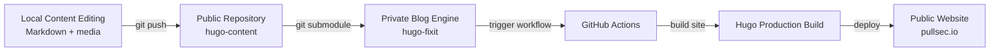

<p align="center">
  
  
  
  
  
</p>

<p align="center">
  <a href="https://github.com/pullsec/hugo-content/issues">Report Bug</a>
  ·
  <a href="https://github.com/pullsec/hugo-content/pulls">Request Feature</a>
</p>

<!-- TABLE OF CONTENTS -->
<details>
  <summary>Table of Contents</summary>
  <ol>
    <li><a href="#about">about</a></li>
    <li><a href="#architecture">architecture</a></li>
    <li><a href="#publishing-model">publishing-model</a></li>
    <li><a href="#repository-structure">repository-structure</a></li>
    <li><a href="#content-workflow">content-workflow</a></li>
    <li><a href="#integration-with-the-main-blog">integration-with-the-main-blog</a></li>
    <li><a href="#faq">faq</a></li>
  </ol>
</details>

---

## about

This repository contains the **public content** of the PullSec blog.

It includes writeups, technical notes, project pages, and public-facing markdown content used by the main Hugo site.  
The blog engine, theme integration, layouts, and deployment workflows are managed separately in a private repository.

This separation keeps the architecture clean:

- **content stays public**
- **the site engine stays private**
- **the deployment pipeline remains isolated**

## architecture

> [!IMPORTANT]
> This repository is intentionally content-only and is consumed by the main blog as a Git submodule.



### workflow summary

| Stage        | Component        | Role                            | Description                                      |
|--------------|------------------|---------------------------------|--------------------------------------------------|
| Authoring    | Local Workspace  | Content creation                | Write and update markdown content                |
| Source       | hugo-content     | Public content store            | Version control for published content            |
| Integration  | hugo-fixit       | Site engine                     | Pulls content via Git submodule                  |
| CI/CD        | GitHub Actions   | Build automation                | Generates and deploys the final static site      |
| Deployment   | GitHub Pages     | Hosting                         | Serves the final website                         |

## publishing-model

> [!NOTE]
> This repository is public by design. Only the content is exposed.  
> The blog engine, configuration, layouts, and deployment logic are kept private.

| Repository         | Visibility | Purpose                                  |
|--------------------|-----------|------------------------------------------|
| `hugo-content`     | Public    | Writeups, posts, pages, and public media |
| `hugo-fixit`       | Private   | Hugo engine, config, layouts, workflows  |
| `hugo-community`   | Public    | Giscus / GitHub Discussions backend      |

## repository-structure

```bash
about/          About page content
collections/    Collection taxonomy pages
categories/     Category taxonomy pages
friends/        Friends / blogroll page content
posts/          General blog articles
projects/       Project pages
tags/           Tag taxonomy pages
writeups/       Security writeups and walkthroughs
```

### notes

- Content is organized using Hugo-compatible markdown structure.
- Writeups should use **page bundles** whenever images or local assets are needed.
- Taxonomy folders are kept here so content remains fully separated from the engine.

## content-workflow

### clone repository

```bash
git clone https://github.com/pullsec/hugo-content.git
cd hugo-content
```

### update content

```bash
git add .
git commit -m "feat: add new writeup"
git push
```

### update the main blog repository

After pushing content changes, the private blog repository must update its submodule pointer:

```bash
cd ../hugo-fixit
git submodule update --remote --merge content
git add content
git commit -m "chore: update content submodule"
git push
```

## integration-with-the-main-blog

This repository is intended to be mounted inside the main blog repository as:

```text
content/
```

### add as submodule

From the main private blog repository:

```bash
git submodule add https://github.com/pullsec/hugo-content.git content
```

If already configured:

```bash
git submodule update --init --recursive
```

## local-preview

This repository does not build the site by itself.

To preview content properly, use it through the main Hugo project (`hugo-fixit`) where the engine, theme, and layout logic are available.

Example from the main blog repository:

```bash
podman run --rm -it \
  --userns=keep-id \
  -p 1313:1313 \
  -v "$PWD":/src:Z \
  -w /src \
  ghcr.io/gohugoio/hugo:v0.158.0 \
  server --bind 0.0.0.0 --baseURL http://localhost:1313
```

## faq

### why separate content from the main site?

To maintain a clean separation between:

- editorial content
- site engine and configuration
- deployment and automation logic

### why keep this repository public?

Because the content itself is intended to be published and shared openly.

### why keep the engine private?

To avoid exposing internal site configuration, layout customizations, and deployment implementation.

### can this repository be used standalone?

Not as a full website.  
It is a content source designed to be consumed by the main Hugo project.
test ruleset pipeline
