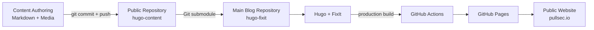
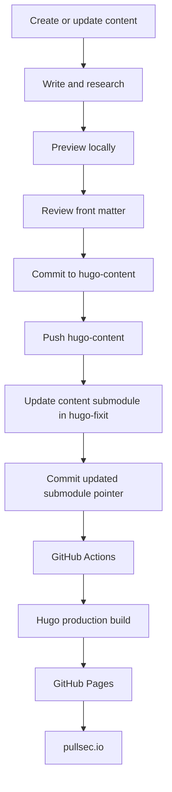
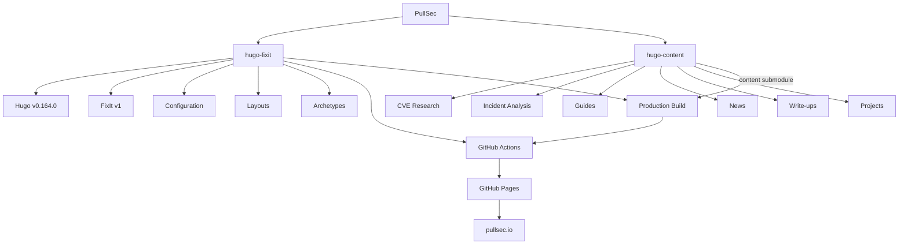

<p align="center">
  
  
  
  
</p>

<p align="center">
  <a href="https://pullsec.io/">Website</a>
  ·
  <a href="https://github.com/pullsec/hugo-content/issues">Report Bug</a>
  ·
  <a href="https://github.com/pullsec/hugo-content/pulls">Contribute</a>
</p>

---

<details>
  <summary><strong>Table of Contents</strong></summary>

- [About](#about)
- [Architecture](#architecture)
- [Publishing Model](#publishing-model)
- [Repository Structure](#repository-structure)
- [Content Types](#content-types)
- [Content Workflow](#content-workflow)
- [Creating Content](#creating-content)
- [Page Bundles and Assets](#page-bundles-and-assets)
- [Front Matter](#front-matter)
- [Integration with the Main Blog](#integration-with-the-main-blog)
- [Local Preview](#local-preview)
- [Git Workflow](#git-workflow)
- [Common Pitfalls](#common-pitfalls)
- [FAQ](#faq)

</details>

## About

This repository contains the public editorial content of the
[PullSec](https://pullsec.io/) technical blog.

It contains Markdown documents and associated resources covering topics such as:

- cybersecurity research;
- CVE and vulnerability analysis;
- security incidents;
- system and network administration;
- infrastructure and homelab projects;
- technical guides;
- security news;
- CTF and Hack The Box write-ups.

This repository intentionally contains **content only**.

The Hugo engine, FixIt theme, layouts, assets, archetypes, configuration and
deployment workflows are maintained separately in the main `hugo-fixit`
repository.

This separation keeps the project architecture modular and allows the
published content to remain publicly accessible independently from the site
infrastructure.

## Architecture

> [!IMPORTANT]
> `hugo-content` is not a standalone Hugo website.
>
> It is consumed by the main Hugo project as the `content/` Git submodule.


```mermaid
flowchart LR
    A[Content Authoring<br/>Markdown + Media]
    B[Public Repository<br/>hugo-content]
    C[Main Blog Repository<br/>hugo-fixit]
    D[Hugo + FixIt]
    E[GitHub Actions]
    F[GitHub Pages]
    G[Public Website<br/>pullsec.io]

    A -->|git commit + push| B
    B -->|Git submodule| C
    C --> D
    D -->|production build| E
    E --> F
    F --> G
```

### Workflow Summary

| Stage | Component | Role | Description |
| --- | --- | --- | --- |
| Authoring | Local workspace | Content creation | Write Markdown and manage media |
| Content | `hugo-content` | Public content store | Version control for published content |
| Integration | `hugo-fixit` | Main Hugo project | Consumes this repository as `content/` |
| Rendering | Hugo + FixIt | Static generation | Processes content into the website |
| CI/CD | GitHub Actions | Automation | Builds and deploys the website |
| Hosting | GitHub Pages | Deployment | Serves the generated static site |
| Production | `pullsec.io` | Public endpoint | Published PullSec blog |

## Publishing Model

This repository is public by design.

The content itself is intended to be published and shared openly, while the
site infrastructure is maintained separately.

| Repository | Purpose |
| --- | --- |
| `hugo-content` | Public Markdown content and associated media |
| `hugo-fixit` | Hugo configuration, themes, layouts, archetypes and CI/CD |
| `hugo-community` | Community functionality and discussion backend |

The separation can be represented as:

```text
hugo-fixit
│
├── archetypes/
├── assets/
├── config/
├── layouts/
├── themes/
│
└── content/ ───────────────► hugo-content
```

The main repository controls **how content is rendered**.

This repository controls **what content is published**.

## Repository Structure

```text
.
├── .github/
│   └── workflows/       Repository automation
│
├── about/               About and profile content
├── categories/          Category taxonomy pages
├── collections/         Collection taxonomy pages
├── community/           Community-related content
├── cve/                 CVE and vulnerability research
├── guides/              Technical guides and tutorials
├── incident/            Security incident analysis
├── posts/               General articles and news
├── projects/            Project-related content
├── reward/              Reward/support-related content
├── tags/                Tag taxonomy pages
├── writeups/            CTF and Hack The Box write-ups
│
└── README.md            Repository documentation
```

Content organization follows Hugo's content model.

Some sections contain regular Markdown files while others use page bundles
when local resources such as screenshots or diagrams are required.

## Content Types

PullSec separates content according to its technical purpose.

### CVE Research

Location:

```text
cve/
```

Used for vulnerability analysis and CVE research.

Example:

```text
cve/
└── kernel/
    └── CVE-2026-31431.md
```

Typical subjects include:

- vulnerability analysis;
- exploitation primitives;
- root cause analysis;
- affected components;
- mitigation;
- detection opportunities;
- technical references.

### Security Incidents

Location:

```text
incident/
```

Used for security incident analysis and threat activity.

Page bundles are preferred when the article requires local resources.

Example:

```text
incident/
└── ai-powershell/
    ├── index.md
    └── images/
```

Typical subjects include:

- intrusion analysis;
- attack chains;
- threat actor activity;
- PowerShell abuse;
- credential compromise;
- persistence;
- lateral movement;
- detection engineering;
- lessons learned.

### Guides

Location:

```text
guides/
```

Used for technical tutorials and operational documentation.

Example:

```text
guides/
└── wireless/
```

Typical subjects include:

- system administration;
- networking;
- wireless security;
- homelab infrastructure;
- Linux;
- security tooling;
- configuration walkthroughs.

### News

Location:

```text
posts/news/
```

Used for cybersecurity news, ecosystem developments and technical commentary.

Example:

```text
posts/
└── news/
    └── example.md
```

### Write-ups

Location:

```text
writeups/
```

Used primarily for CTF and Hack The Box technical walkthroughs.

Example:

```text
writeups/
└── hackthebox/
    └── artificial/
        ├── index.md
        └── images/
```

Write-ups generally document:

```text
Reconnaissance
      ↓
Enumeration
      ↓
Initial Access
      ↓
Exploitation
      ↓
Privilege Escalation
      ↓
Post-Exploitation
      ↓
Lessons Learned
```

### Projects

Location:

```text
projects/
```

Used for project-related pages and technical project documentation.

## Content Workflow

The content publishing workflow is intentionally separated from the site
infrastructure.


```mermaid
flowchart TD
    A[Create or update content]
    B[Write and research]
    C[Preview locally]
    D[Review front matter]
    E[Commit to hugo-content]
    F[Push hugo-content]
    G[Update content submodule in hugo-fixit]
    H[Commit updated submodule pointer]
    I[GitHub Actions]
    J[Hugo production build]
    K[GitHub Pages]
    L[pullsec.io]

    A --> B
    B --> C
    C --> D
    D --> E
    E --> F
    F --> G
    G --> H
    H --> I
    I --> J
    J --> K
    K --> L
```

### Clone the Content Repository

For direct content work:

```bash
git clone https://github.com/pullsec/hugo-content.git
cd hugo-content
```

Before editing:

```bash
git checkout main
git pull --rebase
```

## Creating Content

Content templates are maintained as Hugo archetypes in the parent
`hugo-fixit` repository.

Available specialized archetypes include:

| Kind | Destination | Purpose |
| --- | --- | --- |
| `cve` | `content/cve/` | CVE and vulnerability research |
| `incident` | `content/incident/` | Security incident analysis |
| `guide` | `content/guides/` | Technical guides |
| `news` | `content/posts/news/` | News and ecosystem analysis |
| `writeup` | `content/writeups/` | CTF / Hack The Box write-ups |

> [!IMPORTANT]
> Run `hugo new` from the root of the main `hugo-fixit` repository.
>
> The archetypes are stored there while this repository is mounted as
> `content/`.

### Create a CVE Article

```bash
hugo new content cve/kernel/CVE-YYYY-NNNNN.md --kind cve
```

Example:

```bash
hugo new content cve/kernel/CVE-2026-12345.md --kind cve
```

### Create an Incident Analysis

```bash
hugo new content incident/example/index.md --kind incident
```

### Create a Guide

```bash
hugo new content guides/example.md --kind guide
```

### Create a News Article

```bash
hugo new content posts/news/example.md --kind news
```

### Create a Write-up

```bash
hugo new content writeups/hackthebox/machine/index.md --kind writeup
```

### Create Content with Podman

When Hugo is not installed directly on the host:

```bash
podman run --rm -it \
  --userns=keep-id \
  -v "$PWD":/src:Z \
  -w /src \
  ghcr.io/gohugoio/hugo:v0.164.0 \
  new content incident/example/index.md \
  --kind incident
```

This command must be executed from the main `hugo-fixit` repository.

## Page Bundles and Assets

Page bundles should be preferred when an article contains local resources.

For example:

```text
writeups/
└── hackthebox/
    └── machine/
        ├── index.md
        └── images/
            ├── enumeration.png
            ├── foothold.png
            └── privilege-escalation.png
```

Likewise for incident research:

```text
incident/
└── example/
    ├── index.md
    └── images/
        ├── attack-chain.png
        └── timeline.png
```

This keeps article-specific resources close to the content that consumes them.

It also prevents the global static asset directories from becoming a
collection of unrelated article resources.

## Front Matter

Content metadata is defined using YAML front matter.

A typical PullSec article contains metadata similar to:

```yaml
---
title: "Example Article"
date: 2026-01-01T12:00:00+02:00
lastmod: 2026-01-01T12:00:00+02:00

description: "Technical description of the article."

comment: false

type: posts

toc:
  enable: true

categories:
  - security

collections:
  - research

tags:
  - linux
  - security
  - research

keywords:
  - cybersecurity
  - vulnerability research
---
```

The exact front matter depends on the content archetype.

### Metadata Guidelines

`title` should clearly identify the subject.

`description` should provide a concise technical summary suitable for search
results and metadata.

`categories` should represent the broad content family.

`collections` should group related research or technical subjects.

`tags` should describe technologies, techniques, platforms or concepts.

`keywords` may provide additional search and SEO context.

`lastmod` should reflect meaningful article modifications rather than cosmetic
changes.

## Integration with the Main Blog

This repository is mounted by the main Hugo project as:

```text
content/
```

From the main `hugo-fixit` repository:

```bash
git submodule status content
```

To initialize the content submodule after cloning:

```bash
git submodule update --init --recursive
```

### Updating the Content Pointer

After committing and pushing changes from `hugo-content`:

```bash
cd ../hugo-fixit
```

Update the submodule:

```bash
git submodule update --remote --merge content
```

Review the change:

```bash
git diff --submodule
```

Then commit the new content revision:

```bash
git add content
git commit -m "chore(content): update content submodule"
git push origin main
```

The main repository now references the new `hugo-content` commit.

## Local Preview

This repository does not contain everything required to render PullSec by
itself.

The proper preview environment is the main `hugo-fixit` repository.

From its root directory:

```bash
podman run --rm -it \
  --userns=keep-id \
  -p 1313:1313 \
  -v "$PWD":/src:Z \
  -w /src \
  ghcr.io/gohugoio/hugo:v0.164.0 \
  server \
  --bind 0.0.0.0 \
  --baseURL http://localhost:1313
```

Open:

```text
http://localhost:1313/
```

This ensures the content is rendered using the actual:

- Hugo configuration;
- FixIt theme;
- layouts;
- shortcodes;
- components;
- assets;
- production content structure.

## Git Workflow

### Before Editing

```bash
git checkout main
git pull --rebase
git status
```

### After Editing

Inspect the changes:

```bash
git status
git diff
```

Stage the required content:

```bash
git add path/to/content
```

Commit:

```bash
git commit -m "docs: update article"
```

Push:

```bash
git push origin main
```

### Example Commit Messages

New CVE research:

```text
feat(cve): add CVE-2026-12345 analysis
```

New incident:

```text
feat(incident): add PowerShell intrusion analysis
```

New guide:

```text
feat(guides): add wireless security guide
```

New write-up:

```text
feat(writeups): add Hack The Box machine writeup
```

Article correction:

```text
fix(content): correct technical details
```

Article update:

```text
docs: update vulnerability analysis
```

## Common Pitfalls

| Issue | Cause | Resolution |
| --- | --- | --- |
| Changes are not visible on PullSec | `hugo-fixit` still references the previous content commit | Update the `content` submodule pointer |
| Cannot push from `content/` | Submodule is in detached HEAD state | Run `git checkout main` |
| Push is rejected | Local content branch is outdated | Run `git pull --rebase` |
| Article renders incorrectly | Invalid front matter or unsupported structure | Compare against the appropriate archetype |
| Images are missing | Incorrect bundle/resource path | Keep article resources inside the appropriate page bundle |
| Local preview differs from production | Wrong Hugo environment/version | Preview through `hugo-fixit` using Hugo `v0.164.0` |
| New article has inconsistent metadata | Article created manually | Use the corresponding Hugo archetype |
| Content is committed but not deployed | Main repository pointer was not updated | Commit the updated `content` submodule in `hugo-fixit` |

### Can this repository build PullSec by itself?

No.
## FAQ

<details>
  <summary><strong>Why is the content stored in a separate repository?</strong></summary>

The content is maintained independently from the main Hugo infrastructure.

This separation keeps editorial content isolated from configuration, themes,
layouts, assets, CI/CD workflows, and deployment logic.

It also allows the public content history to evolve independently from the
website infrastructure.

</details>

<details>
  <summary><strong>Why use a Git submodule?</strong></summary>

The `hugo-content` repository is integrated into `hugo-fixit` as a Git
submodule.

This allows both repositories to maintain independent Git histories while
allowing Hugo to consume the content directly during the build.

The parent repository also records the exact content revision used for a
particular deployment.

</details>

<details>
  <summary><strong>Why is the content submodule sometimes in detached HEAD state?</strong></summary>

Git submodules normally check out the exact commit referenced by their parent
repository rather than automatically checking out a branch.

Before editing content directly inside the submodule, switch to `main`:

```bash
git checkout main
git pull --rebase origin main
```

Verify the state with:

```bash
git status
```

</details>

<details>
  <summary><strong>Why are my content changes not immediately visible on the website?</strong></summary>

Pushing a change to `hugo-content` updates this repository, but the main
`hugo-fixit` repository may still reference the previous content commit.

Update the submodule pointer from `hugo-fixit`:

```bash
cd content
git checkout main
git pull --rebase origin main
cd ..

git add content
git commit -m "chore(content): update content submodule"
git push origin main
```

The deployment pipeline can then build the website using the new revision.

</details>

<details>
  <summary><strong>Why use specialized archetypes?</strong></summary>

Different types of technical content require different metadata.

A CVE analysis does not necessarily need the same initial structure as a
Hack The Box write-up, incident analysis, guide, or news article.

Specialized archetypes provide consistent starting points while avoiding a
single oversized generic template.

Current archetypes include:

```text
cve.md
guide.md
incident.md
news.md
writeup.md
```

alongside the more general project archetypes.

</details>

<details>
  <summary><strong>Where are the archetypes stored?</strong></summary>

Archetypes are maintained in the main `hugo-fixit` repository:

```text
hugo-fixit/archetypes/
```

They are infrastructure-level templates rather than editorial content, so
they do not belong in `hugo-content`.

</details>

<details>
  <summary><strong>Where is the website infrastructure maintained?</strong></summary>

The Hugo configuration, FixIt integration, layouts, reusable assets,
archetypes, CI/CD pipeline, and deployment configuration are maintained in
the `hugo-fixit` repository.

This repository focuses on content.

</details>

<details>
  <summary><strong>Why use page bundles?</strong></summary>

Page bundles keep an article and its resources together.

For example:

```text
writeups/hackthebox/example/
├── index.md
└── images/
    ├── enumeration.png
    └── exploitation.png
```

This is particularly useful for long technical articles containing
screenshots, diagrams, or other article-specific resources.

</details>

<details>
  <summary><strong>Should generated site files be committed here?</strong></summary>

No.

This repository contains source content.

The generated production site belongs to the Hugo build and deployment
process managed by `hugo-fixit`.

Files generated under `public/` are build artifacts rather than editorial
source content.

</details>

<details>
  <summary><strong>How should a rejected push be handled?</strong></summary>

If Git reports:

```text
! [rejected] main -> main (fetch first)
```

the remote branch contains commits that are not available locally.

Prefer rebasing the local work:

```bash
git pull --rebase origin main
```

Resolve any conflicts if necessary, then:

```bash
git push origin main
```

Avoid using `git push --force` on `main` for normal content synchronization.

</details>

## Project Relationship

PullSec separates the website infrastructure from the public editorial
content.


```mermaid
flowchart TB
    P[PullSec]

    HF[hugo-fixit]
    HC[hugo-content]

    HUGO[Hugo v0.164.0]
    FIXIT[FixIt v1]
    CONFIG[Configuration]
    LAYOUTS[Layouts]
    ARCH[Archetypes]
    CICD[GitHub Actions]

    CVE[CVE Research]
    INCIDENT[Incident Analysis]
    GUIDES[Guides]
    NEWS[News]
    WRITEUPS[Write-ups]
    PROJECTS[Projects]

    BUILD[Production Build]
    PAGES[GitHub Pages]
    SITE[pullsec.io]

    P --> HF
    P --> HC

    HF --> HUGO
    HF --> FIXIT
    HF --> CONFIG
    HF --> LAYOUTS
    HF --> ARCH
    HF --> CICD

    HC --> CVE
    HC --> INCIDENT
    HC --> GUIDES
    HC --> NEWS
    HC --> WRITEUPS
    HC --> PROJECTS

    HF --> BUILD
    HC -->|content submodule| BUILD

    BUILD --> CICD
    CICD --> PAGES
    PAGES --> SITE
```
