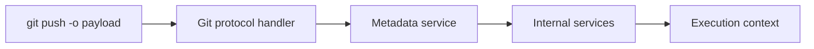
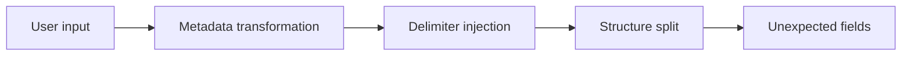
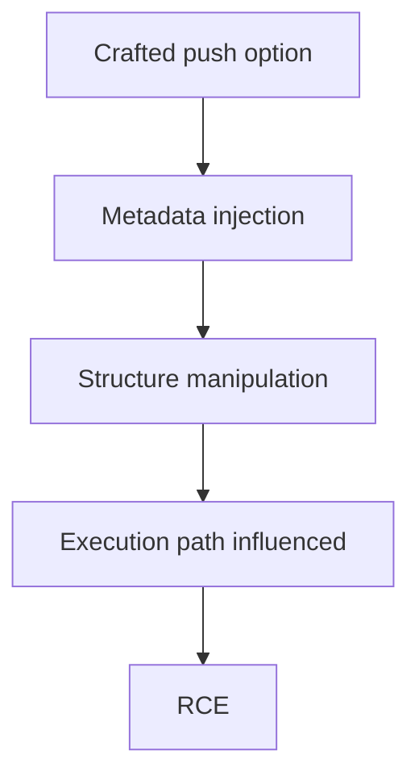
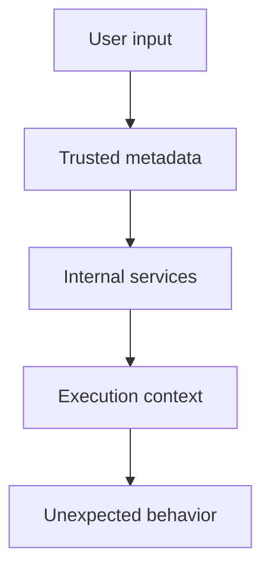

After exploring kernel vulnerabilities, I wanted to shift toward a different attack surface.

This time: distributed systems.

<!--more-->

## About

This post covers **CVE-2026-3854**, a critical GitHub vulnerability where a simple `git push` could lead to **remote code execution**.

> [!NOTE]
> The goal is to understand how user-controlled metadata can cross trust boundaries inside a distributed system.

## Why This Vulnerability?

CVE-2026-3854 is not a memory corruption bug.

It is a logic flaw in how GitHub processes metadata across multiple internal components.

## Vulnerability Overview



The attacker does not directly execute code.

They influence how the system interprets and propagates metadata.

## Root Cause — Simplified

The issue comes from how push options are transformed and re-parsed across services.

```bash
git push -o "key=value;injected=1"
```

What looks like a single field becomes multiple internal fields:

Example:

```bash
git push origin main -o "env=prod;hook=run"
```

```text
env=prod
hook=run
```

Different components interpret the delimiter differently.

| Step          | Expected          | Actual                |
|---------------|------------------|----------------------|
| Input         | Single field     | Contains delimiter   |
| Validation    | Reject           | Passes               |
| Transformation| Preserve         | Split structure      |
| Parsing       | Trusted metadata | Attacker-controlled  |



> [!IMPORTANT]
> This is not a single parsing bug. It is a mismatch between multiple systems.

## Exploitation Idea

The exploit relies on controlling metadata structure.



The attacker is not injecting code.

They are injecting structure.

## Key Insight

> [!IMPORTANT]
> This vulnerability provides control over how the system interprets data, not over memory.

Instead of:

- arbitrary read  
- arbitrary write  

It provides:

- control over metadata  
- control over interpretation  
- control over execution context  

## Why This Is Dangerous

This bug lives inside a distributed system.

Each component:

- trusts upstream processing  
- applies its own parsing  
- assumes the structure is valid  

Once that assumption breaks:



The danger comes from broken trust between systems.

This becomes critical in CI/CD environments where metadata directly influences execution.

## Impact

| Environment            | Impact |
|----------------------|--------|
| GitHub.com           | Execution in shared infrastructure, potential cross-repository effects |
| GitHub Enterprise    | Full system compromise, access to code, secrets, CI/CD pipelines |

This represents a **supply chain risk**.

## Mitigations

Mitigation focuses on enforcing consistent data handling and removing implicit trust between system components.

| Category | Mitigation |
|----------|-----------|
| Input validation | Strictly sanitize and normalize user-controlled metadata |
| Consistency | Ensure all services interpret metadata in the same way |
| Trust boundaries | Treat every internal component as untrusted input |
| Isolation | Limit impact of malformed requests across services |
| Monitoring | Detect abnormal metadata patterns and unexpected execution behavior |

> [!IMPORTANT]
> In distributed systems, validating input once is not enough. Every boundary must be treated as untrusted.

## What I Learned

This vulnerability shows that exploitation is not always about complexity.

```text
simple input → interpretation flaw → RCE
```

Understanding how systems interpret data can be more important than understanding memory.

## Conclusion

CVE-2026-3854 is not about breaking memory. It is about breaking trust between systems.

A simple input, interpreted differently across components, becomes enough to alter execution behavior.

No complex exploit chain.  
No low-level primitives.  

Just inconsistent assumptions.

> [!IMPORTANT]
> The more systems interact, the more dangerous small inconsistencies become.

## References

https://github.com/advisories/GHSA-64fw-jx9p-5j24  
https://www.wiz.io/blog/github-rce-vulnerability-cve-2026-3854  
https://thehackernews.com/2026/04/researchers-discover-critical-github.html  
https://www.it-connect.fr/cette-faille-github-est-exploitable-par-un-simple-git-push-cve-2026-3854/

