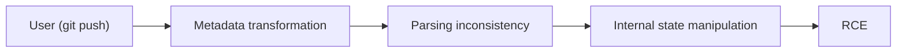
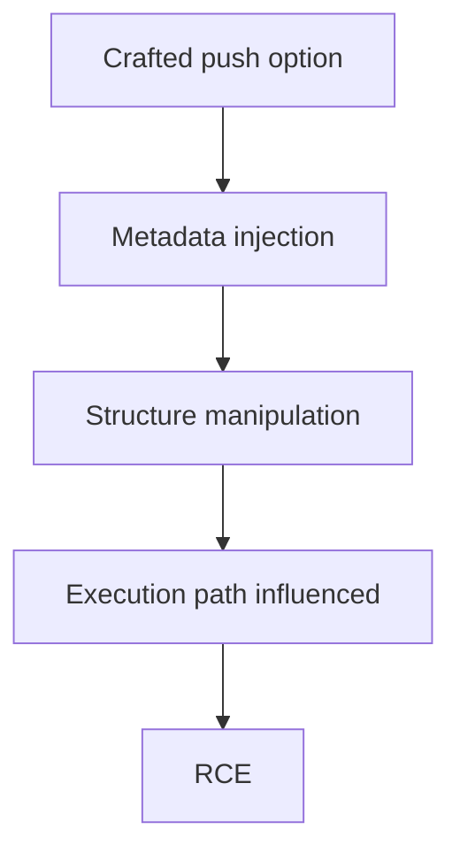
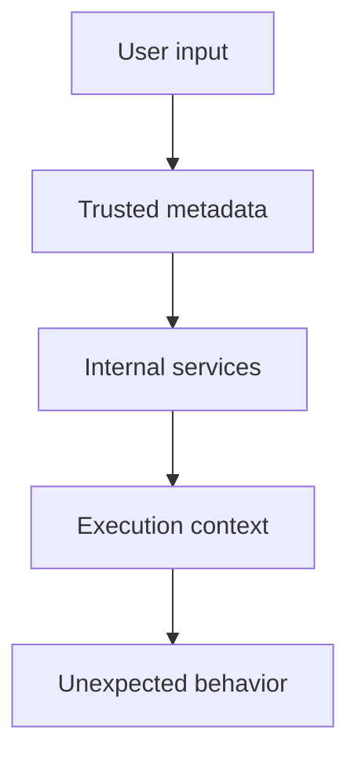
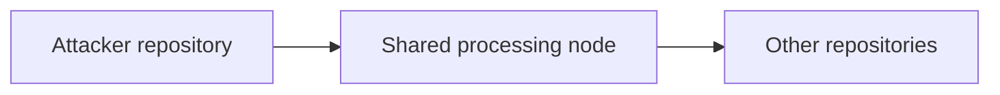
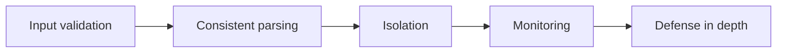
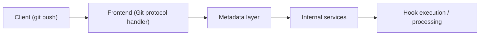

After spending time exploring kernel logic bugs, I wanted to shift focus toward a completely different attack surface. 

This time, not the kernel, but something much larger.

<!--more-->

## About

This post is about **CVE-2026-3854**, a critical vulnerability affecting GitHub’s infrastructure. The interesting part is not only the impact, but the way the vulnerability works.
At first glance, it feels almost too simple.
And yet, under the right conditions, a simple `git push` operation could lead to **remote code execution**.

> [!NOTE]
> My objective here is not to reverse GitHub’s full internal infrastructure, but to understand the logic behind the vulnerability, rewrite it in my own words, and explain how user-controlled metadata can cross trust boundaries inside a distributed system.

## Why This Vulnerability?

When I first came across this vulnerability, it felt very different from what I had studied before.

In the previous article, I focused on memory corruption bugs and how they can be turned into complex exploitation chains. That included understanding how objects are allocated and freed, how dangling pointers appear, and how attackers can reclaim memory to build useful primitives. I also explored protections such as KASLR and how information leaks are often required to bypass them.

CVE-2026-31431 was interesting because it showed how all of these concepts connect together in practice.

However, CVE-2026-3854 stands out for a completely different reason. Instead of relying on memory corruption, this vulnerability is based on a logic flaw in how GitHub processes user-controlled metadata across multiple internal systems.

Instead of relying on complex exploitation techniques, this vulnerability stands out for what it does *not* require:

| Aspect                | Observation                     |
|----------------------|--------------------------------|
| Memory corruption    | Not required                   |
| Race condition       | Not required                   |
| Complex primitives   | Not required                   |

> [!WARNING]
> That simplicity is exactly what makes it dangerous.

Rather than building an exploit step by step, the vulnerability directly exposes a powerful primitive: the ability to influence how GitHub internally interprets and processes metadata derived from a `git push`.

This completely changes the mindset.

| Traditional mindset            | New mindset                        |
|--------------------------------|-----------------------------------|
| How do I control memory?        | How is data interpreted?          |
| How do I leak addresses?        | Where does the data flow?         |
| How do I bypass protections?    | What assumptions are made?        |
|                                | What happens if they break?       |

> [!TIP]
> No corruption, no race — just a broken assumption between systems.

## Vulnerability Overview

At a high level, the vulnerability allows an attacker to influence how GitHub processes metadata derived from a `git push`.



>[!NOTE]
> The attacker does not directly execute code.
> They influence how the system interprets and propagates data across multiple internal components.

> [!CAUTION]
> This effectively turns a simple input into a control primitive over internal system behavior

At first glance, this might look like a simple parsing issue.

But the impact comes from where this parsing happens.

Instead of being limited to a single component, the malformed data propagates through multiple layers of the system.

Each layer:

- receives structured metadata
- applies its own interpretation
- trusts upstream processing

This creates inconsistencies, and those inconsistencies can be abused.

> [!WARNING]
> Once the structure of the metadata is attacker-controlled, the system no longer behaves as expected.

## Root Cause — Simplified

The vulnerability comes from how GitHub handles push options and transforms them into internal metadata.

Under normal conditions, a push option looks like this:

```bash
git push -o key=value
```

At first, this feels counterintuitive. A simple delimiter should not lead to code execution. But in distributed systems, structure matters more than content.

This seems harmless.

A simple key-value pair attached to the push request. However, this value does not remain unchanged.

Instead, it is:

- received by the frontend
- transformed into internal metadata
- propagated across multiple services
- parsed again at different stages

At each step, the system assumes that the data has already been validated.
This assumption is where the problem begins. Under specific conditions, the attacker can inject special characters such as delimiters:

```bash
git push -o "key=value;injected=1"
```

From the attacker’s perspective, this is still a single string.
But internally, something different happens.

This happens because different components interpret the delimiter differently.

| Step                  | Expected Behavior          | Actual Behavior                  |
|----------------------|--------------------------|---------------------------------|
| Input                | Single field              | Contains delimiter              |
| Validation           | Reject unsafe characters  | Delimiter passes                |
| Transformation       | Preserve structure        | Structure is split              |
| Parsing              | Trusted metadata          | Attacker-controlled fields      |

> [!CAUTION]
> The system believes it is processing structured metadata.  
> In reality, the structure itself is attacker-controlled.

This effectively turns a simple input into something much more powerful.
Instead of controlling values, the attacker controls **how the data is structured internally**.


> [!IMPORTANT]
> This is not a parsing bug in a single component. It is a mismatch between multiple components interpreting the same data differently.

Each service:

- trusts upstream processing
- applies its own parsing logic
- assumes the structure is valid

Once that assumption breaks, the attacker gains control over how the system behaves.

## Exploitation Idea

The exploit does not rely on memory corruption.

Instead, it relies on controlling how metadata is interpreted across multiple internal components.

At a high level, the attacker provides a crafted push option:

```bash
git push origin main -o "key=value;injected=1"
```

From the client perspective, this is a single field.
But internally, it becomes multiple fields.

```text
key=value
injected=1
```

This creates a new capability:

- injecting additional metadata
- altering how internal services process the request
- influencing execution behavior

Instead of building primitives step by step, the vulnerability directly exposes one:



> [!NOTE]
> The attacker is not injecting code directly.
> They are injecting structure.

This is what makes the vulnerability powerful.

Instead of breaking the system, the attacker makes the system behave incorrectly by controlling how it interprets data.

> [!WARNING]
> Once metadata becomes attacker-controlled, internal logic can be influenced in unintended ways.

## Key Insight

> [!IMPORTANT]
> This is not a memory corruption bug, it is a logic bug that behaves like a control over internal system behavior.

The vulnerability does not provide a traditional primitive such as:

- arbitrary read  
- arbitrary write  
- control over memory  

Instead, it provides something different:

- control over metadata  
- control over interpretation  
- control over execution context  

This changes how the vulnerability should be understood.

Rather than asking:
How do I control memory?

The real question becomes:
How does the system interpret my input?

> [!TIP]
> The exploit does not break the system. It makes the system break itself.

## Why This Is Dangerous

At first glance, this vulnerability might look like a simple parsing issue.
A delimiter problem.

Something that could be fixed with better input validation.

But the real danger comes from where this issue happens.
Unlike a local vulnerability, this bug exists inside a distributed system where multiple components interact and trust each other.

Each component:

- receives structured metadata  
- assumes it has been validated  
- applies its own interpretation  

This creates inconsistencies, and those inconsistencies can be abused.

> [!WARNING]
> The vulnerability is not dangerous because of the bug itself. It is dangerous because of the system it lives in.

Once the attacker can control how metadata is interpreted, they can influence:

- how internal services process requests  
- how execution context is defined  
- how backend logic is triggered 



> [!IMPORTANT]
> This is not just a vulnerability in code. It is a vulnerability in how trust is established between systems.

In a platform like GitHub, this becomes even more critical.
Because the same infrastructure is shared across multiple users and repositories.

> [!CAUTION]
> A single malformed request can impact components beyond the original repository.

## Interesting Scenarios

To better understand the impact of this vulnerability, it helps to look at how it could be abused in different contexts.

### Multi-tenant environment

On GitHub.com, repositories do not run in complete isolation. They share backend infrastructure.



In this scenario, the vulnerability is not limited to a single repository.
Instead, the attacker is interacting with shared components.

> [!WARNING]
> The impact may extend beyond the original target.

### Low-privileged user

One of the most interesting aspects of this vulnerability is the required access level.

| Permission   | Required       |
| ------------ | -------------- |
| Admin access | Not required |
| Push access  | Enough      |

A user only needs the ability to push to a repository.

> [!CAUTION]
> The dangerous capability here is not admin access. It is simply the ability to send crafted input.

### Enterprise environments

On self-hosted GitHub Enterprise instances, the impact becomes more direct.

| Target          | Impact             |
| --------------- | ------------------ |
| Source code     | Full access        |
| CI/CD pipelines | Execution control  |
| Secrets         | Potential exposure |

In this context, remote code execution often means full system compromise.

> [!IMPORTANT]
> The vulnerability can directly affect internal infrastructure.

## Impact

The impact of this vulnerability depends on the environment.

### GitHub.com

- execution within shared infrastructure  
- potential cross-repository impact  
- interaction with multi-tenant systems  

### GitHub Enterprise Server

- full system compromise  
- access to source code  
- access to secrets  
- control over CI/CD pipelines  

> [!WARNING]
> This is not just a single-system vulnerability.  
> It represents a potential **supply chain risk**.

## Mitigations

Possible mitigations include:

- strict input sanitization  
- consistent parsing across services  
- validation at each processing stage  
- monitoring unexpected metadata behavior  



## What I Learned

This vulnerability challenged my expectations.

After working on memory corruption bugs, I was expecting:

- complex primitives  
- multi-step exploitation chains  
- memory manipulation  

Instead, this exploit shows something different:

```text
simple input → interpretation flaw → RCE
```

There was no complex setup.
But understanding *why* it works required thinking differently.
And honestly… it took me a while to accept that something this simple could be this powerful.



> [!NOTE]
> The same data flows through multiple components, each applying its own interpretation.

## Conclusion

CVE-2026-3854 is a strong example of modern vulnerabilities.

- It is not based on memory corruption.
- It is not local.
- It is not complex.

And yet, its impact is critical.

> [!IMPORTANT]
> The more systems interact, the more dangerous small inconsistencies become.

Sometimes, breaking a simple assumption is enough.
