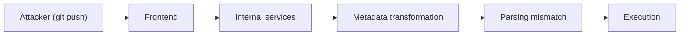
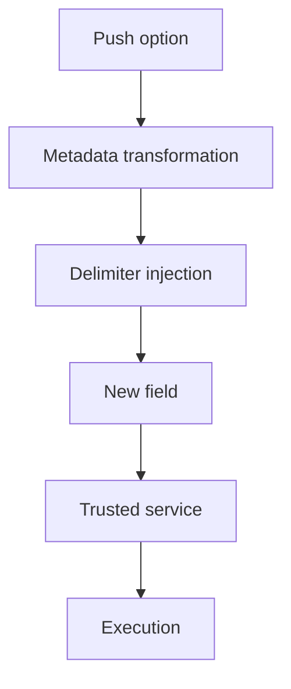

After spending time exploring kernel logic bugs, I wanted to shift focus toward a completely different attack surface.

This time, not the kernel.

But something much larger.

<!--more-->

## About

This post is about **CVE-2026-3854**, a critical vulnerability affecting GitHub’s infrastructure.

> [!NOTE]
> The goal here is not to reverse the full backend implementation, but to understand how a simple user-controlled input inside a `git push` operation can propagate through multiple internal systems and lead to **remote code execution (RCE)**.

What makes this vulnerability interesting is not raw complexity.

It is the *path*.

There is no memory corruption, no race condition, no heap trick.

Instead, everything relies on a small detail:

> [!IMPORTANT]
> A mismatch in how data is interpreted across multiple services.

## Why This Vulnerability?

Most vulnerabilities I previously studied were local:

- kernel bugs  
- privilege escalation  
- memory corruption  

Those follow a familiar pattern: trigger → primitive → escalate.

Here, things are different.

| Aspect | Observation |
|------|------------|
| Entry point | `git push` |
| Required interaction | Standard Git usage |
| Complexity | Low (attacker side) |
| Impact | Remote Code Execution |

At first glance, nothing looks unusual.

But the key difference is that the attacker does not directly exploit a bug in a single component.

Instead, they influence how data moves and gets interpreted across a chain of services.

That difference completely changes the exploitation mindset.

## Vulnerability Overview

At a high level, the vulnerability follows this flow:

```
git push → metadata → parsing mismatch → execution → RCE
```



This is not a single bug.

It is a failure in how components agree on what the data means.

## Understanding `git push` in a Distributed System

It is easy to think of `git push` as “sending code to a server”.

But in reality, it is closer to sending a structured request into a distributed pipeline.

| Stage | Role | What Happens |
|------|------|-------------|
| Client | User input | Sends commits and optional metadata |
| Frontend | Entry point | Receives request and performs initial validation |
| Internal services | Processing | Routes and prepares operations |
| Metadata transformation | Critical | Converts input into internal structures |
| Execution layer | Backend | Executes hooks and internal logic |

Each of these stages trusts the previous one.

That trust is where the problem begins.

The data is not malicious in appearance.

But its structure can be manipulated.

## Root Cause

Git allows passing additional options during a push:

```bash
git push -o key=value
```

This feature is useful, but also becomes the entry point.

The value does not remain a simple string.

It gets:

- transformed into metadata  
- forwarded between services  
- parsed multiple times  

The issue arises when delimiters are not properly handled.

| Step | Expected | Actual |
|------|----------|--------|
| Input | key=value | key=value;extra=1 |
| Validation | Reject unsafe input | Delimiter allowed |
| Transformation | Single field | Split into multiple fields |
| Interpretation | Trusted structure | Attacker-controlled structure |

At first, this looks like a validation bug.

But it is more subtle.

> [!WARNING]
> Each component believes the previous one already sanitized the data.

This assumption breaks the system.

## Exploitation Idea

The attacker does not inject code.

They inject *structure*.

```bash
git push origin main -o "key=value;exec=1"
```

What the system expects:

```
key=value
```

What actually happens:

```
key=value
exec=1
```

| Stage | Expected Behavior | Real Behavior |
|------|------------------|---------------|
| Parsing | Single field | Multiple fields |
| Metadata | Static structure | Modified structure |
| Execution | Safe logic | Altered execution path |

This subtle difference is enough to influence backend behavior.

## Practical Insight (Simulation)

We can reproduce the core idea locally.

```bash
export INPUT="key=value;injected=true"
IFS=';' read -ra parts <<< "$INPUT"
```

Output:

```
key=value
injected=true
```

| Input | Expected Interpretation | Actual Result |
|------|------------------------|--------------|
| key=value | One field | One field |
| key=value;test=1 | One field | Two fields |

No crash. No error.

Just a silent change in structure.

That is what makes this class of vulnerability dangerous.

## From Push Option to RCE

Breaking down the full chain:

| Step | Description |
|------|------------|
| 1 | Attacker sends crafted push option |
| 2 | Metadata is generated |
| 3 | Delimiter creates new field |
| 4 | Downstream service trusts it |
| 5 | Execution path changes |
| 6 | RCE occurs |



> [!IMPORTANT]
> The attacker controls how the system interprets the data, not just the data itself.

## Why This Is Dangerous

This vulnerability is not unique.

It belongs to a broader class:

| Category | Similarity |
|----------|------------|
| HTTP Request Smuggling | Parsing mismatch |
| Header Injection | Delimiter abuse |
| Deserialization bugs | Trust in structure |

The pattern is always the same:

> Different components disagree on what the data means.

And that disagreement becomes an attack surface.

## Interesting Scenarios

### Multi-tenant environment

On GitHub.com, repositories share infrastructure.

| Element | Risk |
|--------|------|
| Shared nodes | Cross-repository impact |
| Processing layer | Lateral movement |

A single malformed push can affect shared processing logic.

### Low-privileged user

| Permission | Impact |
|-----------|--------|
| Push access | RCE trigger |
| Admin access | Not required |

This is what makes the vulnerability particularly dangerous.

The attacker does not need elevated privileges.

### Enterprise environments

| Target | Impact |
|--------|--------|
| Repositories | Data exposure |
| CI/CD | Pipeline compromise |
| Secrets | Full compromise |

In this context, RCE often means complete system takeover.

## Impact

| Target | Result |
|--------|--------|
| GitHub.com | Multi-tenant risk |
| GitHub Enterprise | Full compromise |

> [!WARNING]
> This is not just a bug.  
> It is a supply chain risk.

## Mitigations

Fixing this kind of vulnerability is not trivial.

It requires consistency across all layers.

| Layer | Action |
|------|--------|
| Input | Strict sanitization |
| Parsing | Unified logic |
| Pipeline | Validation at each stage |
| Monitoring | Detect anomalies |

The key idea:

> Never assume another component already validated the data.

## What I Learned

At first, this vulnerability feels simple.

Almost too simple.

No memory corruption.  
No complex exploit chain.

But the difficulty is somewhere else.

Understanding how data flows through distributed systems is much harder than understanding how memory works.

Once that clicks, the vulnerability becomes obvious.

## Conclusion

CVE-2026-3854 is not about breaking systems directly.

It is about breaking how systems understand data.

And in distributed architectures:

> Small inconsistencies can lead to massive impact.

## References

- https://www.wiz.io/blog/github-rce-vulnerability-cve-2026-3854  
- https://thehackernews.com/2026/04/researchers-discover-critical-github.html  

