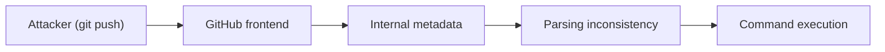
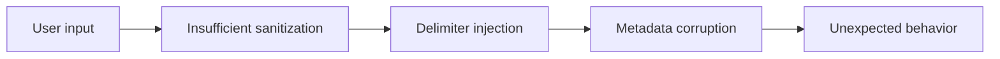
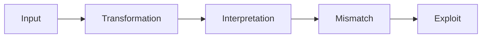
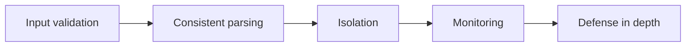

After spending time exploring kernel logic bugs, I wanted to shift focus toward a completely different attack surface.

This time, not the kernel.

But something much larger.

<!--more-->

## About

This post is about **CVE-2026-3854**, a critical vulnerability affecting GitHub’s infrastructure.

> [!NOTE]
> The goal here is not to reverse the full backend implementation, but to understand how a simple user-controlled input inside a `git push` operation can propagate through multiple internal systems and lead to **remote code execution (RCE)**.

This vulnerability is particularly interesting because it does not rely on:

- memory corruption  
- race conditions  
- complex heap manipulation  

Instead, it is based on something much more subtle:

> [!IMPORTANT]
> **A broken assumption between distributed systems.**

## Why This Vulnerability?

Most of the vulnerabilities I studied before were local:

- kernel bugs  
- privilege escalation  
- memory corruption  

This one is different.

| Aspect                | Observation                          |
|----------------------|--------------------------------------|
| Entry point          | `git push`                           |
| Required interaction | None beyond protocol usage           |
| Complexity           | Low (from attacker perspective)      |
| Impact               | Remote Code Execution                |

> [!WARNING]
> A single command can cross multiple trust boundaries.

## Vulnerability Overview

At a high level, the vulnerability looks like this:

```
git push (attacker-controlled input)
        ↓
internal metadata transformation
        ↓
parsing inconsistency
        ↓
command injection
        ↓
RCE
```



## Understanding `git push` (Simplified)

Before diving into the bug, it is important to understand what happens during a push.

Normal flow:

```
Client → Git protocol → Server → Processing → Storage
```

But in a large platform like GitHub, this becomes:

```
Client
  ↓
Frontend service
  ↓
Internal services
  ↓
Metadata transformation
  ↓
Hooks / processing pipeline
```


> [!NOTE]
> Each step may interpret data slightly differently.

## Root Cause — Simplified

The vulnerability is caused by improper handling of **push options**.

Git allows passing options during push:

```bash
git push -o key=value
```

These options are:

- received by the server  
- transformed into internal metadata  
- forwarded across services  

Under specific conditions:

- special characters are not properly sanitized  
- internal delimiters can be injected  
- parsing logic becomes inconsistent  



> [!CAUTION]
> The system believes it is parsing structured data.  
> In reality, the structure itself is attacker-controlled.

## Exploitation Idea

The attacker does not need to break memory.

Instead, the goal is to break **data interpretation**.

Example:

```bash
git push origin main -o "key=value;injected=1"
```

What happens conceptually:

```
Expected:
key=value

Actual:
key=value
injected=1
```

This allows:

- injecting new metadata fields  
- altering internal logic  
- influencing execution paths  

```
controlled metadata
        ↓
internal misinterpretation
        ↓
unexpected execution path
        ↓
RCE
```

## Key Insight

> [!IMPORTANT]
> This is not a parsing bug in a single component.  
> It is a **desynchronization between multiple components**.

Different services:

- expect structured input  
- apply different parsing rules  
- trust upstream transformations  

> [!WARNING]
> When these assumptions diverge, attackers gain control over system behavior.

## Why This Is Dangerous

This vulnerability belongs to a broader class of bugs:

| Category                  | Similarity                          |
|--------------------------|------------------------------------|
| HTTP Request Smuggling   | Parsing inconsistency              |
| Header Injection         | Delimiter abuse                    |
| Deserialization bugs     | Trust in structured data           |

> [!TIP]
> The common theme is always the same:
>
> **“What one system sees is not what another system interprets.”**

## Exploitation Mindset

This vulnerability changes the way we think about exploitation.

Traditional mindset:

```
How do I control memory?
How do I leak addresses?
How do I bypass protections?
```

New mindset:

```
Where is the data transformed?
Who interprets it?
What assumptions are made?
What happens if parsing breaks?
```



## Impact

Depending on the target:

### GitHub.com

- multi-tenant environment  
- shared infrastructure  
- risk of cross-repository impact  

### GitHub Enterprise

- full instance compromise  
- access to:
  - source code  
  - secrets  
  - CI/CD pipelines  

> [!WARNING]
> This is a **supply chain risk**, not just a single-system vulnerability.

## Mitigations

Mitigations focus on restoring trust boundaries:

- strict input sanitization  
- consistent parsing across services  
- delimiter escaping  
- validation at each layer  



Operational recommendations:

- monitor unusual `git push` options  
- audit logs for unexpected metadata  
- update affected systems  

## What I Learned

This vulnerability reinforces an important idea:

```
Exploitation is not always about breaking memory.
```

Sometimes, it is about breaking **assumptions**.

In this case:

- no corruption  
- no race  
- no complex primitives  

Just:

```
user input → protocol → misinterpretation → RCE
```

At first, it feels too simple.

But once you understand how data flows through distributed systems…

it becomes clear why it works.

## Conclusion

CVE-2026-3854 is a strong example of modern vulnerabilities:

- not local  
- not memory-based  
- but deeply tied to system architecture  

It shows that:

> [!IMPORTANT]
> The more systems interact, the more dangerous small inconsistencies become.

And sometimes…

breaking a delimiter is enough.

## References

- https://www.wiz.io/blog/github-rce-vulnerability-cve-2026-3854  
- https://thehackernews.com/2026/04/researchers-discover-critical-github.html  

