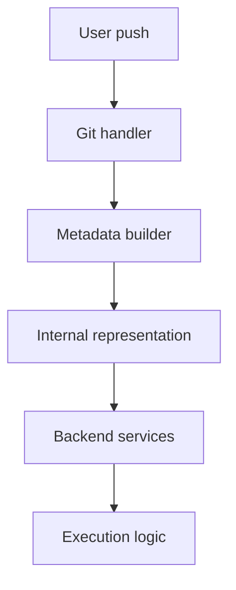
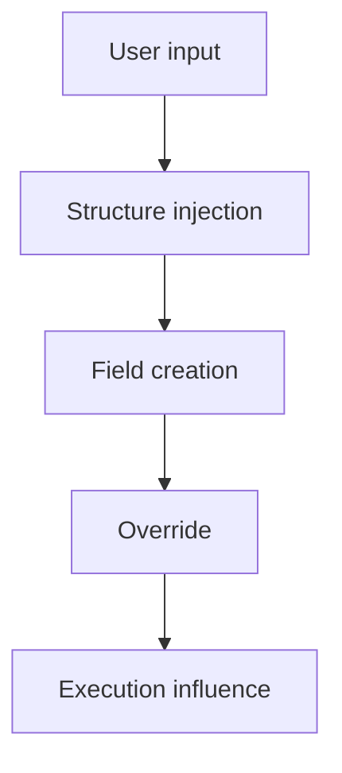

After exploring kernel vulnerabilities, I wanted to shift toward a different attack surface.

This time: distributed systems CVE-2026-3854 is different.

<!--more-->

There is no heap corruption, no race condition, and no need for low-level primitives. Instead, the vulnerability lives in something much harder to reason about:

> how multiple services interpret the same piece of data.

At first glance, the entry point looks trivial:

```bash
git push -o "<payload>"
```

But behind that command lies a chain of transformations where user-controlled metadata is propagated, reshaped, and eventually trusted.

The interesting part is not only the impact. It is the primitive:

> A user-controlled push option can be transformed into trusted internal metadata and override execution-critical values.

## TL;DR

At a high level, the exploit chain is:

```text
git push -o payload
      ↓
push option enters Git pipeline
      ↓
embedded into internal metadata structure
      ↓
delimiter confusion (;)
      ↓
structure is broken into multiple fields
      ↓
attacker-controlled keys override trusted values
      ↓
execution context modified
      ↓
RCE
```


```mermaid
flowchart LR
    A["User push"]
        --> B["Push option"]
        --> C["Metadata transformation"]
        --> D["Structure split"]
        --> E["Override values"]
        --> F["Execution context"]
        --> G["RCE"]
```

## About

The goal of this post is not to provide a weaponized exploit.

The goal is to understand how a simple parsing inconsistency can become a reliable execution primitive in a distributed system.

> [!NOTE]
> This case study focuses on how metadata flows across services and how trust boundaries break when structure is attacker-controlled.

## Why This Vulnerability Matters

Unlike classic vulnerabilities, this bug does not give you memory access.

Instead, it gives you something more subtle:

```text
controlled metadata → trusted override → execution path control
```

This is dangerous because:

- the system itself executes the payload logic  
- no memory corruption is required  
- the exploit is deterministic  

In other words:

> the attacker does not break the system — the system breaks itself.

## Vulnerable Area

The vulnerability is not in a single function.

It is in the interaction between multiple components:

- Git push options (user input)
- metadata transformation layer
- internal serialization format
- backend parsing logic
- execution hooks / runtime context

In practice, this flow happens across multiple internal services:

```text
Git handler → metadata builder → internal transport → backend parser → execution layer
```

Each step reinterprets the same data slightly differently.


```mermaid
flowchart TD
    A["User push"]
        --> B["Git handler"]
        --> C["Metadata builder"]
        --> D["Internal representation"]
        --> E["Backend services"]
        --> F["Execution logic"]
```

Each stage trusts the previous one.

That assumption is the root of the problem.

## Root Cause

The root cause is a structural ambiguity.

GitHub represents metadata internally using a format like:

```text
key=value;key=value;key=value
```

The semicolon (`;`) is used as a delimiter.

The problem:

> user-controlled input is inserted into this structure without strict normalization.

### Simplified model

User input:

```bash
git push -o "env=prod;hook=run"
```

Expected interpretation:

```text
env = "prod;hook=run"
```

Actual interpretation:

```text
env = prod
hook = run
```

## Why This Breaks Security

Each service assumes:

- metadata is already validated  
- structure is correct  
- values are safe  

But in reality:

```text
user data → structure → trusted metadata
```

This creates a broken trust boundary.

## Parsing Behavior

The parsing logic is simple:

1. split on `;`
2. parse each segment as `key=value`
3. apply values
4. last value wins

Example:

```text
env=prod;env=dev
```

Final result:

```text
env=dev
```

This creates a primitive:

> attacker-controlled overwrite of trusted values

## Exploitation Model

The exploit is not about injecting code.

It is about injecting structure.


```mermaid
flowchart TD
    A["User input"]
        --> B["Structure injection"]
        --> C["Field creation"]
        --> D["Override"]
        --> E["Execution influence"]
```

## Exploitation Chain

The attack can be broken into three primitives:

```text
1. Inject additional metadata fields
2. Override trusted values
3. Trigger execution through modified context
```

### More Realistic Payload Example

```bash
git push origin main -o "env=prod;rails_env=development"
```

This does not inject code.

It changes how the backend interprets execution context.

From there, internal services may:

- load different configurations  
- execute alternative hooks  
- bypass expected restrictions  

This is enough to influence execution behavior.

### Step-by-step

1. Input is accepted as a single field  
2. Metadata is embedded into internal structure  
3. Parser splits on `;`  
4. New field appears (`rails_env`)  
5. Existing value is overridden  
6. Execution context changes  

## Why This Leads to RCE

Some internal metadata fields influence:

- execution environment  
- hook configuration  
- service behavior  

By overriding them:

```text
trusted configuration → attacker configuration → execution
```

This transforms a data injection into an execution primitive.

### What Can Actually Be Controlled

In practice, not all metadata fields are equal.

Some internal fields have direct impact on execution, such as:

- runtime environment selection (e.g. `rails_env`)
- hook configuration paths
- execution context parameters

If an attacker can override those fields, they do not need to inject code.

They only need to redirect execution toward logic that already exists inside the system.

```text
metadata override → different execution path → unintended code execution
```

This is what turns a parsing issue into a real RCE condition.

## Why This Is Powerful

| Constraint | Reality |
|-----------|--------|
| No memory corruption | Not required |
| No race condition | Deterministic |
| No leak required | None |
| Single command | Yes |

This makes the vulnerability:

> simple, reliable, and extremely dangerous

## Impact

| Environment | Impact |
|------------|--------|
| GitHub.com | Execution in shared infrastructure |
| Enterprise | Full system compromise |

This represents a supply chain risk.

## Detection Ideas

Detection should focus on metadata anomalies:

```bash
grep ";" /var/log/github-audit.log
```

Look for:

- delimiter usage  
- duplicated keys  
- unusual push options  

## Mitigations

| Category | Mitigation |
|----------|-----------|
| Input validation | Reject delimiters |
| Normalization | Canonicalize metadata |
| Parsing | Use a single parser |
| Trust boundaries | Re-validate at each stage |
| Monitoring | Detect abnormal metadata |

## Key Insight

> This vulnerability is not powerful because of what it writes,  
> but because of **where the data is interpreted**.

## What I Learned

This vulnerability shows that:

```text
structure → interpretation → execution
```

In distributed systems:

- structure defines behavior  
- parsing defines trust  
- inconsistencies define attack surface  

## Conclusion

CVE-2026-3854 is not about breaking memory.

It is about breaking assumptions.

A simple delimiter is enough to turn user input into execution control.

> In distributed systems, controlling structure can be as powerful as controlling memory.

