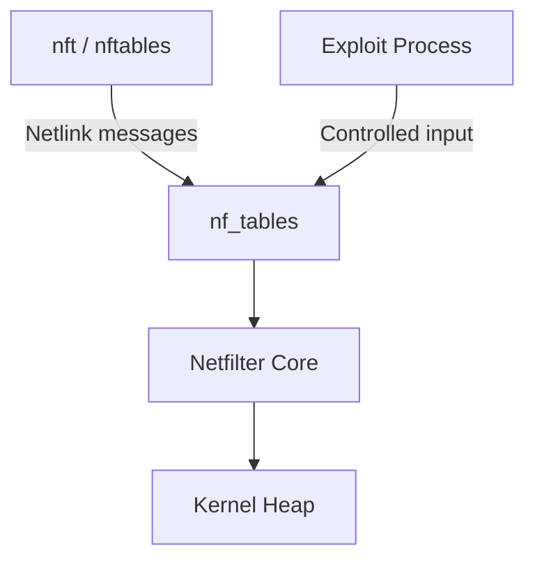
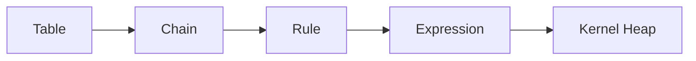
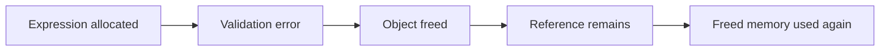
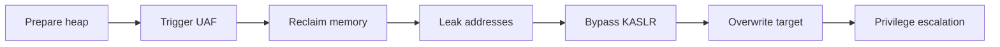
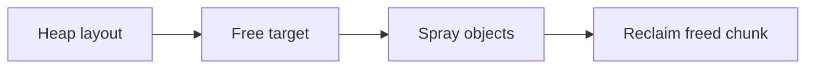
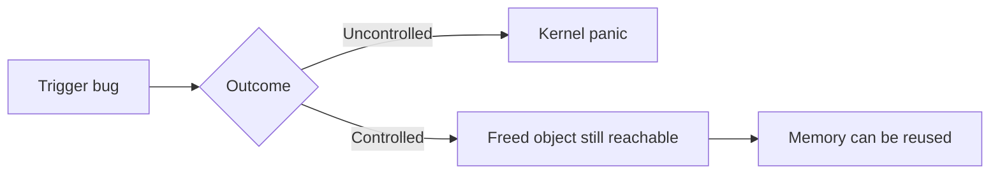
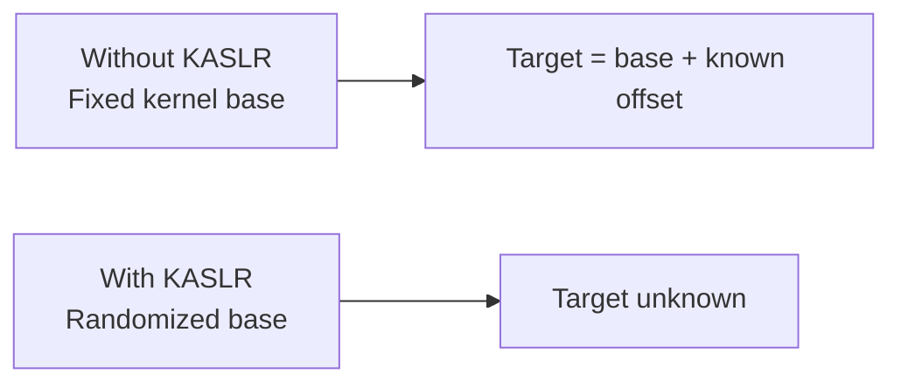
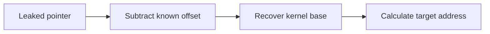
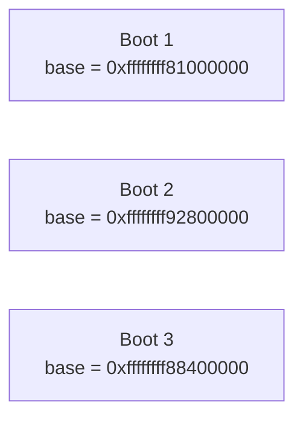
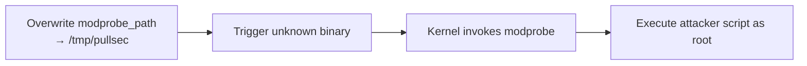

In my previous kernel exploitation notes, I mostly focused on the foundations: what the Linux kernel is, the difference between user space and kernel space, common vulnerability classes, and the general workflow behind exploit development.

This post is a continuation of that learning path.

<!--more-->

## About

Instead of jumping directly into writing a full exploit from scratch, I wanted to take a real-world vulnerability and break it down step by step.

The goal is not to explain every kernel structure in detail, but to understand the exploitation flow behind **CVE-2022-32250**, a Use-After-Free vulnerability in the Linux kernel Netfilter subsystem.

> [!NOTE]
> My objective here is to rewrite the logic in my own words and connect it with the basics already covered on this blog.

## Why This Vulnerability?

CVE-2022-32250 stood out because it brings several exploitation concepts together:

- Use-After-Free
- kernel heap manipulation
- object reuse
- information leaks
- KASLR bypass
- privilege escalation through `modprobe_path`

It is a good case study because it shows how small primitives can be chained into something useful.

## Quick Recap: Use-After-Free

A **Use-After-Free** happens when memory is freed, but still used through a dangling pointer.

```c
struct object *obj = kmalloc(sizeof(*obj), GFP_KERNEL);

kfree(obj);

/*
 * Bug:
 * obj still points to the old memory region.
 */
obj->callback();
```

In userland, this is already dangerous.  
In the kernel, it is worse because freed memory may later contain privileged objects, function pointers, credentials, or network structures.

The simplified idea is:

| Step | Action | Result |
|------|--------|--------|
| 1 | Kernel allocates an object | Valid memory region |
| 2 | Kernel frees the object | Memory becomes available |
| 3 | Pointer still exists | Dangling reference |
| 4 | Attacker sprays objects | Heap is influenced |
| 5 | Freed memory is reused | Attacker data may land there |
| 6 | Kernel uses pointer | Controlled behavior may happen |

## Where the Bug Lives

CVE-2022-32250 affects **Netfilter**, the Linux kernel framework used for packet filtering, NAT, and firewalling.

Tools like `iptables` and `nftables` interact with this subsystem from userland.  
If the kernel mishandles controlled input coming from nftables, it can lead to memory corruption.



## nftables Model

At a high level, nftables is organized as:



Expressions are the interesting part here.

They are small kernel objects created, validated, and freed through user-controlled nftables operations.  
A bug in their lifecycle can become a heap corruption issue.

## Vulnerability Summary

**CVE-2022-32250** is a Use-After-Free vulnerability in the Linux kernel `nf_tables` subsystem.

| Item | Description |
|------|-------------|
| Vulnerability | Use-After-Free |
| Component | `nf_tables` / Netfilter |
| Trigger | Crafted nftables operations |
| Impact | Local privilege escalation |
| Goal | Turn memory corruption into useful primitives |

Simplified exploitation path:

```text
Local attacker
  → Trigger bug through nftables
  → Create Use-After-Free in kernel heap
  → Reuse freed memory
  → Leak kernel addresses
  → Bypass KASLR
  → Overwrite sensitive kernel data
  → Privilege escalation
```

This is not a remote exploit.  
It requires local access and depends on system configuration, especially namespace and nftables access.

## Root Cause — Simplified

The vulnerability comes from incorrect handling of expression objects inside `nf_tables`.

In the vulnerable path, an expression object is allocated.  
If validation fails, the object may be freed while part of the internal state still references it.

That leaves a dangling pointer.



Simplified pseudo-code:

```c
expr = kzalloc(expr_size, GFP_KERNEL);

if (validation_fails) {
    kfree(expr);
    return error;
}

/*
 * In the vulnerable scenario,
 * another structure may still reference expr.
 */
```

> [!TIP]
> The bug is not only that memory is freed.  
> The problem is that something still points to it afterwards.

## Exploitation Chain Overview

The exploit chain can be split into logical stages:



The vulnerability only gives an opportunity.  
The exploit still has to turn it into reliable primitives.

### Stage 1 — Heap Grooming

Heap grooming makes kernel allocations more predictable.

Without it, the freed object may be reused by unrelated kernel data.



The goal is to make the freed memory land where the exploit wants it.

### Stage 2 — Triggering the UAF

Triggering the bug is not enough.

A crash proves the bug exists.  
A controlled state makes it exploitable.



The final exploit needs stability, not just a crash.

### Stage 3 — Reclaiming the Freed Object

Once the object is freed, the next step is to place a useful object in the same memory region.

A simplified spray looks like this:

```c
for (int i = 0; i < SPRAY_COUNT; i++) {
    spray_controlled_object();
}
```

A good replacement object should:

- have a predictable size
- be allocated in the same kernel cache
- contain controllable data
- help build a read or write primitive

The exploit discussed by Theori uses **POSIX message queues (`mqueue`)** as part of this strategy.

### Why mqueue?

`mqueue` is useful because message queue objects can create kernel allocations with attacker-controlled content.

From userland, the API looks simple:

```c
mq_open();
mq_send();
mq_receive();
mq_close();
```

Example skeleton:

```c
#include <mqueue.h>
#include <fcntl.h>
#include <sys/stat.h>

struct mq_attr attr = {
    .mq_flags = 0,
    .mq_maxmsg = 10,
    .mq_msgsize = 0x100,
    .mq_curmsgs = 0,
};

mqd_t mq = mq_open("/pullsec_mq", O_CREAT | O_RDWR, 0644, &attr);
```

The important part is not the API itself.  
The value is how the kernel allocates and manages the related objects internally.

### Stage 4 — Leaking Addresses

Modern kernel exploitation usually needs leaks.

Without a leak, addresses are unpredictable because of **KASLR**.



A typical pattern is:



At this point, exploitation becomes less about guessing and more about calculation.

### Stage 5 — KASLR Bypass

KASLR randomizes the kernel base address at boot.



If the exploit wants to overwrite a global kernel variable, it must recover where that variable lives in the current boot.

That is why leaking a kernel pointer is such an important step.

### Stage 6 — modprobe_path

One classic Linux kernel exploitation target is `modprobe_path`.

Default value:

```text
/sbin/modprobe
```

If an exploit can overwrite it with an attacker-controlled path, the kernel may execute a user-controlled script as root.



Example payload:

```bash
cat > /tmp/pullsec << 'EOF'
#!/bin/sh
cp /bin/bash /tmp/rootbash
chmod 4755 /tmp/rootbash
EOF

chmod +x /tmp/pullsec
```

Trigger with an invalid binary:

```bash
printf '\xff\xff\xff\xff' > /tmp/trigger
chmod +x /tmp/trigger
/tmp/trigger
```

If the overwrite worked:

```bash
/tmp/rootbash -p
id
```

Expected result:

```text
uid=1000(user) gid=1000(user) euid=0(root)
```

## Practical Lab Notes

For this kind of topic, I prefer working in a disposable virtual machine.



{}

```text
Host:
- Linux workstation
- QEMU/KVM or VirtualBox
- Snapshot support enabled

Guest:
- vulnerable Linux kernel
- debug symbols if possible
- SSH access
- no important data
```

{}

{}

```bash
sudo apt update
sudo apt install -y build-essential git gdb make gcc \
    libmnl-dev libnftnl-dev strace ltrace \
    linux-tools-common linux-tools-generic
```

{}

{}

```bash
uname -a
cat /proc/version
cat /proc/sys/kernel/kptr_restrict
cat /proc/sys/kernel/dmesg_restrict
cat /proc/sys/kernel/unprivileged_userns_clone

which nft
nft --version
lsmod | grep nf_tables
```

{}

{}

```text
1. Take snapshot
2. Run PoC
3. Save logs
4. Revert snapshot
5. Repeat
```

Useful commands:

```bash
dmesg -w
strace -f ./exploit
```

{}



## Mitigations

Mitigation is mostly about reducing the attack surface and limiting the impact of kernel memory corruption.

| Category | Mitigation |
|----------|-----------|
| Patching | Keep the kernel up to date |
| Isolation | Disable unprivileged user namespaces when possible |
| Access control | Restrict nftables usage |
| Hardening | Enable AppArmor / SELinux |
| Monitoring | Watch for unexpected privilege escalation behavior |

Example hardening checks:

```bash
sysctl kernel.unprivileged_userns_clone
sysctl kernel.kptr_restrict
sysctl kernel.dmesg_restrict
```

Example hardening values:

```bash
sudo sysctl -w kernel.kptr_restrict=2
sudo sysctl -w kernel.dmesg_restrict=1
sudo sysctl -w kernel.unprivileged_userns_clone=0
```

Be careful with `kernel.unprivileged_userns_clone=0`: it can break applications relying on user namespaces, such as containers or sandboxed applications.

## Conclusion

This post is a transition point in my kernel exploitation notes.

The goal was not to claim full mastery of CVE-2022-32250, but to understand how the pieces fit together:

- Netfilter object lifetime
- Use-After-Free
- heap grooming
- mqueue-based allocations
- kernel leaks
- KASLR bypass
- `modprobe_path` overwrite

The important lesson is that modern kernel exploitation is mostly about reliability and chaining.

The vulnerability is only the entry point.  
The real challenge is controlling the environment around it.

And yes… it took longer than expected.

But that’s probably the most valuable part of the process.

