In my previous kernel exploitation notes, I mostly focused on the foundations: what the Linux kernel is, the difference between user space and kernel space, common vulnerability classes, and the general workflow behind exploit development.

This post is a continuation of that learning path.

<!--more-->

## About

Instead of jumping directly into writing a full exploit from scratch, I wanted to take a real-world vulnerability and break it down step by step. The goal here is not to pretend that everything is easy or fully mastered, but to document the process of understanding how a modern Linux kernel exploit chain is built.

> [!NOTE]
> My objective here is to rewrite the logic in my own words, connect it with the basics already covered on this blog, and make the exploitation flow easier to follow.
> The case study is **CVE-2022-32250**, a Use-After-Free vulnerability in the Linux kernel Netfilter subsystem.

## Why This Vulnerability?

When I first came across this exploit, it immediately felt like a step up compared to what I had covered so far.

In the previous article, I focused on building the fundamentals:
understanding the difference between user space and kernel space, how syscalls interact with the kernel, how memory is organized, and what common vulnerability classes look like. I also briefly explored protections such as KASLR, SMEP, and SMAP, along with the general workflow behind exploit development.

CVE-2022-32250 stood out because it brings all of these concepts together into a single, real-world exploitation chain. Instead of looking at each concept in isolation, this vulnerability shows how they interact in practice:

Use-After-Free leads to kernel heap manipulation, which then enables object reuse and information leaks. Those leaks are used to bypass KASLR, and finally, everything is chained together to achieve privilege escalation through `modprobe_path`.
This makes it a perfect case study to move from theory to something closer to real kernel exploitation.

## Personal Learning Notes

When I first approached this vulnerability, I did not fully understand the entire exploitation chain.

The bug itself looked simple at first glance: an object is freed while something still references it.  
However, the real challenge was not identifying the bug, but understanding how to turn it into a usable primitive.

Most of the learning process was not about getting a root shell, but about breaking down the problem step by step:

| Step | What I Focused On | Goal |
|------|------------------|------|
| 1 | Reading the vulnerable code path | Understand where the bug originates |
| 2 | Analyzing allocations | Identify what kind of object is created |
| 3 | Tracking the free operation | Understand when and why the object is freed |
| 4 | Identifying dangling references | Find what still points to freed memory |
| 5 | Thinking about reuse | Figure out how to reclaim the freed chunk |
| 6 | Debugging crashes | Observe kernel behavior and side effects |
| 7 | Breaking the exploit | Turn a complex chain into smaller primitives |

Over time, this made the exploit much easier to reason about.
Instead of seeing it as a single complex exploit, I started to see it as a sequence of smaller, understandable steps.
This helped me understand something important about kernel exploitation:

> [!NOTE]
> A kernel exploit is usually not one magic trick. It is a chain of small primitives that eventually become powerful together.

## Quick Recap: What Is a Use-After-Free?

A **Use-After-Free** happens when memory is freed, but the program still keeps and uses a pointer to that memory.

Simple example:

```c
struct object *obj = kmalloc(sizeof(*obj), GFP_KERNEL);

kfree(obj);

/*
 * Bug:
 * obj still points to the old memory region.
 */
obj->callback();
```

In userland, this is already dangerous.
In the kernel, it is much more serious because kernel memory contains privileged objects, function pointers, credentials, network structures, and other sensitive data.

The simplified idea is:

| Step | Action | Result |
|------|--------|--------|
| 1 | Kernel allocates an object | Valid memory region |
| 2 | Kernel frees the object | Memory becomes available |
| 3 | Pointer still exists | Dangling reference |
| 4 | Attacker sprays objects | Heap is controlled |
| 5 | Freed memory is reused | Attacker data placed |
| 6 | Kernel uses pointer | Controlled behavior |

## High-Level Architecture

Before looking at the vulnerability, it helps to understand where the bug lives.

CVE-2022-32250 affects **Netfilter**, which is the Linux kernel framework used for packet filtering, NAT, and firewalling.

Tools like `iptables` and `nftables` interact with this subsystem.
The important point is that a userland process can interact with Netfilter through controlled inputs.
If the kernel mishandles one of those inputs, it can create a memory corruption bug.

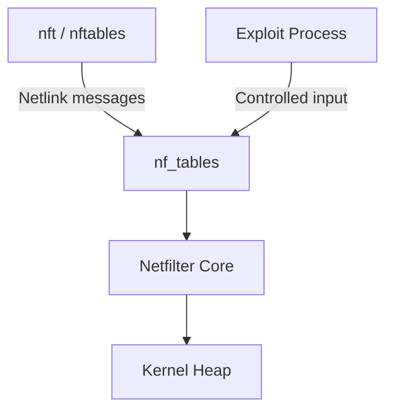

## Netfilter / nftables Basic Model

At a high level, nftables is organized as a hierarchy of objects, where each level adds more structure to how packets are processed.  
A table contains chains, chains contain rules, and rules are ultimately made of expressions.

Expressions are the smallest execution units in this model. They are kernel objects that define what action should be performed, such as matching a packet field, comparing values, updating counters, or triggering jumps and NAT operations.

From an exploitation perspective, these expressions are particularly interesting because they are dynamically allocated and freed in the kernel heap through user-controlled inputs.  
This means that any mistake in how they are created, validated, or destroyed can lead to memory corruption issues.

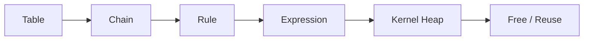

A rule is composed of one or more expressions.

These expressions are small kernel objects that define what actions should be performed on a packet.
Depending on the rule, they can handle different operations such as matching fields, comparing values, updating counters, or triggering control flow changes like jumps or NAT.

Typical examples include:

match packet field
compare value
update counter
jump to another chain
perform NAT action

From an exploitation perspective, expressions are particularly interesting because they are dynamically allocated and freed inside the kernel heap through user-controlled inputs.

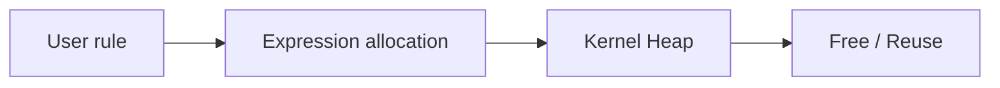

That means bugs in expression validation, creation, or destruction can become heap corruption vulnerabilities.

## Vulnerability Summary

**CVE-2022-32250** is a Use-After-Free vulnerability in the Linux kernel `nf_tables` subsystem.

| Item | Description |
|------|-------------|
| Vulnerability | Use-After-Free |
| Component | `nf_tables` / Netfilter |
| Trigger | Crafted nftables operations |
| Impact | Local privilege escalation |
| Main goal | Turn a memory corruption bug into useful exploit primitives |
| Final objective | Gain root privileges |

The simplified exploitation path looks like this:

```text
Local attacker
  → Trigger bug through nftables
  → Create Use-After-Free in kernel heap
  → Reuse freed memory
  → Leak kernel addresses
  → Bypass KASLR
  → Overwrite sensitive kernel data
  → Privilege escalation
```

This is not a remote exploit.
It requires local access and the ability to create user/net namespaces, depending on the system configuration, but local privilege escalation is still extremely important because it can turn a normal user into root.

## Root Cause — Simplified

The vulnerability originates from incorrect handling of expression objects within the `nf_tables` subsystem.

More specifically, the issue lies in how the kernel manages the lifecycle of these objects when an error occurs during their creation or validation.

In the vulnerable code path, an expression object is first allocated in the kernel heap.  
However, if a validation step fails, the object may be freed while part of the internal `nf_tables` state still holds a reference to it.

This leads to a classic Use-After-Free condition.

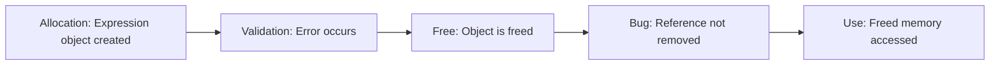

This pseudo-code is intentionally simplified and only represents the object lifetime issue, not the exact vulnerable kernel path:

```c
expr = kzalloc(expr_size, GFP_KERNEL);

if (validation_fails) {
    kfree(expr);
    return error;
}

/*
 * In the vulnerable scenario, another structure may still
 * reference the freed expression.
 */
```

> [!TIP]
> The kernel may free an object too early or fail to fully detach it from internal structures before freeing it.  
> This leaves behind a **dangling pointer**, which is the root cause of the Use-After-Free condition.

## Memory Lifecycle Diagram

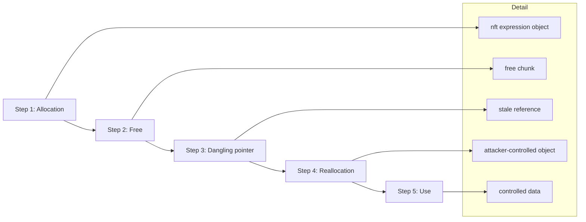

This is the key primitive.

If we can control what gets placed into the freed memory region, we can influence what the kernel later reads or writes.

## Exploitation Chain Overview

The exploit chain can be split into several logical stages:

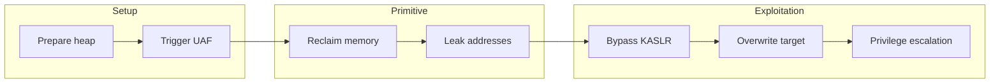

This is why the exploit is more advanced than a basic kernel bug.

The vulnerability only gives an opportunity. The exploit still has to build reliable primitives from it.

### Stage 1 — Heap Grooming

Kernel exploitation often starts with **heap grooming**.

The goal is to make kernel allocations more predictable.  
The kernel heap is noisy: many subsystems allocate and free memory constantly.  
If a Use-After-Free is triggered without controlling the layout, the freed chunk may be reused by unrelated objects.

Heap grooming reduces that randomness by shaping the heap layout.

At a high level, the process looks like this:

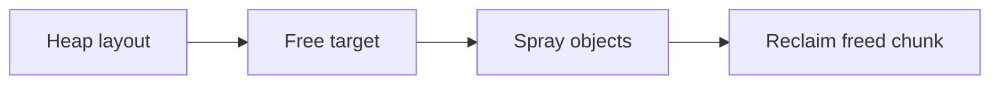

The exploit attempts to reclaim the freed memory with a useful kernel object.

### Stage 2 — Triggering the UAF

The vulnerability is triggered through carefully crafted nftables operations.
However, the goal is not simply to crash the kernel.  
A crash only confirms that a bug exists, it does not make it exploitable.

What we need instead is a **controlled and repeatable state**, where the freed object can still be reached and reused.

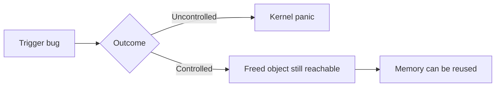

That difference matters a lot.
A kernel panic is useful during debugging, but the final exploit needs stability.

### Stage 3 — Reclaiming the Freed Object

Once the object is freed, the next goal is to place a controlled object in the same memory region.

This is where spraying comes in.

A very simplified userland view could look like this:

```c
for (int i = 0; i < SPRAY_COUNT; i++) {
    spray_controlled_object();
}
```

But in the kernel, not every object is useful.

A good replacement object should:

- have a predictable size
- be allocated in the same kernel cache
- contain controllable data
- expose useful pointers or fields
- help build either a read primitive or a write primitive

The exploit discussed by Theori uses **POSIX message queues (`mqueue`)** as part of the exploitation strategy.

### Why mqueue?

`mqueue` is useful because message queue objects can create kernel allocations with attacker-controlled content.

From userland, message queues are accessed with APIs such as:

```c
mq_open();
mq_send();
mq_receive();
mq_close();
```

Example skeleton:

```c
#include <mqueue.h>
#include <fcntl.h>
#include <sys/stat.h>

struct mq_attr attr = {
    .mq_flags = 0,
    .mq_maxmsg = 10,
    .mq_msgsize = 0x100,
    .mq_curmsgs = 0,
};

mqd_t mq = mq_open("/pullsec_mq", O_CREAT | O_RDWR, 0644, &attr);
```

From an exploitation point of view, the value is not the API itself.

The value is how the kernel internally allocates and manages message queue related objects.

These objects can be used to help with:

- heap shaping
- controlled allocations
- leaking useful pointers
- improving exploit reliability

### Stage 4 — Leaking Addresses

Modern kernel exploitation almost always requires **information leaks**.

The main reason is **KASLR (Kernel Address Space Layout Randomization)**, which randomizes the kernel base address at boot time.

Without a leak, important symbols are not at predictable addresses, making reliable exploitation difficult.

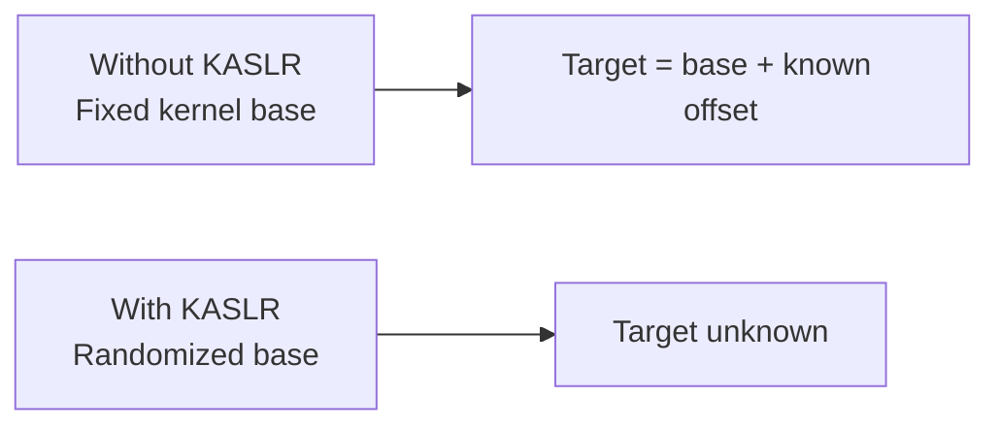

The exploit needs to recover enough information to calculate where important kernel objects or symbols are located.

A typical pattern is:

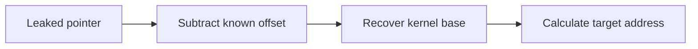

### Stage 5 — KASLR Bypass

KASLR stands for **Kernel Address Space Layout Randomization**.

Its purpose is to prevent attackers from knowing where kernel code and data are located in memory by randomizing the base address at each boot.

At a high level, the layout changes every time the system starts:

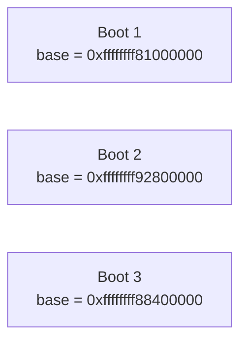

If the exploit wants to overwrite a global kernel variable, it must know where that variable lives in the current boot.

That is why leaking a kernel pointer is a critical step.

### Stage 6 — modprobe_path

One classic Linux kernel exploitation target is `modprobe_path`.

`modprobe_path` is a kernel variable that stores the path to the program executed by the kernel when it needs to invoke `modprobe`.

Default value:

```text
/sbin/modprobe
```

If an exploit can overwrite this value with an attacker-controlled path, it may be possible to make the kernel execute a user-controlled script as root.

Simplified flow:

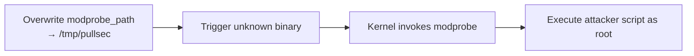

Example payload file:

```bash
cat > /tmp/pullsec << 'EOF'
#!/bin/sh
cp /bin/bash /tmp/rootbash
chmod 4755 /tmp/rootbash
EOF

chmod +x /tmp/pullsec
```

Then an invalid binary can be used to trigger the modprobe behavior:

```bash
printf '\xff\xff\xff\xff' > /tmp/trigger
chmod +x /tmp/trigger
/tmp/trigger
```

If the overwrite worked, the payload runs with root privileges.

Then:

```bash
/tmp/rootbash -p
id
```

Expected result:

```text
uid=1000(user) gid=1000(user) euid=0(root)
```

## Practical Lab Notes

For this kind of topic, I prefer working in a disposable virtual machine.

Recommended setup:

```text
Host:
- Linux workstation
- QEMU/KVM or VirtualBox
- Snapshot support enabled

Guest:
- vulnerable Linux kernel
- debug symbols if possible
- SSH access
- no important data
```

Useful packages:

```bash
sudo apt update
sudo apt install -y build-essential git gdb make gcc \
    libmnl-dev libnftnl-dev strace ltrace \
    linux-tools-common linux-tools-generic
```

Useful commands during analysis:

```bash
uname -a
cat /proc/version
cat /proc/sys/kernel/kptr_restrict
cat /proc/sys/kernel/dmesg_restrict
cat /proc/sys/kernel/unprivileged_userns_clone
```

Check nftables availability:

```bash
which nft
nft --version
lsmod | grep nf_tables
```

Kernel logs:

```bash
dmesg -w
```

Process tracing:

```bash
strace -f ./exploit
```

Crash debugging is easier with a VM snapshot.

Before testing anything unstable:

```text
1. Take snapshot
2. Run PoC
3. Save logs
4. Revert snapshot
5. Repeat
```

## Debugging Mindset

One mistake I made at first was trying to understand the exploit as one big block.

That made it harder.

A better approach is to split it:

```text
Can I trigger the bug?
Can I trigger it twice?
Can I avoid crashing immediately?
Can I observe allocation behavior?
Can I reclaim the freed chunk?
Can I leak one pointer?
Can I identify where that pointer belongs?
Can I compute the kernel base?
Can I control a write?
Can I overwrite a useful target?
```

This step-by-step approach is much closer to how exploit development actually feels.

It is not linear.

Most of the time is spent going back and forth between:

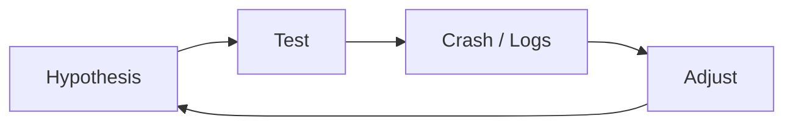

## What I Learned

This exploit was a turning point for me.

Before diving into it, I mostly understood Use-After-Free as a concept, something you read about, recognize, and move on.  
After spending time on this vulnerability, I started to understand what it actually means to *exploit* it.

And that difference is not small.

What looked like a simple bug quickly turned into a chain of dependencies, assumptions, crashes, and small wins.
There was no single “aha” moment, just a lot of iteration, debugging, and figuring out why things were *not* working.

After studying it, I better understood how exploitation requires turning that bug into primitives:

```text
bug -> controlled reuse -> leak -> address calculation -> write primitive -> privilege escalation
```

The important lesson is that modern kernel exploitation is mostly about reliability and chaining.
The vulnerability is only the entry point — the real challenge is controlling the environment around it.

## Mitigations

Mitigating this type of vulnerability involves reducing the attack surface and limiting the impact of kernel memory corruption.

Key measures include:

| Category | Mitigation | Goal |
|----------|-----------|------|
| Patching | Keep the kernel up to date | Remove known vulnerabilities |
| Isolation | Disable unprivileged user namespaces | Reduce attack surface for local users |
| Access control | Restrict nftables usage | Prevent untrusted users from interacting with Netfilter |
| Hardening | Enable AppArmor / SELinux | Limit post-exploitation capabilities |
| System security | Limit local user access | Reduce risk of LPE scenarios |
| Monitoring | Detect unexpected `modprobe_path` changes | Identify exploitation attempts |
| Kernel security | Use hardened kernels | Add additional protection layers |

---

In practice, no single mitigation is sufficient, a layered approach is required:

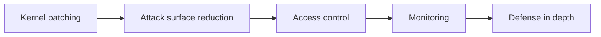

Example hardening check:

```bash
sysctl kernel.unprivileged_userns_clone
sysctl kernel.kptr_restrict
sysctl kernel.dmesg_restrict
```

Example hardening values:

```bash
sudo sysctl -w kernel.kptr_restrict=2
sudo sysctl -w kernel.dmesg_restrict=1
```

Depending on the distribution and workload, disabling unprivileged user namespaces may reduce attack surface:

```bash
sudo sysctl -w kernel.unprivileged_userns_clone=0
```

Be careful: this can break applications relying on user namespaces, such as containers or sandboxed applications.

## Conclusion

This post is a transition point in my kernel exploitation notes, previous article focused on foundations.

This one takes a real vulnerability and follows the exploitation logic without going too deep into every kernel structure.

I still consider this part of the learning process. The goal is not to claim full mastery of CVE-2022-32250, but to understand how the pieces fit together:

- Netfilter object lifetime
- Use-After-Free
- heap grooming
- mqueue-based allocations
- kernel leaks
- KASLR bypass
- `modprobe_path` overwrite

More importantly, it changed how I approach exploitation.

It’s not about jumping directly to a working exploit.  
It’s about breaking things down, understanding each primitive, and iterating until the behavior becomes predictable.

And yes… it took longer than expected.
But that’s probably the most valuable part of the process.
