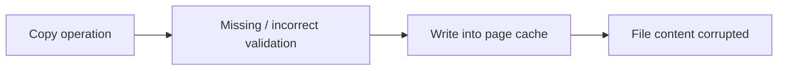
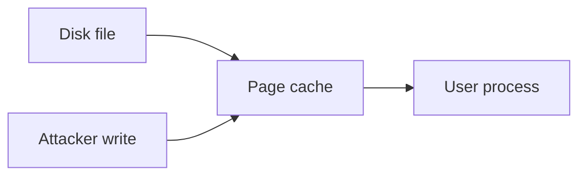

In my previous kernel exploitation notes, I mostly focused on memory corruption vulnerabilities such as Use-After-Free, along with the general workflow behind building exploitation chains.

This post is a continuation of that learning path.

<!--more-->

## About

The goal here is not to build a full exploit from scratch, but to understand how a logic flaw in the kernel can lead to something just as impactful as traditional memory corruption.

> [!NOTE]
> This case study focuses on **CVE-2026-31431**, a Linux kernel vulnerability allowing privilege escalation through unintended modification of the page cache.

## Why This Vulnerability?

CVE-2026-31431 stands out because it is not a memory corruption bug.

It directly provides a powerful primitive through a logic flaw.

That simplicity is exactly what makes it dangerous.

## Vulnerability Overview

At a high level, the vulnerability allows:

```
controlled write
      ↓
page cache modification
      ↓
target privileged file
      ↓
privilege escalation
```


## Root Cause — Simplified

Data is copied into memory, but validation is incomplete.

This breaks isolation guarantees and allows unintended writes into the page cache.



Example (simplified):

```c
copy_from_user(page_cache_buffer, user_data, size);
```

If validation is incomplete, user-controlled data may end up modifying cached file content.

## Why Page Cache Matters

The page cache stores file data in memory.

If an attacker can modify it, they can influence what processes will later read or execute.



This becomes critical when the cached file is later executed with elevated privileges.

## Exploitation Idea

The exploit relies on controlling what gets written into the page cache.

```
controlled write
      ↓
target sensitive file
      ↓
modify execution behavior
      ↓
root
```

Typical targets:

- setuid binaries  
- scripts executed with elevated privileges  

This turns a logic flaw into a direct path to privilege escalation.

## Key Insight

> [!IMPORTANT]
> This is not a memory corruption bug.  
> It is a logic flaw that behaves like a direct write primitive.

## Comparison with Memory Exploits

| Aspect        | UAF | Logic bug |
|---------------|-----|----------|
| Type          | Memory corruption | Logic flaw |
| Complexity    | High | Moderate |
| Reliability   | Fragile | Reliable |
| Primitive     | Reuse + leak | Direct write |
| Exploit chain | Long | Short |

## What I Learned

This vulnerability shows that exploitation is not always about complexity.

A simple logic flaw can directly become a powerful primitive.

## Mitigations

This type of vulnerability is not only about fixing a specific code path.

It is about enforcing strong isolation guarantees inside the kernel.

- validate data before copying into sensitive memory regions  
- enforce strict separation between user-controlled data and cached file content  
- harden page cache handling logic  
- monitor unexpected file modifications at runtime  

> [!IMPORTANT]
> Breaking isolation at the kernel level can turn simple bugs into powerful primitives.

## Conclusion

CVE-2026-31431 shows that not all kernel exploits require complex primitives.

No heap manipulation.  
No information leak.  

Just a broken assumption about where data should go.

Once that assumption fails, the kernel can be tricked into modifying data it should never touch.

> [!IMPORTANT]
> In kernel exploitation, controlling *where data ends up* can be as powerful as controlling memory itself.

## References

https://xint.io/blog/copy-fail-linux-distributions  
https://copy.fail/

