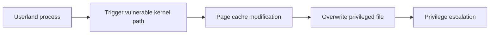
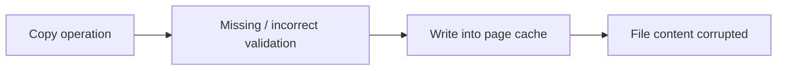
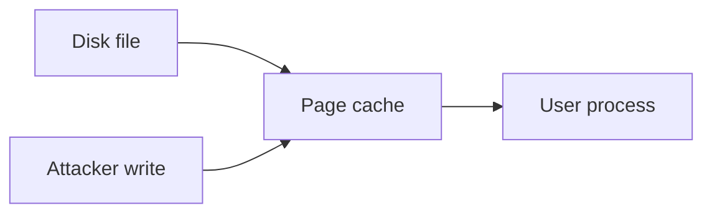
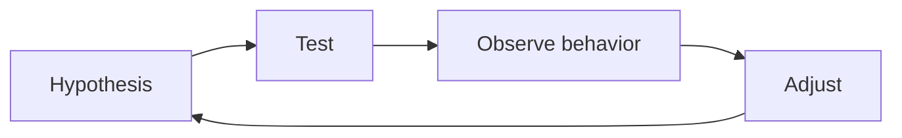
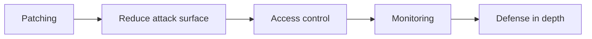

In my previous kernel exploitation notes, I mostly focused on memory corruption vulnerabilities such as Use-After-Free, along with the general workflow behind building exploitation chains.

This post is a continuation of that learning path.

<!--more-->

## About

Instead of focusing on another memory corruption bug, I wanted to explore a different class of vulnerability. The goal here is not to build a full exploit, but to understand how a logic flaw in the kernel can lead to something just as impactful as traditional memory corruption.

> [!NOTE]
> My objective here is to rewrite the logic in my own words, connect it with the basics already covered on this blog, and make the exploitation flow easier to follow. The case study is **CVE-2026-31431**, a Linux kernel vulnerability that allows privilege escalation through unintended modification of the page cache.

## Why This Vulnerability?

When I first came across this vulnerability, it felt very different from what I had studied before.

In the previous article, I focused on memory corruption bugs and how they can be turned into complex exploitation chains. That included understanding how objects are allocated and freed in the kernel, how dangling pointers appear, and how attackers can reclaim memory to build useful primitives. I also explored protections such as KASLR and how information leaks are often required to bypass them.

CVE-2022-32250 was interesting because it showed how all of these concepts connect together in practice.

However, CVE-2026-31431 stands out for a completely different reason. Instead of relying on memory corruption, this vulnerability is based on a logic flaw inside the kernel.

Instead of relying on complex exploitation techniques, this vulnerability stands out for what it does *not* require:

| Aspect                | Observation                     |
|----------------------|--------------------------------|
| Race condition       | Not required                   |
| Heap grooming        | Not required                   |
| Complex reuse        | Not required                   |

> [!WARNING]
> That simplicity is exactly what makes it dangerous.

Rather than building an exploit step by step, the vulnerability directly provides a powerful primitive: the ability to influence how the kernel handles data in the page cache.

This completely changes the mindset.

| Traditional mindset            | New mindset                     |
|--------------------------------|--------------------------------|
| How do I control memory?        | Where does the data go?         |
| How do I leak addresses?        | What controls the destination?  |
| How do I bypass protections?    | What assumptions are made?      |
|                                | What happens if they break?     |

> [!TIP]
> No corruption, no race just a broken assumption.

## Vulnerability Overview

At a high level, the vulnerability allows an attacker to:

```
controlled write
      ↓
page cache modification
      ↓
target privileged file
      ↓
privilege escalation
```



## Root Cause — Simplified

The vulnerability comes from incorrect handling of data copying inside the kernel.

Under specific conditions:

- data is copied into memory
- validation is incomplete or incorrect
- isolation guarantees are broken



> [!NOTE]
> The kernel believes it is performing a safe copy operation.  
> In reality, it modifies data it should not control.

> [!CAUTION]
> This effectively turns a logic flaw into a **write primitive**.

## Why Page Cache Matters

The **page cache** is a core mechanism used by the kernel to cache file contents in memory.

Normal behavior:

```
Disk file → Page Cache → User reads data
```

Vulnerable behavior:

```
Attacker → Page Cache → File content modified
```



> [!WARNING]
> Modifying the page cache means modifying what processes will later execute or read.

## Exploitation Idea

The exploit does not require building complex primitives.

Instead, it relies on controlling what gets written into the page cache.

```
controlled write
      ↓
target sensitive file
      ↓
modify execution behavior
      ↓
root
```

Typical targets include:

- setuid binaries  
- scripts executed with elevated privileges  

> [!TIP]
> The exploit is simple in structure, but powerful in impact.

## Key Insight

> [!IMPORTANT]
> This is not a memory corruption bug.  
> It is a logic bug that behaves like a direct write primitive.

## Comparison with Memory Exploits

| Aspect        | UAF (previous article) | Copy Fail     |
| ------------- | ---------------------- | ------------- |
| Type          | Memory corruption      | Logic bug     |
| Complexity    | High                   | Moderate      |
| Reliability   | Often fragile          | Very reliable |
| Primitive     | Reuse + leak           | Direct write  |
| Exploit chain | Long                   | Short         |

## Debugging Mindset

This vulnerability highlights something important:

```
Not all exploits require complex primitives.
```

Instead of focusing on memory layout, the key questions are:

```
Where does the data go?
What controls the destination?
What assumptions does the kernel make?
What happens if those assumptions are wrong?
```



## What I Learned

This vulnerability challenged my expectations.

After working on memory corruption bugs, I was expecting:

- heap manipulation  
- complex reuse  
- multiple chained primitives  

Instead, this exploit shows that:

```
simple logic flaw → powerful primitive → root
```

There was no complicated setup.

But understanding *why* it works still required careful thinking.

And honestly…  
it took me a while to accept that something this simple could be this powerful.

## Mitigations

Possible mitigations include:

- keeping the kernel updated  
- restricting access to unprivileged features  
- limiting local user access  
- monitoring unexpected file modifications  



## Conclusion

This vulnerability is a good reminder that exploitation is not always about complexity.

Sometimes, the most impactful bugs come from small mistakes in logic.

After working on more complex kernel bugs, this felt different:

- less about fighting the system  
- more about understanding what the kernel assumes  

And once that assumption breaks…

everything becomes much simpler.

