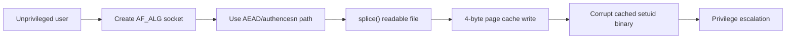
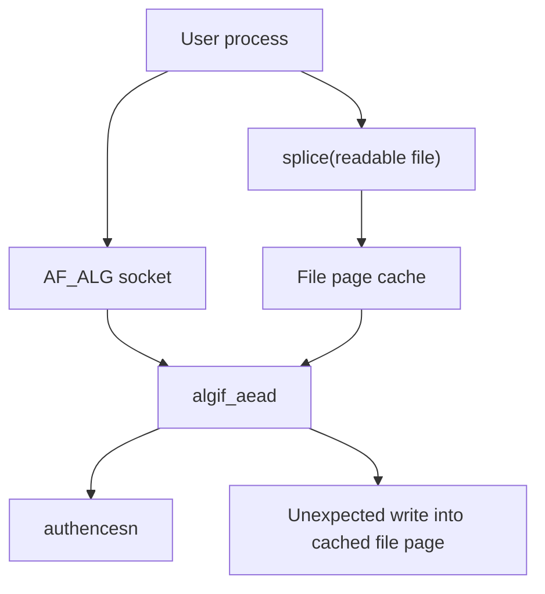
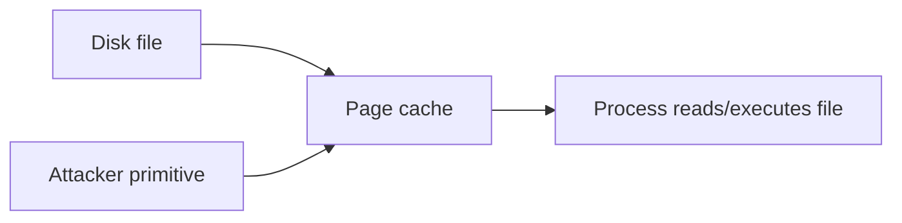
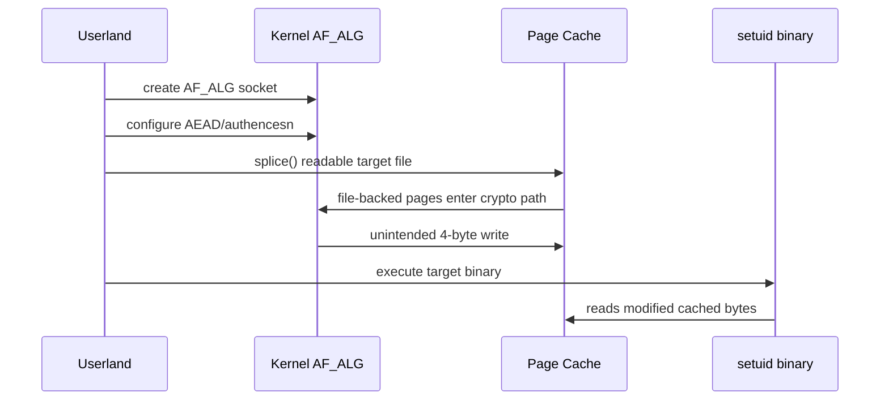
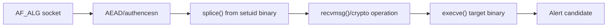

In my previous kernel exploitation notes, I mostly focused on memory corruption vulnerabilities such as Use-After-Free, along with the general workflow behind building exploitation chains.

CVE-2026-31431, also known as **Copy Fail**, is different.

<!--more-->

There is no heap feng shui, no race condition, no information leak, and no kernel address guessing. The vulnerability is a logic flaw in the Linux kernel crypto interface that can turn a small controlled write into a local privilege escalation.

The interesting part is not only the impact. It is the primitive:

> A local unprivileged process can influence the page cache of a readable file through an unexpected interaction between `AF_ALG`, `splice()`, and the `algif_aead` / `authencesn` code path.

## TL;DR

CVE-2026-31431 is a Linux kernel local privilege escalation vulnerability affecting the userspace crypto API exposed through `AF_ALG`.

At a high level, the exploit chain is:

```text
AF_ALG socket
      ↓
AEAD crypto operation
      ↓
splice() with a readable file
      ↓
page cache page is referenced instead of safely copied
      ↓
controlled 4-byte write
      ↓
setuid-root binary page cache corruption
      ↓
root shell
```


```mermaid
flowchart LR
    A["Unprivileged user"]
        --> B["Create AF_ALG socket"]
        --> C["Use AEAD/authencesn path"]
        --> D["splice() readable file"]
        --> E["4-byte page cache write"]
        --> F["Corrupt cached setuid binary"]
        --> G["Privilege escalation"]
```

## About

The goal of this post is not to publish a weaponized exploit.

The goal is to understand why this bug is dangerous, why it is reliable, and why logic flaws can sometimes be as powerful as classic memory corruption vulnerabilities.

> [!NOTE]
> This case study focuses on the exploitation model and defensive analysis of **CVE-2026-31431 / Copy Fail**. The lab helper referenced later is read-only and does not attempt exploitation.

## Why This Vulnerability Matters

CVE-2026-31431 stands out because the attacker does not need a fragile memory corruption chain.

The bug provides a narrow but powerful primitive:

```text
controlled 4-byte write → page cache corruption → execution path modification
```

That primitive is especially dangerous because the target can be a file the attacker is only allowed to read. When that file is a setuid-root binary, corrupting its cached content can change what gets executed without modifying the file on disk.

## Vulnerable Area

The vulnerable area is the Linux kernel crypto userspace interface:

- `AF_ALG` sockets
- `algif_aead`
- `authencesn(hmac(sha256),cbc(aes))`
- `splice()`
- page cache backed file data

`AF_ALG` allows userspace programs to use kernel cryptographic algorithms through sockets. `splice()` can move data between file descriptors without copying data through userspace.

That combination is normally useful for performance. In this case, it becomes the dangerous part.


```mermaid
flowchart TD
    A["User process"] --> B["AF_ALG socket"]
    B --> C["algif_aead"]
    C --> D["authencesn"]
    A --> E["splice(readable file)"]
    E --> F["File page cache"]
    F --> C
    C --> G["Unexpected write into cached file page"]
```

## Root Cause

The simplified root cause is:

> Data from a file-backed page cache page is used in a crypto operation where the kernel later performs a write into a buffer that should not be writable from the attacker's point of view.

The bug is tied to an optimization where AEAD operations can work in-place. In practice, the source and destination handling becomes unsafe when pages obtained through `splice()` are chained into the crypto scatterlist.

A simplified model looks like this:

```c
/* simplified model, not exact kernel code */
req->src = file_backed_pages;
req->dst = req->src;              // in-place operation

/* later, authencesn uses part of the destination as scratch space */
dst[offset + 0] = attacker_byte_0;
dst[offset + 1] = attacker_byte_1;
dst[offset + 2] = attacker_byte_2;
dst[offset + 3] = attacker_byte_3;
```

The important detail is not the size of the write. It is **where** the write lands.

A four-byte write sounds small, but if the attacker controls:

- the target file,
- the offset,
- and the four bytes,

then the primitive becomes useful enough to patch cached executable content in memory.

## Why Page Cache Corruption Is Powerful

The page cache stores file content in RAM.

When a process executes or reads a file, the kernel may serve that content from the page cache instead of reading it again from disk.


```mermaid
flowchart LR
    A["Disk file"] --> B["Page cache"] --> C["Process reads/executes file"]
    D["Attacker primitive"] --> B
```

This matters because page cache corruption can be temporary, memory-only, and hard to see with tools that only verify files on disk.

For example, a disk integrity checker may hash `/usr/bin/su` on disk and see no change, while the kernel may still serve modified bytes from memory until the cache is dropped or overwritten.

## Exploitation Model

The public exploitation idea can be summarized as three primitives:

```text
1. Bind an AF_ALG socket to the vulnerable AEAD/authencesn configuration.
2. Use splice() to bring pages from a readable target file into the crypto path.
3. Trigger the crypto operation so the 4-byte scratch write lands in the target page cache.
```


```mermaid
sequenceDiagram
    participant U as Userland
    participant K as Kernel AF_ALG
    participant P as Page Cache
    participant S as setuid binary

    U->>K: create AF_ALG socket
    U->>K: configure AEAD/authencesn
    U->>P: splice() readable target file
    P->>K: file-backed pages enter crypto path
    K->>P: unintended 4-byte write
    U->>S: execute target binary
    S->>P: reads modified cached bytes
```

A realistic target is a setuid-root binary such as:

```bash
ls -l /usr/bin/su /bin/su 2>/dev/null
```

The attacker does not need write permission to the binary on disk. The primitive targets the cached file content in memory.

> [!IMPORTANT]
> The core exploitation value is not arbitrary file write on disk. It is controlled corruption of file-backed memory through the page cache.

## Why A Small Write Can Be Enough

A four-byte write is limited, but it can still be chained.

Repeated writes can modify multiple offsets. When the target is executable code, even a tiny patch can change control flow, alter a conditional branch, or stage a minimal payload.

This is why the vulnerability is more practical than it first appears:

| Constraint | Why it is still useful |
|-----------|-------------------------|
| Only 4 bytes per write | Can be repeated at chosen offsets |
| Memory-only corruption | Enough for execution after cache corruption |
| Requires local access | Still critical on shared systems, containers, CI runners, and multi-user servers |
| No disk modification | Harder for disk-based integrity tools to detect |

## Safe Lab Inspector

I also wrote a read-only helper script for lab validation:

```text
scripts/cve_2026_31431.py
```

The script does **not** exploit the vulnerability. It only collects environment information and checks whether the lab matches public PoC prerequisites.

It reports things such as:

- current kernel version,
- whether the script runs as an unprivileged user,
- virtualization/container indicators,
- selected kernel hardening sysctls,
- availability of relevant crypto primitives,
- presence of setuid-root `su`,
- a static prerequisite score.

Example usage:

```bash
python3 scripts/cve_2026_31431.py --confirm-lab
```

With JSON output:

```bash
python3 scripts/cve_2026_31431.py --confirm-lab --json-out report.json
```

Example checks performed by the script:

```text
running_as_unprivileged_user
proc_crypto_available
authencesn_present
hmac_sha256_present
cbc_aes_present
su_present
su_setuid_root
```

> [!WARNING]
> A matching prerequisite score does not prove that the host is vulnerable. It only means the environment looks suitable for controlled manual validation.

This distinction is important. A safe inspector is useful for documenting a lab, but it should not claim exploitation unless a separate controlled PoC has actually been executed and validated.

## Commands For Defensive Triage

These commands are useful for documentation and defensive triage. They do not exploit the vulnerability.

Check kernel version:

```bash
uname -a
uname -r
```

Check whether relevant crypto primitives appear in `/proc/crypto`:

```bash
grep -E "authencesn|hmac|sha256|cbc|aes" /proc/crypto
```

Check whether `algif_aead` is loaded:

```bash
lsmod | grep algif_aead
```

Check common setuid-root targets:

```bash
find /usr/bin /bin -perm -4000 -uid 0 -type f 2>/dev/null
```

Check selected hardening values:

```bash
sysctl kernel.unprivileged_userns_clone
sysctl kernel.kptr_restrict
sysctl kernel.dmesg_restrict
sysctl kernel.yama.ptrace_scope
sysctl fs.protected_hardlinks
sysctl fs.protected_symlinks
```

## Detection Ideas

Detection should focus on behavior rather than disk changes.

Useful signals include:

- unusual `AF_ALG` socket creation,
- `SOCK_SEQPACKET` AF_ALG usage by unexpected processes,
- suspicious use of `splice()` involving setuid binaries,
- unprivileged processes interacting with crypto AEAD paths,
- execution of setuid binaries shortly after unusual AF_ALG activity.

A high-level detection model:

```text
unprivileged process
      ↓
AF_ALG socket
      ↓
AEAD/authencesn selection
      ↓
splice() readable setuid file
      ↓
execve() setuid binary
```


```mermaid
flowchart LR
    A["AF_ALG socket"] --> B["AEAD/authencesn"]
    B --> C["splice() from setuid binary"]
    C --> D["recvmsg()/crypto operation"]
    D --> E["execve() target binary"]
    E --> F["Alert candidate"]
```

Disk-only file integrity monitoring may miss this class of issue because the interesting modification happens in memory.

## Mitigations

The real fix is to update the kernel to a patched version from the distribution vendor.

Temporary hardening ideas may include:

| Category | Mitigation |
|----------|------------|
| Patching | Install vendor kernel updates as soon as available |
| Exposure reduction | Restrict untrusted local users and shared shell access |
| Container hardening | Treat containers as affected when they share a vulnerable host kernel |
| Syscall filtering | Use seccomp profiles to reduce access to dangerous syscall combinations where possible |
| LSM policy | Use AppArmor/SELinux policy to restrict unusual AF_ALG usage where practical |
| Monitoring | Alert on unexpected AF_ALG + splice + setuid execution patterns |
| Incident response | Reboot after patching to clear potentially corrupted page cache state |

> [!IMPORTANT]
> Containers do not bring their own kernel. If the host kernel is vulnerable, container boundaries may not be enough.

## Comparison With Memory Corruption Bugs

| Aspect | Classic UAF | Copy Fail |
|--------|-------------|-----------|
| Bug class | Memory corruption | Logic flaw |
| Primitive | Object reuse / control flow corruption | Controlled page cache write |
| Reliability | Often fragile | High when prerequisites match |
| Requires leak | Often yes | No, in the common public model |
| Requires race | Sometimes | No, based on public descriptions |
| Disk modification | Not necessarily | No, memory-backed page cache corruption |

## Key Insight

> [!IMPORTANT]
> This is not powerful because it writes many bytes. It is powerful because it writes controlled bytes into the wrong trust boundary.

Kernel exploitation is often about breaking assumptions.

Here, the broken assumption is that a readable file page entering a crypto operation cannot become a writable destination buffer from an unprivileged attacker's perspective.

## What I Learned

This vulnerability is a good reminder that exploitation is not always about complexity.

A logic flaw can be more reliable than a memory corruption bug when it exposes a clean primitive.

In this case, the primitive is small but dangerous:

```text
4 controlled bytes + chosen page cache offset + executable target = practical LPE path
```

The main lesson is simple:

> Controlling where data ends up can be as powerful as controlling a pointer.

## Conclusion

CVE-2026-31431 shows that kernel exploitation is not limited to heap manipulation, information leaks, or race conditions.

A performance optimization, a complex scatterlist path, and an unexpected interaction with `splice()` were enough to turn a crypto API path into a page-cache write primitive.

No disk write is needed.
No setuid binary permission change is needed.
No kernel address leak is needed.

Just a broken trust boundary between readable file-backed memory and writable crypto output.

## References

- https://xint.io/blog/copy-fail-linux-distributions
- https://copy.fail/
- https://github.com/pullsec/cve-deep-dive/blob/main/CVE-2026-31431/scripts/cve_2026_31431.py
- https://www.sysdig.com/blog/cve-2026-31431-copy-fail-linux-kernel-flaw-lets-local-users-gain-root-in-seconds
- https://ubuntu.com/blog/copy-fail-vulnerability-fixes-available
- https://cert.europa.eu/publications/security-advisories/2026-005/

