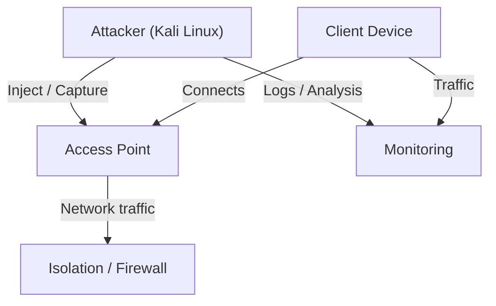

In this part, we move from theory to practice.

In the first part, the goal was to understand how Wi-Fi works from a security perspective.  
Now, the goal is different: interacting with it in a controlled way.

Before performing any wireless experiments, we need a lab where everything is predictable, observable, and safe to break.

<!--more-->

## About

Understanding wireless security is not enough. At some point, you need to observe real traffic, interact with networks, and see how things behave outside of theory.

This is where a lab becomes essential. Instead of experimenting on real networks, we build a controlled environment where everything is predictable, reproducible, and safe to break.

The goal is simple: create a space where you can learn by doing.

## Environment

Before performing any wireless experiments, we need a safe and controlled environment.

The goal is not just to install Kali — it’s to control how your lab behaves.

### Quick Comparison

| Setup | Complexity | Isolation | Flexibility | Use Case |
|------|-----------|----------|-------------|----------|
| Kali VM | Low | Medium | High | Fast setup / daily testing |
| Raspberry Pi | Medium | High | Medium | Portable / isolated lab |



{}

| Category | Details |
|---------|--------|
| Tools | VirtualBox / VMware / QEMU |
| Requirements | VT-x / AMD-V enabled, ~4GB RAM, 20GB disk |
| Adapter | USB Wi-Fi (monitor mode) |
| Advantages | Fast setup, snapshots, easy reset |
| Use Case | Learning, debugging, daily testing |

{}

{}

| Category | Details |
|---------|--------|
| Hardware | Raspberry Pi 4 |
| Storage | 16GB+ microSD |
| Adapter | External Wi-Fi adapter |
| Setup | Flash Kali ARM image, boot |
| Advantages | Isolated, portable, realistic |
| Use Case | Real-world testing, mobility |

{}



## Architecture

This setup is not just about running tools — it’s about controlling how interactions happen.

Each component has a specific role in the lab.

You are not just observing a network — you are designing it.

### Components Overview

| Component | Role | Security Perspective |
|----------|-----|----------------------|
| Attacker (Kali) | Runs tools, captures/injects traffic | Entry point for observation and interaction |
| Access Point | Central communication hub | Controls and exposes wireless traffic |
| Client Device | Generates real traffic | Creates realistic behavior to observe |
| Isolation / Firewall | Prevents external impact | Protects external networks from lab activity |
| Monitoring | Captures and analyzes flows | Provides visibility into network behavior |



### Why this matters

In a real environment, you don’t control the network.

In a lab, you control everything:

- the traffic  
- the clients  
- the access point  
- the visibility  

This is what allows you to understand how wireless attacks actually work.
Without this level of control, everything becomes guesswork.
And in wireless security, guessing is what leads to mistakes.

## Preparing Your Wireless Interface


Before interacting with wireless networks, you need to make sure your environment is trusted, functional, and controllable.

This is where setup turns into visibility.

### Verify Your Image

Before installing Kali, always verify the ISO integrity.

```bash
sha256sum kali-linux.iso
```

Compare the output with the official checksum provided on the Kali website.

>[!WARNING]
>If the hash does not match, do not use the image.
>Running an unverified ISO can expose you to a compromised system without knowing it.

### Wireless Adapter Setup

To work with wireless security, your adapter must support monitor mode and packet injection.

These two capabilities are what allow your interface to observe and interact with wireless traffic beyond normal usage.

Check your device:

```bash
lsusb
lspci
```

This allows you to confirm the chipset and ensure compatibility with security tools.

### Driver Installation

If needed (RTL8814AU example):

```bash
git clone https://github.com/morrownr/8814au.git
cd 8814au
sudo ./install-driver.sh
```

>[!NOTE]
>Always verify chipset compatibility before installing drivers.
>Installing the wrong driver can break your wireless interface.

### Interface Setup

Check available interfaces:

```bash
iw dev
```

Enable monitor mode:

```bash
ip link set wlan0 down
iw dev wlan0 set type monitor
ip link set wlan0 up
```

Verify:

```bash
iw dev wlan0 info
```
At this point, your adapter is no longer connected to a network — it is observing raw wireless traffic.

### Troubleshoot

If your interface does not appear or does not work, it may be blocked:

```bash
rfkill list
rfkill unblock wifi
```

### Discover Networks

Scan nearby networks:

```bash
iw dev wlan0 scan | head
```

This allows you to passively discover nearby networks, including their SSIDs, channels, and encryption types.

At this stage, you are not interacting with the network yet — you are observing how it is configured.

>[!TIP]
>At this stage, you are no longer just configuring a system —
>you are starting to observe how wireless networks behave in real conditions.

## Monitor Mode

Monitor mode removes the normal network abstraction.

In managed mode, your adapter only sees traffic that is meant for you.
In monitor mode, it captures everything happening on the air.

You are no longer interacting with a network, you are observing how networks behave. This includes networks you are not connected to, devices you don’t control, and frames that are normally hidden by the operating system. This is why monitor mode is the foundation of wireless security testing.

>[!NOTE]
>Without monitor mode, most wireless attacks are simply not possible.

## What You Don’t See in Managed Mode

In normal usage, your system hides most of what is happening. You only see the network you are connected to and your own traffic. Everything else is invisible. Everything else is invisible.

In monitor mode, this changes completely. You start seeing other networks, other clients, broadcast activity, and authentication flows. This is the moment where the wireless environment stops being abstract.

You don’t just use Wi-Fi anymore — you observe it.

## Wireless Frames

Wi-Fi does not rely on classic packets — it uses 802.11 frames. These frames define how devices discover, connect, and communicate.

There are three main types:

- Management frames → beacons, authentication, association
- Control frames → coordination between devices
- Data frames → actual transmitted data

From a security perspective, management frames are critical.

They are often:

- unencrypted
- unauthenticated
- blindly trusted

This makes them a common target for attacks like:

- deauthentication
- rogue access points
- network spoofing

>[!WARNING]
>If you understand management frames, you understand a large part of wireless attacks.

## What You Have Now

At this point, you don’t just have a lab — you have visibility.
You can now discover nearby networks, observe wireless behavior, and identify configurations and patterns.

More importantly, you start to see things that normal users never see. This is the moment where the environment stops being “invisible”.

## Conclusion

This lab is your playground from here, the next step is simple:

Start interacting with the environment.

Sniff traffic, observe behavior, and understand what is happening before attempting any attack.

That’s where theory becomes real — and where intuition starts to build.
