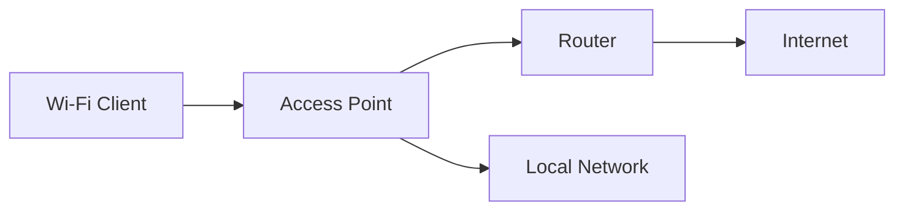

In this post, I’m trying to build a clear foundation for understanding how Wi-Fi works from a security perspective.

The goal is not to cover every wireless concept, but to understand the pieces that matter before moving into practical labs.

<!--more-->

## About

Wi-Fi is everywhere. It connects our devices, powers networks, and enables communication without cables.  
Because it is accessible by design, it is also a natural target from a security perspective.

Understanding wireless security starts with understanding how things actually work under the hood.

## Why Wireless Security Matters

Wireless networks rely on radio signals, shared mediums, and broadcast communication.

That means:

- traffic can be observed  
- signals can be interfered with  
- configurations can be misused  

Unlike wired networks, you don’t need physical access to interact with Wi-Fi.  
If you are within range, you are already part of the attack surface.

Before talking about attacks, it’s important to understand the environment itself.

## What is Wi-Fi?

Wi-Fi is a wireless technology that allows devices to connect to a network using radio waves.

In practice, it’s just a way to replace a cable with a signal — but that signal can be observed, manipulated, or disrupted.

It is based on the IEEE 802.11 standard and is used in:

- home networks  
- enterprise environments  
- public hotspots  

## Key Features

| Feature | Description |
|--------|------------|
| Wireless Connectivity | No cables required |
| Portability | Devices can connect from different locations |
| Speed | Modern Wi-Fi can reach high throughput |
| Security | Uses encryption like WPA2/WPA3 |
| Compatibility | Supported by most devices |
| Range | Depends on frequency and environment |
| Interference | Affected by other devices and networks |

## The Evolution

| Year | Standard | Key Features |
|------|---------|-------------|
| 1997 | 802.11 | First wireless standard |
| 1999 | 802.11b | Increased speed |
| 2003 | 802.11g | Better performance |
| 2006 | 802.11n | MIMO, improved range |
| 2012 | 802.11ac | Higher throughput |
| 2019 | 802.11ax | Efficiency and density improvements |

## Security Protocols

| Protocol | Encryption | Security |
|----------|-----------|----------|
| WEP | RC4 | Weak |
| WPA | TKIP | Moderate |
| WPA2 | AES | Strong |
| WPA3 | SAE | Very strong |

Even strong protocols like WPA2/WPA3 can be weak if:

- weak passwords are used  
- misconfigurations exist  
- downgrade attacks are possible  

## Basic Terms



{}

A Wi-Fi adapter allows a device to connect to wireless networks.

In practice, it acts as the interface between your system and the wireless environment.

Some adapters support advanced modes used in security testing:

- Managed mode → normal usage
- Monitor mode → capture wireless traffic
- AP mode → create a network

From a security perspective, the adapter is your entry point.
Its capabilities define what you can observe or interact with.

{}

{}

An Access Point (AP) is the device that provides wireless connectivity.

It acts as a bridge between wireless clients and a wired network.

In most environments, the AP is responsible for:

- authentication
- traffic routing
- network segmentation

From a security perspective, the AP is a critical component:

- all traffic goes through it
- it can be monitored or targeted
- misconfigurations can expose the network

{}

{}

Wi-Fi operates mainly on two frequency bands:

- 2.4 GHz → longer range, more interference
- 5 GHz → shorter range, higher speed

Each band has trade-offs between performance and coverage.

From a security perspective, range matters.
The further a signal travels, the larger the potential attack surface.

A stronger signal is not always better — it also means more exposure.

{}

{}

Channels divide frequency ranges to allow multiple networks to operate simultaneously.

Each Wi-Fi band contains multiple channels:

- 2.4 GHz → fewer channels, often overlapping
- 5 GHz → more channels, less overlap

In crowded environments, poor channel selection can lead to:

- interference
- degraded performance
- easier traffic observation

From a security perspective, overlapping channels can make it easier to monitor or disrupt wireless communication.

{}

{}

- ESSID → network name visible to users
- BSSID → unique identifier of the access point (MAC address)

A single network (ESSID) can have multiple BSSIDs (multiple APs).

From a security perspective:

- ESSIDs can be hidden but still detectable
- BSSIDs uniquely identify devices
- both are useful for reconnaissance and targeting

{}



### How Wi-Fi Works

Because communication is broadcast over the air, any device in range can potentially observe these frames, even without being authenticated 

This is why passive monitoring (sniffing) is possible without being connected to the network.

At a high level:



A device connects to an access point, receives network configuration, and communicates either locally or externally.

Everything goes through the access point, which means it becomes a central point for both communication and potential monitoring.

## Adapter Modes

Wi-Fi adapters can operate in different modes:

- Managed → normal usage  
- Monitor → capture traffic  
- AP → create network  

These modes are important for security testing, especially for passive observation and traffic analysis.

```bash
ip link set wlan0 down
iw dev wlan0 set type monitor
iw dev
iw dev wlan0 scan | head
ip link set wlan0 up
```

These commands allow you to inspect wireless interfaces, switch modes, and passively discover nearby networks and their capabilities.

## Wireless Frames

Wi-Fi communication is based on frames, not just packets. There are different types:

- Management frames (beacons, authentication)
- Control frames
- Data frames

From a security perspective, management frames are particularly interesting because they are often not protected and can be abused (e.g. deauthentication attacks).

In many configurations, these frames are not encrypted.

## What I Learned

Understanding wireless security is not about tools first. It’s about understanding:

- how devices communicate  
- how signals behave  
- where trust boundaries exist  

Without that, tools become guesswork instead of understanding.

Once you understand the environment, everything else — sniffing, deauth, attacks — starts to make sense.

## Conclusion

This is just the starting point.

Before looking at attacks or tools, understanding how wireless networks are structured is essential.

From here, the next step is to build a lab, switch an adapter into monitor mode, and start observing real traffic.

That’s where things move from theory to practice.
