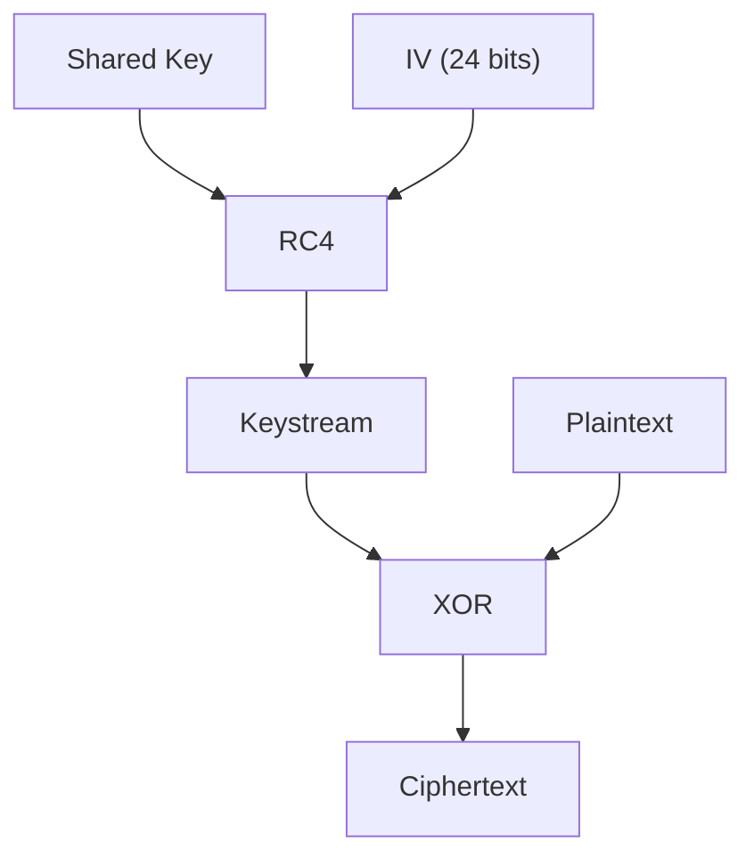
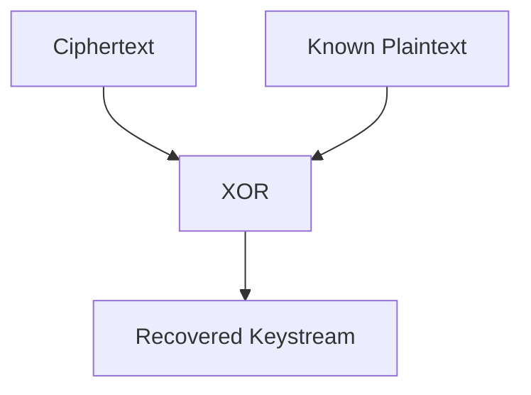
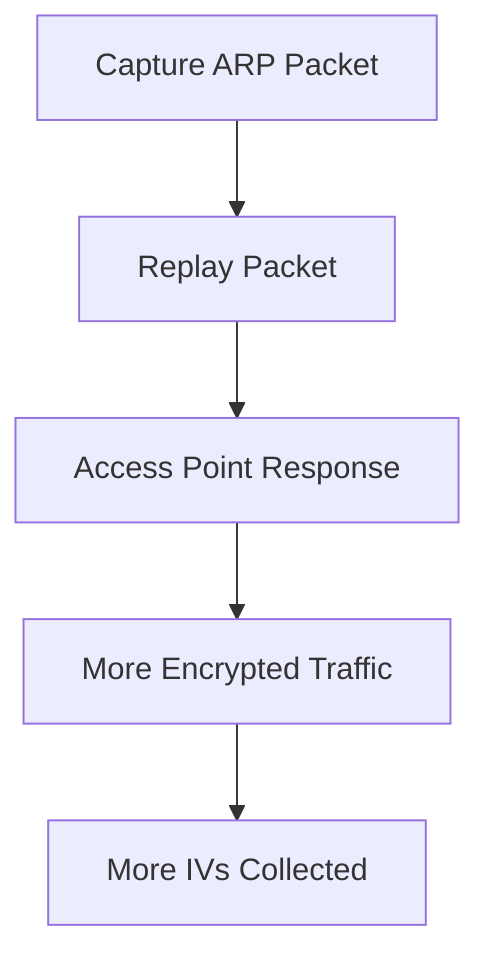

In this part, we move from observation to interaction.

The previous post focused on building a controlled wireless lab.  
Now, we use that lab to understand why WEP is considered broken.

<!--more-->

The goal is simple: study an outdated protocol in a safe environment and understand how its design weaknesses can be exploited.

## About

After building a controlled wireless lab, the next step is to use it to explore real wireless weaknesses.

For this first practical example, I focus on WEP.

WEP is outdated and should no longer be used, but it remains valuable from a learning perspective because its flaws are easy to observe and understand in a controlled setup.

This post is not about attacking real networks.  
It’s about understanding why WEP failed, how weak cryptographic design can be abused, and why modern wireless security moved away from it.

## How WEP Encryption Works

WEP is based on a stream cipher called **RC4**.

Instead of encrypting data directly, RC4 generates a **keystream**, which is then combined with the plaintext using an XOR operation.

The idea is simple:

- plaintext ⊕ keystream = ciphertext  
- ciphertext ⊕ keystream = plaintext  

In WEP, the keystream is generated using:

- a shared secret key (configured on the network)
- a 24-bit Initialization Vector (IV)

These two values are combined and used as input for RC4.



### Decryption (Same Mechanism)

Decryption in WEP follows the exact same process.

Since XOR is reversible, the receiver simply regenerates the same keystream using:

- the shared key  
- the IV (sent in cleartext)

Then:

- ciphertext ⊕ keystream = plaintext  

This symmetry is what makes stream ciphers efficient — but also fragile when misused.

### Why This Is Dangerous

Because the IV is transmitted openly and reused frequently, attackers can observe multiple packets generated with the same keystream.

When that happens, the security of the system collapses:

- identical keystreams can be reused  
- relationships between packets can be exploited  
- and eventually, the secret key can be recovered  

This is the core weakness of WEP.

## Methodology

WEP attacks are not about guessing a password.

They rely on collecting enough data to exploit how the encryption works.

Because WEP is based on a stream cipher, everything depends on the keystream.  
If an attacker can recover part of it, they can start understanding — and eventually breaking — the encryption.

### Recovering the Keystream

If both ciphertext and part of the plaintext are known, the keystream can be recovered using a simple XOR operation.



This is where WEP starts to break.

Some protocols, like ARP, contain predictable data. That means parts of the plaintext are already known.

That means parts of the plaintext are already known.

## Why Traffic Matters

To exploit this weakness, the goal is simple:

collect as many packets as possible.

By switching your adapter to monitor mode, you can passively capture:

- encrypted traffic
- broadcast packets
- ARP requests

Over time, this gives you:

- repeated IVs
- reusable keystream fragments
- enough data to start breaking the encryption

## What Comes Next

This is the foundation of WEP attacks.

From here, the process becomes practical:

- capture traffic
- identify useful packets (like ARP)
- increase traffic if needed (injection)
- recover the key

The next steps will focus on turning this theory into actual attacks

### Capture Ciphertext

The first step is to capture encrypted traffic.

By switching your wireless adapter to monitor mode, you can passively collect packets from all nearby networks — without being connected.

This gives you access to:

- encrypted data  
- broadcast traffic  
- management frames  

These packets are the raw material of the attack.

---

### Known Plaintext (ARP)

Capturing traffic is not enough.

To break WEP, you also need **known plaintext**.

This is where ARP becomes critical.

ARP packets are predictable by design.  
Parts of their content are always the same, which means:

- part of the plaintext is already known  
- part of the keystream can be recovered  

This makes ARP packets extremely valuable for WEP attacks.

---

### The Limitation

The main constraint is volume.

To successfully recover the key, you need:

- thousands of packets  
- many different IVs  

On a quiet network, this can take a very long time.

---

### ARP Replay Attack

To solve this problem, attackers generate traffic instead of waiting for it.

With an ARP replay attack:

- a captured ARP request is reused  
- it is injected repeatedly into the network  
- the access point responds each time  
- new packets with new IVs are generated  

This dramatically increases the amount of usable data.



Instead of waiting for traffic, you force the network to generate it.

## Exploiting WEP

At this point, the theory is clear.

The practical workflow depends on network activity.



{}
Use this when the network is already generating enough traffic.

```bash
sudo airodump-ng --bssid <BSSID> -c <channel> -w wep wlan0
sudo aircrack-ng wep.cap
```

This relies on collecting enough IVs without injecting traffic.
{}

{}
Use this when the network is quiet but has an associated client.

```bash
sudo aireplay-ng -1 3600 -q 10 -a <BSSID> wlan0
sudo aireplay-ng --arpreplay -b <BSSID> -h <client-MAC> wlan0
sudo aircrack-ng wep-arp.cap
```

The goal is to force the network to generate more encrypted packets.
{}

{}
Use this when traffic is low and you need to recover enough keystream to forge packets.

```bash
sudo aireplay-ng -1 0 -a <BSSID> -h <fake-MAC> wlan0
sudo aireplay-ng -5 -b <BSSID> -h <fake-MAC> wlan0
sudo packetforge-ng -0 -a <BSSID> -h <fake-MAC> -y <keystream-file> -w arp-request
sudo aireplay-ng -2 -r arp-request wlan0
sudo aircrack-ng wep_frag.cap
```

This is more advanced, but it shows how broken WEP becomes once keystream material can be reused.
{}



## Automation

After understanding the manual workflow, automation becomes easier to reason about.

Tools like **Wifite** can automate parts of the process:

```bash
sudo wifite --kill
```

The `--kill` option stops conflicting processes such as `NetworkManager` or `wpa_supplicant`, then prepares the wireless interface for capture.

Wifite can be useful in a lab because it quickly identifies nearby networks, encryption types, channels, and clients.

But automation should come after understanding.

If you use the tool without knowing what happens underneath, the result is just output on a screen.
If you understand the workflow, the tool becomes a shortcut.

## Conclusion

At this point, WEP should make sense.

Not just as a protocol, but as a broken design.

You’ve seen how:

- encryption relies on a reusable keystream  
- IVs are too small and reused  
- predictable traffic (like ARP) can be abused  
- and how collecting enough data is often enough to recover the key  

What makes WEP interesting is not the attack itself — it’s how simple the failure is.

Once you understand that, the rest becomes almost mechanical:
capture traffic, force more of it, and extract what you need.

This is why WEP is no longer used.

More importantly, this is why understanding the underlying mechanism matters more than the tools.

In the next part, we move to WPA/WPA2.

The approach changes, the attacks are different — but the mindset stays the same:
observe, understand, then break.
