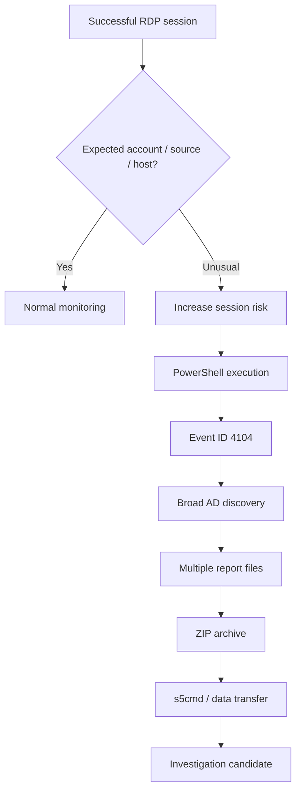

The headline is easy to remember: an attacker used an apparently AI-generated PowerShell script to enumerate Active Directory.

The more interesting part is what happened around that script.

<!--more-->

In June 2026, Huntress investigated an intrusion where a threat actor used previously compromised credentials to access a domain-joined Windows Server through RDP. Within minutes, the attacker staged and executed a custom PowerShell reconnaissance script from `C:\ProgramData\`, then moved on to additional tooling for data transfer and network-share discovery.

There was no new vulnerability, no novel privilege-escalation primitive, and no fundamentally new attack chain.

What changed was the tooling layer.

The PowerShell script appeared to have been produced with the help of a Large Language Model (LLM), making it a useful example of something defenders are likely to see more often: bespoke, disposable tooling that may never reuse the same hash, strings, function layout, or exact syntax twice.

The challenge for defenders is therefore not to identify "AI malware" as a new malware family.

It is to understand which parts of an intrusion can change quickly, and which parts remain operationally necessary.

## About

The goal of this post is not to prove which model generated a specific script or to reproduce the attacker's tooling.

The goal is to examine what this incident tells us about detection engineering.

> [!NOTE]
> Huntress assessed the PowerShell script as AI-generated based on multiple structural and stylistic indicators. Those indicators are compelling, but the defensive value of the incident does not depend on proving the exact authorship of every line.

The useful question is simpler:

> If attackers can generate unique tooling on demand, what should defenders anchor their detections to?

## Incident Overview

Huntress reported that the intrusion began with an RDP session to a domain-joined Windows Server using pre-compromised credentials. Context suggested that the attacker had reached the environment through a VPN before establishing the interactive session.

Once connected, the operator staged tooling under:

```text
C:\ProgramData\
```

Within minutes, the attacker executed:

```text
C:\ProgramData\Untitled1.ps1
```

The script was designed to map the Active Directory environment. It attempted to identify the domain controller, enumerate directory objects, write the results to local files, generate a human-readable HTML report, and package the collected data into a ZIP archive.

Roughly half an hour later, the attacker introduced:

```text
C:\ProgramData\s5cmd.exe
```

`s5cmd` is a legitimate high-speed command-line utility for Amazon S3 operations. In this context, Huntress associated it with the data-transfer phase of the intrusion.

The actor later returned with `SharpShares.exe`, a known share-enumeration utility, to search for additional user-accessible network shares.

The sequence is important because it is conventional.


Remove the AI-related detail and the attack still makes sense.

The attacker already had credentials, needed to understand the environment, needed to identify useful data, and needed a way to move that data.

AI changed how one tool was produced.

It did not remove any of those requirements.

## Inside the PowerShell Reconnaissance

The script itself is interesting because it does not look like a carefully minimized intrusion utility.

Huntress reconstructed `Untitled1.ps1` from PowerShell Script Block Logging telemetry, specifically Event ID `4104` in the `Microsoft-Windows-PowerShell/Operational` log.

Internally, the script carried the title:

```text
100% Working AD Information Gathering Script - FULLY FIXED
```

That title already suggests an iterative development process rather than a polished offensive framework. Huntress interpreted it as an artifact of repeated prompt-and-correction cycles: generate a script, encounter errors, ask for fixes, then copy the final "fully fixed" version.

The Domain Controller discovery logic reinforces that interpretation.

Rather than relying on one or two reliable mechanisms, the script used an over-engineered sequence of fallback methods. Huntress observed attempts involving DNS, `nltest`, the Active Directory PowerShell module, environment information, and finally a hardcoded fallback.

That design is not sophisticated in the traditional offensive sense.

It is exhaustive.

A human operator writing disposable reconnaissance code may choose the method that works in the target environment and move on. A language model asked to "make sure it always finds the domain controller" is more likely to produce several alternatives, extensive exception handling, and extra presentation logic.

Once a domain controller was found, the script moved into broad enumeration.

The collected output included:

| Artifact | Information collected |
|---|---|
| `AD_Users.csv` | Domain users |
| `AD_Computers.csv` | Domain computers |
| `AD_Groups.csv` | Group information |
| `AD_OUs.csv` | Organizational Units |
| `AD_Subnets.csv` | Subnet information |
| `AD_Trusts.csv` | Domain trust relationships |
| `AD_Users_With_Email.csv` | User and email mappings |
| `AD_Simple_Users.csv` | Simplified user inventory |
| `DNS_Subnets.txt` | DNS/network information |
| `AD_Report.html` | Human-readable summary |
| `AD_Reports_<datetime>.zip` | Packaged collection |

The HTML report is one of the stranger details.

An attacker who only needs the data does not necessarily need a polished report summarizing whether each enumeration stage succeeded. CSV and text output would already be sufficient for later processing.

The extra presentation layer looks more like a "helpful" software feature than an operational necessity.

That does not prove AI authorship on its own, but it fits the wider pattern observed by Huntress: verbose structure, repeated error handling, redundant discovery paths, cosmetic output, and an unedited placeholder left in the code.

## Why Active Directory Enumeration Matters

Active Directory discovery is often described as reconnaissance, but that word can make the activity sound passive.

In practice, it is how an attacker converts access to one system into a model of the environment.

A domain contains relationships. Users belong to groups, computers are organized into OUs, domains may trust other domains, and shared resources are exposed according to identity and permissions.

The attacker wants to understand those relationships before deciding where to go next.

Broad enumeration can answer questions such as:

```text
Which accounts exist?
Which systems belong to the domain?
Where is the domain controller?
Which groups are interesting?
Which trust relationships extend access?
Which shares may contain useful data?
```

That makes the discovery phase valuable from a detection perspective.

PowerShell itself is not suspicious enough.

RDP itself is not suspicious enough.

An administrator may legitimately enumerate Active Directory.

The signal appears when those events are placed in context.

An unusual RDP session followed by broad domain enumeration, creation of multiple inventory files, archive creation, introduction of a cloud-transfer utility, and further share discovery is much more meaningful than any individual event.

## Why Huntress Suspected AI

Huntress highlighted several characteristics that together supported its AI-generation assessment.

The most obvious was the internal title referring to the script as "FULLY FIXED." Another was a literal placeholder left in the Domain Controller fallback code, suggesting generated template content had been copied without complete editing.

The script also exhibited unusually repetitive structure. Enumeration steps were wrapped in similar `try/catch` patterns, the Domain Controller logic attempted several fallback mechanisms, and console output used multiple colors to make the execution visually clear for the operator.

None of those features is exclusive to LLM-generated code.

A human can write verbose PowerShell.

A human can leave placeholders behind.

A human can over-engineer discovery logic.

The significance comes from the combination of those artifacts and the broader context.

> [!IMPORTANT]
> The exact authorship is less important for defenders than the operational consequence: attackers can increasingly generate customized scripts without relying on a reusable public tool.

This is where the incident becomes more important than the script itself.

## What AI Actually Changes

Traditional detections benefit from reuse.

If attackers repeatedly deploy the same framework, defenders can learn its filenames, hashes, strings, module names, command-line patterns, or other stable indicators.

Reuse creates recognizability.

On-demand generation works against that assumption.

A new script can use different variable names, reorganize functions, rewrite comments, change output filenames, or simply produce a unique hash that has never appeared in a reputation database before.

That makes some static indicators less durable.

It does not make the intrusion invisible.

| Easily changed | Harder to avoid |
|---|---|
| File hash | Authentication activity |
| Script filename | PowerShell execution |
| Variable names | Active Directory queries |
| Comments | Process relationships |
| Function layout | File creation and staging |
| Static strings | Archive creation |
| Cosmetic output | Network communication |
| Exact implementation | Discovery and collection objectives |

This distinction is the core lesson.

AI can make code disposable.

It cannot make Active Directory answer questions without being queried. It cannot collect data without creating observable interactions. It cannot transfer information without producing process or network activity.

For defenders, the useful abstraction therefore moves one level higher.

Instead of asking:

```text
Have we seen this file before?
```

the more durable question becomes:

```text
Why is this identity performing broad domain reconnaissance from this host,
immediately after an unusual remote session, and why is the resulting data
being staged and transferred?
```

That question remains useful even if every script is different.

## Detection Engineering

A good detection strategy should not treat every PowerShell process as malicious.

The environment matters.

The identity matters.

The sequence matters.



### Authentication and RDP

Detection should start before the script executes.

A valid password only proves that authentication succeeded. It does not prove that the user behind the session is legitimate.

Useful questions include whether the account normally uses RDP, whether the source network is expected, whether the destination server has been accessed by that identity before, and whether the timing or MFA context is unusual.

This is especially important when compromised credentials are involved because the first malicious event may look exactly like a successful login.

### PowerShell Event ID 4104

The Huntress investigation demonstrates why Script Block Logging is valuable.

Event ID `4104` can preserve the PowerShell content processed during execution, which means defenders may still recover useful evidence even if the original `.ps1` file is later removed.

A unique file hash does not help much if the script only exists once.

The script content, however, still exposes intent.

Defenders can hunt for unusually broad combinations of directory discovery, Domain Controller lookup, user and computer enumeration, trust discovery, report generation, and archive creation.

The goal should not be to write a signature for the exact Huntress script.

That would simply create another brittle indicator.

The stronger approach is to detect the behavior the script implements.

### Process and File Context

Process telemetry helps connect the activity.

A simplified lineage could look like:

```text
RDP session
   └── cmd.exe
        └── powershell.exe
             ├── AD enumeration
             ├── CSV / HTML creation
             └── ZIP staging

Later:
   ├── s5cmd.exe
   └── SharpShares.exe
```

The individual processes may all be explainable.

The sequence is much harder to dismiss.

The same applies to the filesystem. Files under `C:\ProgramData\` are not inherently malicious, but newly staged scripts and executables appearing there during an unusual remote session deserve more attention.

Likewise, exact output filenames such as `AD_Users.csv` can be useful for retrospective hunting, but the more general pattern is stronger:

> PowerShell rapidly produces several directory inventories and immediately packages them into an archive.

### `s5cmd` and SharpShares

Both tools illustrate why "legitimate" and "benign" are not synonyms.

`s5cmd` is a real S3 utility. Its presence should not automatically trigger a high-severity alert.

Context determines whether it matters.

A defender should ask whether the tool is approved, whether the host has used it before, which identity launched it, where the executable came from, what destination it contacted, and what activity preceded it.

A previously unseen `s5cmd.exe` appearing shortly after data staging is much more interesting than the same binary on an approved backup system.

SharpShares creates a similar signal.

By returning to enumerate additional user-accessible shares, the attacker demonstrated that the initial Active Directory collection was part of a broader search for useful data rather than an isolated administrative task.

## Weak Signals and Stronger Signals

The incident can be summarized as a problem of context.

| Weak signal | Stronger behavioral signal |
|---|---|
| `powershell.exe` executed | PowerShell performs broad AD discovery after unusual RDP |
| Unknown `.ps1` hash | Multiple directory objects enumerated in one short session |
| File written under `C:\ProgramData` | New script/tool staged during suspicious remote access |
| ZIP archive created | AD inventory generated and immediately archived |
| `s5cmd.exe` executed | Previously unseen cloud-transfer tool follows collection |
| `SharpShares.exe` present | Share discovery follows initial compromise and staging |
| Successful RDP login | New source + unusual identity/host relationship + immediate reconnaissance |

> [!TIP]
> A resilient detection should survive changes to filenames, hashes, comments, variable names, and function order. Identity, process lineage, directory access, file staging, network activity, and timing provide a much more durable foundation.

## MITRE ATT&CK Mapping

The AI-generated nature of the script is not itself an ATT&CK technique.

ATT&CK is more useful when it describes what the attacker actually did.

| Stage | Technique | ID | Relevance |
|---|---|---|---|
| Access | Valid Accounts | `T1078` | Compromised credentials were used |
| Remote Access | Remote Desktop Protocol | `T1021.001` | Interactive access to the Windows Server |
| Execution | PowerShell | `T1059.001` | Custom reconnaissance script executed |
| Discovery | Account Discovery | `T1087` | Domain user information enumerated |
| Discovery | Network Share Discovery | `T1135` | SharpShares used to identify accessible shares |
| Collection | Archive Collected Data | `T1560` family | Enumeration output packaged into a ZIP archive |

The exact mapping of data-transfer activity should depend on the observed `s5cmd` command line and destination rather than the executable name alone.

That distinction matters because ATT&CK should reflect evidence, not assumptions.

## Defender Takeaways

The incident does not require a new defensive category called "AI malware detection."

It reinforces controls defenders already know are valuable.

First, identity telemetry matters. The attacker entered with valid credentials, so meaningful detection starts with understanding whether a successful remote session makes sense for that account and host.

Second, PowerShell logging matters. Event ID `4104` gave investigators visibility into a script that could otherwise have been unique and disposable.

Third, process and file context matter. Staging, broad enumeration, archive creation, cloud-transfer tooling, and additional share discovery create a sequence that is more valuable than isolated signatures.

Finally, legitimate tooling still needs scrutiny when it appears in the wrong place at the wrong time.

The general principle is straightforward:

> The less stable the code becomes, the more valuable stable behavior becomes.

## Conclusion

The June 2026 intrusion is interesting because it shows both the potential and the limits of AI-assisted offensive tooling.

Generative AI can reduce the effort required to produce a custom reconnaissance script. It can create code that has never existed before, making exact hashes and static signatures less reliable as primary detection anchors.

But the attacker still had to follow a recognizable operational path.

They needed valid credentials to access the environment, an interactive session to operate from, Active Directory information to understand the domain, local storage to stage the results, and additional tooling to identify and move useful data.

Those steps create telemetry regardless of whether the PowerShell was written manually, copied from a public repository, or generated by an LLM.

That is the useful lesson for detection engineering.

Signatures remain valuable, but they should not be the only layer expected to remain stable.

As offensive code becomes easier to customize, defenders gain more by correlating identity, execution, discovery, staging, and network behavior into a coherent sequence.

The question is no longer only whether a particular file is known to be malicious.

It is whether the activity makes sense for that identity, on that host, at that moment.

## References

- https://www.huntress.com/blog/ai-coded-malware-vibe-coding-active-directory
- https://www.it-connect.fr/cyberattaque-2026-script-powershell-ia-enumeration-active-directory/
- https://attack.mitre.org/techniques/T1078/
- https://attack.mitre.org/techniques/T1021/001/
- https://attack.mitre.org/techniques/T1059/001/
- https://attack.mitre.org/techniques/T1087/
- https://attack.mitre.org/techniques/T1135/
- https://attack.mitre.org/techniques/T1560/
- https://learn.microsoft.com/en-us/powershell/module/microsoft.powershell.core/about/about_logging

