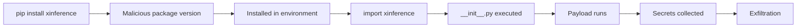
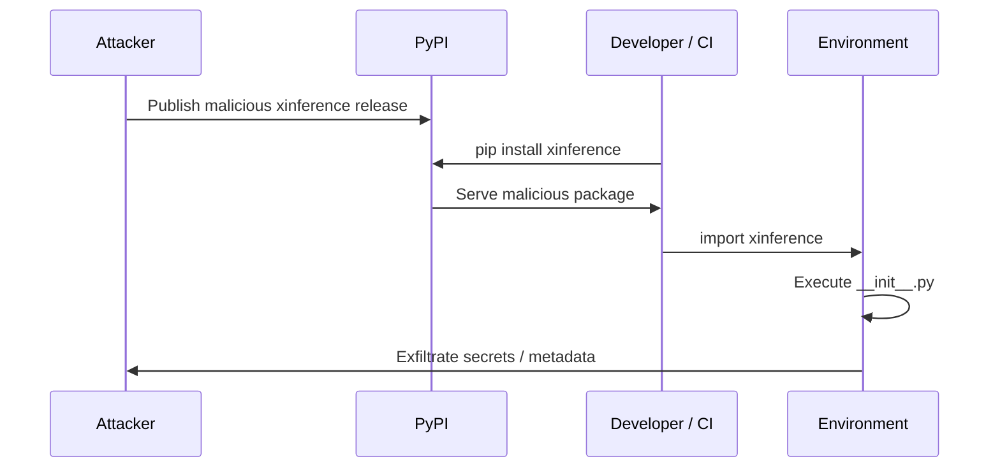
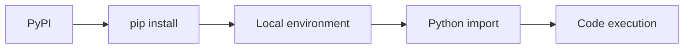
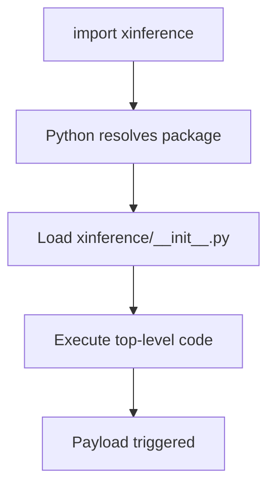
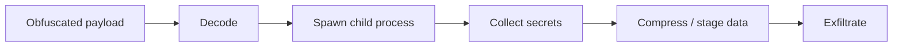
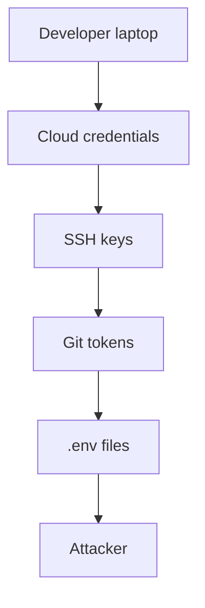
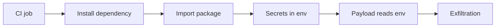

In my previous posts, I focused on kernel vulnerabilities and exploitation primitives such as use-after-free, page cache corruption, and metadata confusion.

This case is different, is not a vulnerability in code is a compromise of trust.

<!--more-->

In early 2026, multiple malicious versions of the `xinference` package were published on PyPI, targeting developers, CI/CD pipelines, and production-like environments.

What makes this incident dangerous is not technical complexity.

It is how normal it looks:

```bash
pip install xinference
```

Behind that command, attacker-controlled code can become part of a trusted Python environment.

And once the package is imported, malicious logic can execute automatically.

The interesting part is not only the payload.

It is the primitive:

> trusted package installation → trusted import → attacker-controlled execution

## TL;DR

At a high level, the attack chain is:

```text
pip install xinference
      ↓
malicious package downloaded from PyPI
      ↓
package installed locally
      ↓
import xinference
      ↓
__init__.py executed
      ↓
hidden payload triggered
      ↓
system reconnaissance
      ↓
credential harvesting
      ↓
data exfiltration
```



## About

The goal of this post is not to reverse engineer every line of the malware.

The goal is to understand how a trusted package distribution mechanism can become a direct execution primitive.

> [!NOTE]
> This article focuses on the attack model, developer impact, and defensive lessons behind the Xinference PyPI supply chain compromise.

## Incident Overview

The Xinference incident is a supply chain compromise, not a traditional CVE.

Attackers did not need to exploit a memory corruption bug, a parsing issue, or a race condition.

Instead, the attacker abused the trust placed in the package release pipeline.

Public reporting described malicious `xinference` releases on PyPI affecting versions:

```text
2.6.0
2.6.1
2.6.2
```

The malicious code was reportedly placed in the package initialization path, making import-time execution possible.

That means a developer could install the package normally and trigger the malicious logic later through a normal import:

```python
import xinference
```

This is what makes the incident so dangerous.

Nothing needs to look suspicious.

No exploit needs to be launched.

The normal workflow is the trigger.

> [!WARNING]
> If a compromised dependency executes during import, every environment that imports it should be treated as potentially exposed.

## Timeline (Simplified)

```text
Attacker gains release access
      ↓
malicious versions are published
      ↓
users install or update dependencies
      ↓
package is imported
      ↓
payload executes
      ↓
secrets are collected
      ↓
incident is discovered
      ↓
malicious releases are removed / blocked
```



## Attack Surface

The attack relies on a simple but powerful execution chain:

```text
package repository → installation → import → execution
```



The key idea:

> installing a package is equivalent to trusting and executing its code.

This is not specific to Xinference.

This is a general property of package ecosystems.

A Python dependency may execute code during:

- installation hooks,
- import-time initialization,
- dynamic module loading,
- subprocess calls,
- plugin discovery,
- runtime configuration loading.

For developers, this is normal behavior.

For attackers, it is an execution surface.

## Root Cause (Trust Model Failure)

The root cause is not a software bug in Xinference itself.

It is a trust model failure.

```text
trusted project
      ↓
compromised release path
      ↓
malicious package version
      ↓
trusted installation
      ↓
trusted import
      ↓
attacker code execution
```

There is no memory corruption.

There is no kernel primitive.

There is no exploit chain in the traditional sense.

The system behaves exactly as designed.

That is the problem.

> [!IMPORTANT]
> Supply chain attacks are dangerous because the attacker does not need to bypass trust. They become part of it.

## Execution Model

In Python, importing a module executes its top-level code.

A simplified package layout looks like this:

```text
xinference/
├── __init__.py
├── core.py
└── ...
```

When Python runs:

```python
import xinference
```

it loads and executes `xinference/__init__.py`.

If malicious logic is embedded there, it runs automatically.



This creates the core primitive:

```text
trusted import → arbitrary code execution
```

The attacker does not need the developer to run a suspicious script.

The developer only needs to import a package that they already trust.

## Payload Behavior (Simplified)

Public analysis described heavily obfuscated code, including base64-encoded payload layers and child process execution.

A simplified model looks like this:

```python
import base64
import subprocess

payload = "base64_encoded_stage"
decoded = base64.b64decode(payload)

subprocess.Popen(
    ["python3", "-c", decoded.decode()],
    stdout=subprocess.DEVNULL,
    stderr=subprocess.DEVNULL,
)
```

The exact implementation may differ, but the idea is the same:

```text
obfuscated blob
      ↓
decode
      ↓
execute
      ↓
collect data
      ↓
exfiltrate
```



> [!CAUTION]
> Obfuscation is not the interesting part by itself. The important part is where the payload runs: inside trusted developer or CI environments.

## Why This Works (Developer Perspective)

This attack works because it abuses normal developer workflows.

In a typical environment:

- dependencies are installed automatically (`pip install -r requirements.txt`)
- packages are trusted implicitly
- code is imported without manual inspection
- secrets are exposed through environment variables
- outbound network access is often unrestricted

From the attacker's perspective:

```text
developer machine = trusted execution environment
CI pipeline       = automated execution engine
cloud workload    = high-value credential source
```

The critical issue is implicit execution:

```python
import xinference
```

This line is enough to trigger attacker-controlled code if the package is compromised.

There is no exploit.

The developer runs the payload voluntarily.

## Real Impact

The impact depends on where the malicious package runs.

### Developer Workstation

Developer machines often contain credentials that are valuable far beyond the local system.

Typical sensitive files include:

```text
~/.aws/credentials
~/.ssh/id_rsa
~/.ssh/config
~/.docker/config.json
~/.kube/config
.env
```

A malicious dependency can:

- read local cloud credentials,
- steal SSH keys,
- extract API tokens from environment variables,
- inspect project files,
- discover internal endpoints,
- access package manager tokens.



### CI/CD Pipeline

CI pipelines are even more attractive because they are automated and usually contain deployment credentials.

Typical CI configuration:

```yaml
env:
  AWS_ACCESS_KEY_ID: ${{ secrets.AWS_ACCESS_KEY_ID }}
  AWS_SECRET_ACCESS_KEY: ${{ secrets.AWS_SECRET_ACCESS_KEY }}
  GITHUB_TOKEN: ${{ secrets.GITHUB_TOKEN }}
```

During a build:

```bash
pip install -r requirements.txt
python -c "import xinference"
```

If the dependency is compromised:

- secrets may be exposed instantly,
- attacker may gain cloud access,
- build artifacts may be tampered with,
- release pipelines may be abused,
- internal registries may be accessed.



### Cloud / Production

In cloud environments, the attacker may not need static credentials.

If the workload has access to a metadata service or workload identity, the malicious package may attempt to access temporary credentials.

Examples of high-value targets:

```text
AWS IAM role credentials
GCP service account tokens
Azure managed identity tokens
Kubernetes service account tokens
Docker registry credentials
Terraform state files
```

This changes the incident from "developer malware" into a potential cloud compromise.

## Detection Ideas

Detection is difficult because the initial behavior looks legitimate.

A Python process importing a Python package is normal.

The suspicious part is what happens after the import.

### Runtime Indicators

Monitor for unexpected outbound connections after package import:

```bash
ss -antp
```

Look for Python processes spawning unexpected child processes:

```bash
ps aux | grep python
pstree -ap | grep python
```

Check for temporary archive files or staging directories:

```bash
find /tmp -maxdepth 2 -type f -name "*.tar.gz" -o -name "*.zip" 2>/dev/null
```

Monitor DNS or network activity from build containers:

```bash
tcpdump -i any port 53
```

> [!NOTE]
> These commands are triage helpers, not complete detection logic.

### Code-Level Indicators

Look for suspicious patterns inside installed packages:

```bash
python - << 'EOF'
import site
print("\n".join(site.getsitepackages()))
EOF
```

Then inspect package files:

```bash
grep -R "base64" /path/to/site-packages/xinference 2>/dev/null
grep -R "subprocess" /path/to/site-packages/xinference 2>/dev/null
grep -R "exec(" /path/to/site-packages/xinference 2>/dev/null
grep -R "eval(" /path/to/site-packages/xinference 2>/dev/null
```

Common red flags:

- `exec()` / `eval()`
- base64-decoded blobs
- dynamic imports
- subprocess spawning
- unexpected network libraries
- code added directly to `__init__.py`

Example suspicious pattern:

```python
import base64
exec(base64.b64decode(payload))
```

### Dependency Inspection

Check installed versions:

```bash
pip show xinference
pip freeze | grep -i xinference
```

Check lockfiles:

```bash
grep -R "xinference" requirements.txt pyproject.toml poetry.lock Pipfile.lock 2>/dev/null
```

Check whether the package was recently installed in CI logs:

```bash
grep -R "xinference" ./logs 2>/dev/null
```

### CI Monitoring

In CI/CD environments:

- log all dependency install steps,
- restrict outbound network during builds where possible,
- alert on unexpected package upgrades,
- use lockfiles,
- delay newly published versions before allowing installation,
- scan artifacts for unexpected payloads.

A useful policy is:

```text
new package version published recently → block or require review
```

This protects against fast-moving supply chain attacks where malicious versions are detected only after publication.

## Mitigations

| Category | Mitigation |
|----------|-----------|
| Dependency control | Pin exact versions |
| Verification | Use hashes or signed artifacts |
| Isolation | Build in disposable environments |
| CI hardening | Restrict secrets and outbound network |
| Secrets hygiene | Rotate credentials after exposure |
| Monitoring | Detect unexpected network/process behavior |
| Review | Delay newly published dependency versions |
| SBOM | Track dependency versions in builds |

### Dependency Pinning

Avoid floating installs:

```text
xinference
```

Prefer explicit versions:

```text
xinference==2.5.0
```

When possible, use hashes:

```bash
pip-compile --generate-hashes
pip install --require-hashes -r requirements.txt
```

### CI/CD Hardening

Recommended controls:

- do not expose production secrets to dependency installation jobs,
- split build and deploy stages,
- use short-lived credentials,
- restrict outbound network by default,
- review dependency updates before deployment,
- run dependency installation in isolated containers.

### Incident Response Checklist

If a compromised version was installed or imported:

```text
1. Remove the package version
2. Preserve logs and artifacts
3. Identify where it ran
4. Rotate exposed credentials
5. Check cloud audit logs
6. Check CI/CD tokens
7. Review outbound network logs
8. Rebuild affected environments
```

> [!WARNING]
> If secrets were present in the environment during import, assume they may have been exposed.

## Key Insight

> In supply chain attacks, the vulnerability is not the code — it is the trust placed in it.

The attacker does not need to break the runtime.

They only need to enter the trust path.

## What I Learned

This incident is a reminder that modern exploitation is not always about primitives like arbitrary read, arbitrary write, or control flow hijacking.

Sometimes the primitive is simpler:

```text
trusted dependency → trusted execution → trusted secrets
```

For developers, the lesson is uncomfortable but important:

> dependency installation is part of the attack surface.

For defenders, the lesson is just as important:

> CI/CD systems should be treated as production security boundaries, not just build automation.

## Conclusion

This incident highlights a fundamental reality:

Modern attacks do not always exploit bugs sometimes, they exploit assumptions.

Here, the assumption is simple:

> packages from a trusted repository are safe.

Once that assumption breaks, every `pip install` becomes a potential execution vector. This is not a bug to patch.

It is a model to rethink.

## References

- https://www.ox.security/blog/xinference-allegedly-hacked-by-teampcp-malicious-package-in-pypi/
- https://nsfocusglobal.com/xinference-pypi-supply-chain-poisoning-warning/
- https://www.stepsecurity.io/blog/teampcp-injects-two-stage-credential-stealer-into-xinference-pypi-package
- https://blog.gitguardian.com/three-supply-chain-campaigns-hit-npm-pypi-and-docker-hub-in-48-hours/

