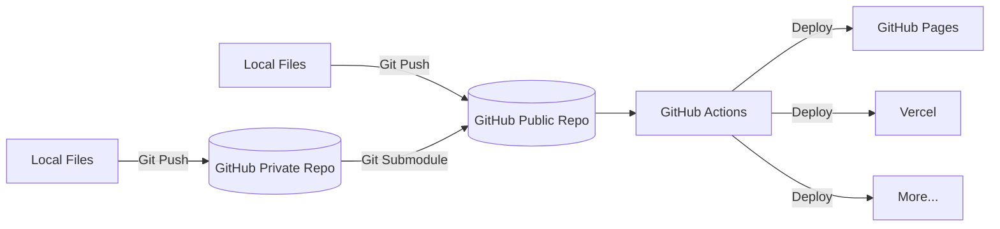
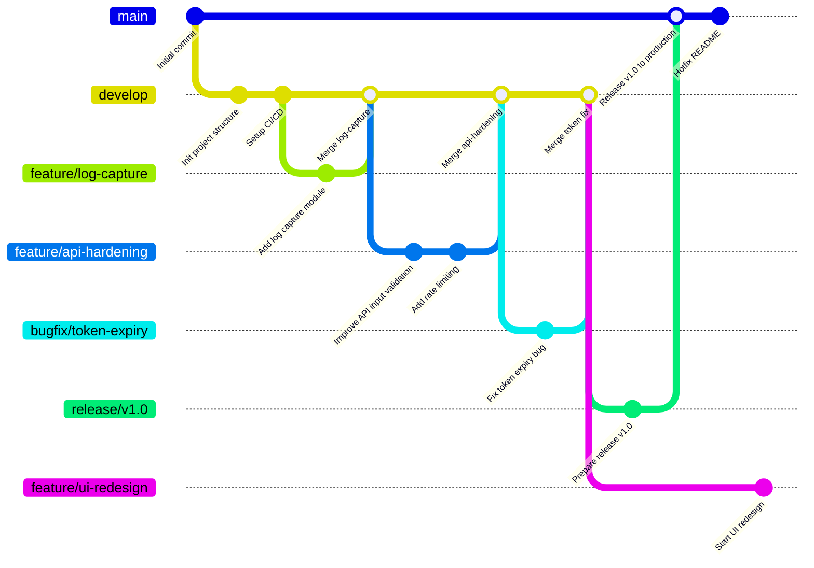

Over time, working on cybersecurity and development projects, I realized something important: writing code is only a small part of the job.
What really makes a difference is everything around it how you organize your work, how you structure your repositories, and how you think about your workflow.

<!--more-->

This GitHub page is not just a place where I store code.  
It’s more like a snapshot of how I work today how I organize things, how I improve over time, and how I try to stay flexible while building projects that actually last.

## architecture

To make things clearer, here’s a simplified view of how I organize my repositories and deployments.

It’s nothing overly complex, but every part has a purpose.  
I try to keep things separated and predictable, so I don’t lose time figuring out where things are or how they connect.

Here’s a high-level overview of how everything fits together:



## branch

I’m following something close to Git Flow.  
Not because it’s perfect, but because it gives me enough structure to stay organized, especially when projects grow or become messy.

It helps me work on multiple things at once without breaking everything, and it keeps things readable over time.

Here’s how I usually organize my branches:

- **`main`** – This is the production branch. Only stable and tested code goes here.
- **`develop`** – Where ongoing work comes together before being ready for production.
- **`feature/*`** – For working on specific features without impacting the rest.
- **`bugfix/*`** – For fixing issues quickly and cleanly.
- **`release/*`** – For preparing a proper release with final checks.

Nothing revolutionary, just something that works well for me and keeps things clean.



## automation

To avoid repeating the same commands over and over again, I added a few small scripts to simplify my workflow.

They’re not fancy tools, just simple helpers that make everyday tasks faster and less error-prone.

> [!IMPORTANT]
> Before using the scripts, make sure you're at the root of the project.  
> You’ll also need Git installed and the GitHub CLI (`gh`) configured.

### Script Overview

| Script                | Purpose                                                  |
|----------------------|----------------------------------------------------------|
| `github-branch.sh`   | Create a branch and optionally open a pull request        |
| `github-deploy`      | Handle release workflow                                  |
| `github-merged.sh`   | Clean up merged branches                                 |

> [!NOTE]
> All the scripts are stored in a `.shell/` directory at the root of the project.

I like keeping them in one place so it’s easy to maintain and update them if needed.

### Usage

#### Create a Branch

```bash
./.shell/github-branch.sh
```

This script guides you through the process and handles repetitive steps for you.

#### deploy a release

```bash
./.scripts/github-deploy
```

Helps manage the release process while still letting you validate things manually.

#### clean up merged branches

```bash
./.scripts/github-merged.sh
```

Helps keep your repository clean after merges.

> [!NOTE]
> Protected branches like `main` and `develop` cannot be deleted for safety reasons.

### example workflow

```bash
./.shell/github-branch.sh
./.shell/github-merged.sh
./.shell/github-deploy
```

> [!TIP]
> You can create aliases to make these commands easier to use.

