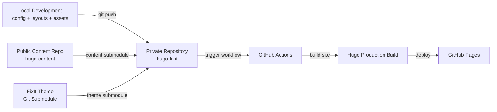
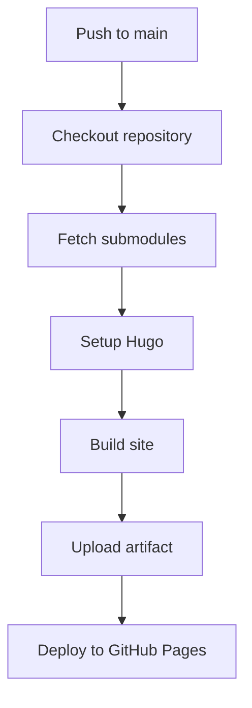
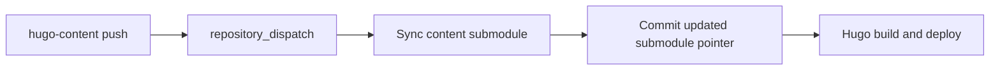

Over time, while working on my blog and documenting cybersecurity, homelab, and infrastructure projects, I realized that writing content was only one part of the process.

The real challenge was making the publishing workflow clean, repeatable, and reliable.

I wanted a setup where I could write content, push changes, and let the rest happen automatically without manually rebuilding or redeploying the site every time.

<!--more-->

This post explains how I currently organize and deploy my Hugo blog using GitHub Actions, Git submodules, the FixIt theme, and GitHub Pages.

The goal is not to build an overly complex pipeline. Instead, the idea is to keep the architecture simple, predictable, and easy to maintain over time.

## Overview

The blog is built with Hugo and the FixIt theme. The main repository contains the site configuration, layouts, assets, workflows, and static files. The content itself is managed in a separate repository and included as a Git submodule.

This separation helps keep the project cleaner:

- the site repository manages the technical structure;
- the content repository manages posts, pages, and write-ups;
- the theme is versioned independently as a submodule;
- GitHub Actions handles the build and deployment process.

In practice, this gives me a workflow that is close to a lightweight GitOps model for a static site.

## Architecture

The current architecture is intentionally simple.



The important part is the separation between the site engine and the content. The main repository does not directly own all Markdown content as normal files. Instead, it tracks the `content/` directory as a submodule.

That means the blog can evolve in two separate layers:

| Layer | Repository | Purpose |
|---|---|---|
| Site | `hugo-fixit` | Hugo config, layouts, assets, workflows, static files |
| Content | `hugo-content` | Posts, write-ups, guides, project pages |
| Theme | `themes/FixIt` | FixIt theme, tracked as a submodule |
| Deployment | GitHub Actions | Build and deploy the final static site |

## Repository structure

The main site repository is organized around Hugo's standard structure.

```text
.github/       GitHub Actions workflows
archetypes/    Content templates
assets/        SCSS, JavaScript, and processed assets
config/        Modular Hugo configuration
content/       Content repository mounted as a Git submodule
data/          Data files used by Hugo
layouts/       Layout overrides and custom partials
static/        Static files served as-is
themes/        Theme submodules
public/        Generated site output
```

For the blog covers and reusable images, I use `static/images/covers/`.

This keeps global visual assets separate from individual article bundles. When a cover is shared across the site or is not tied to one specific Markdown bundle, it belongs in `static/`.

For example:

```text
static/images/covers/github.png
static/images/covers/project.png
static/images/covers/welcome.png
```

Then a post can reference it like this:

```yaml
featuredImagePreview: /images/covers/github.png
```

or for a section page:

```yaml
featuredImage: /images/covers/project.png
```

## Local development

I prefer running Hugo inside a container instead of installing and managing Hugo directly on the host.

This keeps the environment reproducible and avoids version mismatches between local builds and CI builds.

For local development:
```bash
podman run --rm -it \
  --userns=keep-id \
  -p 1313:1313 \
  -v "$PWD":/src:Z \
  -w /src \
  ghcr.io/gohugoio/hugo:0.150.0 \
  server --bind 0.0.0.0 --baseURL http://localhost:1313
```

For local production:
```bash
podman run --rm -it \
  --userns=keep-id \
  -p 1313:1313 \
  -v "$PWD":/src:Z \
  -w /src \
  ghcr.io/gohugoio/hugo:v0.158.0 \
  server --environment production --bind 0.0.0.0 --baseURL http://localhost:1313
```

The local preview is then available at:

```text
http://localhost:1313
```

Using a container gives me a clean and isolated development environment while still allowing live preview during editing.

## Production build

The production build is handled by GitHub Actions, but the same idea can be tested locally.

A production build runs Hugo with minification enabled:

```bash
hugo --gc --minify
```

The generated output is written to:

```text
public/
```

This directory is not meant to be edited manually. It is build output.

## GitHub Actions workflow

Deployment is automated with GitHub Actions.

The deployment workflow performs the following steps:

1. checks out the repository;
2. initializes submodules recursively;
3. restores Hugo cache;
4. installs Hugo Extended;
5. builds the site;
6. uploads the generated `public/` directory;
7. deploys the site to GitHub Pages.

A simplified version of the build flow looks like this:



The key part is the checkout step with submodules enabled:

```yaml
- name: Check out repository code
  uses: actions/checkout@v6
  with:
    submodules: recursive
    fetch-depth: 0
```

This ensures that both the content submodule and the theme submodules are available during the build.

The Hugo build step is straightforward:

```yaml
- name: Hugo build
  run: hugo --gc --minify --logLevel info --cacheDir /tmp/hugo_cache
```

The final deployment uses GitHub Pages:

```yaml
- name: Deploy to GitHub Pages
  id: deployment
  uses: actions/deploy-pages@v5
```

## Content workflow

The `content/` directory is a Git submodule. This is the most important part of the workflow to understand.

When I update posts, guides, or project pages, I first commit those changes inside the content repository.

```bash
cd content

git checkout main
git pull --rebase origin main

# edit content...

git add .
git commit -m "feat(content): update posts"
git push origin main
```

After that, I return to the main site repository and update the submodule pointer.

```bash
cd ..

git add content
git commit -m "chore(content): update content submodule"
git pull --rebase origin main
git push origin main
```

This tells the main site repository which exact content commit it should build from.

Without this step, the content repository may be updated, but the deployed site may still point to an older content revision.

## Automatic content sync

To reduce manual work, the content repository can trigger the main repository through a dispatch workflow.

The general flow is:



This makes the content workflow smoother because pushing to the content repository can automatically update the submodule pointer in the main repository.

The deployment workflow also listens for the completion of the content sync workflow. This ensures that once the submodule pointer is updated, the site is rebuilt and redeployed automatically.

## Theme updates

The FixIt theme is also managed as a Git submodule.

To update the theme manually:

```bash
git submodule update --remote --merge themes/FixIt

git add themes/FixIt
git commit -m "chore(deps): update FixIt theme"
git push origin main
```

Theme updates are intentionally separated from content updates. This makes it easier to troubleshoot problems because content changes and theme changes do not get mixed together.

## Common pitfalls

Working with submodules is powerful, but there are a few traps.

| Issue | Cause | Fix |
|---|---|---|
| Content changes are not visible | Main repo still points to an older submodule commit | Commit the updated `content` pointer in `hugo-fixit` |
| Cannot push from `content/` | Submodule is in detached HEAD | Run `git checkout main` inside `content/` |
| GitHub Actions build misses content | Submodules were not initialized | Use `submodules: recursive` in checkout |
| Local preview differs from production | Different Hugo versions | Use the same Hugo container version locally and in CI |
| Images do not resolve | Wrong path or mixed Page Resource/static usage | Use `/images/covers/name.png` for files in `static/images/covers/` |

This setup is not overly complex, but it gives me enough structure to keep the blog maintainable.

The main benefits are:

- content and site logic are separated;
- the theme can be updated independently;
- deployments are automated;
- local builds are reproducible;
- the workflow stays predictable over time.

It also makes experimentation safer. I can work on layouts, covers, configuration, or content without mixing everything into one large unstructured repository.

The final workflow is simple:

```text
write content
push content
sync submodule
build Hugo site
deploy to GitHub Pages
```

Most of the heavy lifting is handled by GitHub Actions, while Git remains the source of truth for both content and configuration.

This gives me a clean and reproducible publishing workflow for my Hugo blog, without needing to manually rebuild or redeploy the site every time I update something.

